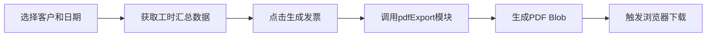

## 1. 产品概述

工时小簿快照是一款面向自由职业者和远程工作者的轻量级工时追踪与发票生成工具，解决项目工时记录混乱、客户账单对不上的痛点。

- 核心价值：自动追踪工作时间，按周期汇总统计，一键生成专业PDF发票
- 目标用户：自由职业者、远程工作者、小型团队

## 2. 核心功能

### 2.1 用户角色

| 角色 | 注册方式 | 核心权限 |
|------|---------|---------|
| 普通用户 | 本地使用，无需注册 | 任务计时、工时统计、客户管理、发票生成 |

### 2.2 功能模块

1. **计时器页面**：任务启动/暂停计时、手动补录、最近任务列表
2. **统计页面**：按周/月/自定义范围汇总工时、柱状图展示、客户筛选
3. **客户页面**：客户信息增删改查
4. **设置页面**：个人信息、费率设置、Logo上传

### 2.3 页面详情

| 页面名称 | 模块名称 | 功能描述 |
|---------|---------|---------|
| 计时器 | 计时卡片 | 显示当前任务名称、计时数字、开始/停止按钮 |
| 计时器 | 补录表单 | 手动填写任务名称、客户、起止时间 |
| 计时器 | 最近任务列表 | 展示最近任务，支持编辑、删除 |
| 统计 | 日期选择器 | 本周/本月/自定义范围切换 |
| 统计 | 柱状图 | 每日总工时可视化展示 |
| 统计 | 任务列表 | 按任务分组展示工时，支持客户筛选 |
| 统计 | 发票生成 | 选中任务后生成PDF发票 |
| 客户 | 客户列表 | 展示所有客户信息 |
| 客户 | 客户表单 | 添加/编辑客户信息 |
| 设置 | 个人信息 | 用户名称、费率、Logo设置 |

## 3. 核心流程

### 3.1 计时流程

用户在计时器页面点击开始按钮，系统启动计时并记录开始时间；再次点击停止按钮，系统计算时长并保存任务记录。若浏览器意外关闭，重新打开时自动恢复计时状态。

### 3.2 发票生成流程

用户在统计页面选择客户和日期范围，系统筛选对应任务，调用PDF生成模块创建含客户信息、任务明细、合计金额和Logo的PDF文件并触发下载。

## 4. 用户界面设计

### 4.1 设计风格

- 主色调：靛蓝渐变（#6366F1 → #8B5CF6），强调色：翠绿（#10B981）
- 背景色：主内容区 #F8FAFC，导航栏 #1E1B4B（磨砂玻璃效果）
- 按钮风格：圆角按钮，悬停有背景色过渡（0.2s），点击有 scale(0.95) 回弹（0.15s）
- 字体：Inter 字体族（Google Fonts 加载），计时数字使用 monospace 等宽字体
- 布局风格：左窄右宽双栏布局，卡片式设计，柔和阴影
- 图标风格：Lucide 线性图标

### 4.2 页面设计概览

| 页面名称 | 模块名称 | UI元素 |
|---------|---------|-------|
| 计时器 | 计时卡片 | 白色背景、圆角16px、阴影0 4px 16px rgba(0,0,0,0.05)、monospace大字计时、呼吸动画 |
| 计时器 | 开始按钮 | 背景#6366F1→#10B981、文字"开始"→"进行中"、0.2s过渡 |
| 统计 | 柱状图 | 渐变色柱子#6366F1→#8B5CF6、柱顶显示小时数、响应式宽度320-800px |
| 导航栏 | 侧边栏 | 宽240px、背景#1E1B4B、backdrop-filter: blur(8px)、选中项#312E81圆角8px |
| 通用 | 按钮交互 | 悬停背景变#4338CA、点击scale(0.95)回弹 |

### 4.3 响应式设计

- 桌面端优先设计
- 平板端：导航栏可折叠
- 移动端：底部导航栏替代侧边栏
- 柱状图最小宽度320px，自动适应容器宽度

### 4.4 动效设计

- 计时器运行时：呼吸动画（亮度1→0.8循环，周期1.5s）
- 按钮点击：scale(0.95) 回弹反馈（0.15s）
- 导航项悬停：背景色过渡（0.2s）
- 编辑按钮：圆形涟漪动画
- 页面切换：淡入过渡
