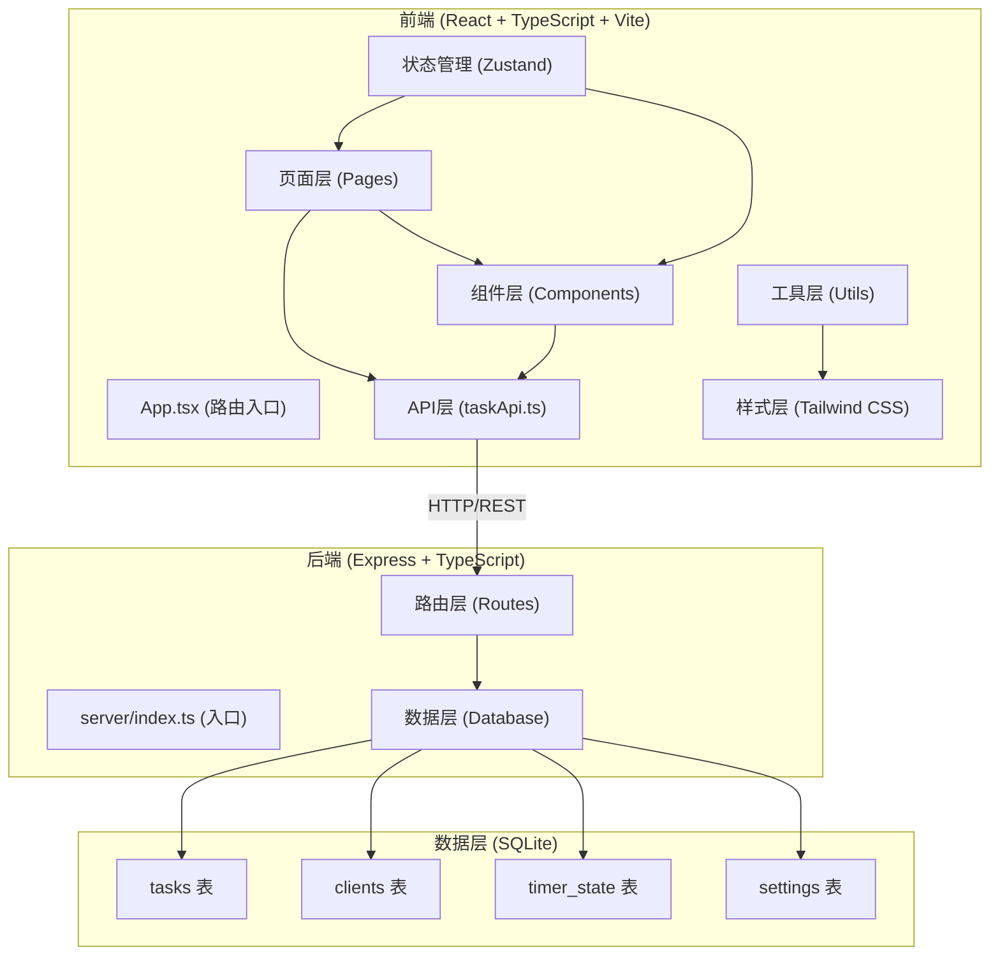
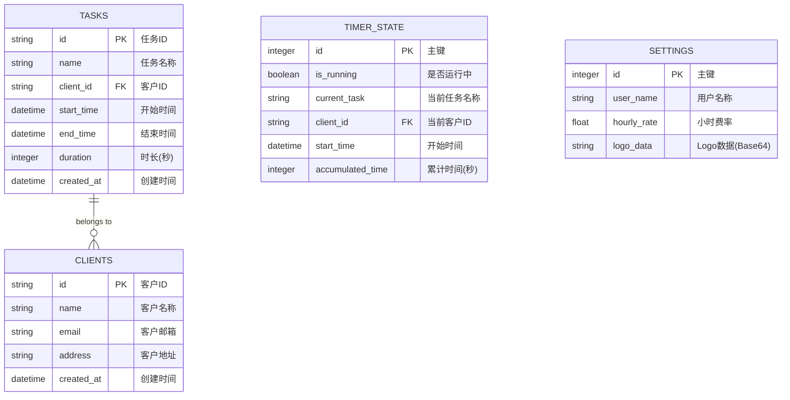

## 1. 架构设计



## 2. 技术选型说明

| 层级 | 技术栈 | 说明 |
|------|--------|------|
| 前端框架 | React 18 + TypeScript | 组件化开发，类型安全 |
| 构建工具 | Vite | 快速开发体验，HMR |
| 路由 | react-router-dom v6 | 单页应用路由管理 |
| HTTP客户端 | axios | 与后端REST API通信 |
| 状态管理 | zustand | 轻量级全局状态管理 |
| 图表库 | recharts | 响应式柱状图展示 |
| PDF生成 | react-to-print | 基于打印的PDF导出 |
| UI样式 | Tailwind CSS 3 | 原子化CSS，快速开发 |
| 图标 | lucide-react | 线性图标库 |
| 后端框架 | Express 4 | 轻量级Node.js Web框架 |
| 数据库 | better-sqlite3 | 同步SQLite驱动，性能优异 |
| ID生成 | uuid | 生成唯一任务ID |
| 跨域 | cors | 处理跨域请求 |

## 3. 项目目录结构

```
.
├── src/                          # 前端源码
│   ├── api/                      # API调用层
│   │   ├── taskApi.ts            # 任务相关API
│   │   ├── clientApi.ts          # 客户相关API
│   │   └── settingsApi.ts        # 设置相关API
│   ├── components/               # 可复用组件
│   │   ├── TaskTimer.tsx         # 计时器组件
│   │   ├── TaskList.tsx          # 任务列表组件
│   │   ├── ClientList.tsx        # 客户列表组件
│   │   ├── Sidebar.tsx           # 侧边导航栏
│   │   ├── TaskForm.tsx          # 任务表单
│   │   ├── ClientForm.tsx        # 客户表单
│   │   ├── DateRangePicker.tsx   # 日期选择器
│   │   ├── BarChart.tsx          # 柱状图组件
│   │   └── InvoicePreview.tsx    # 发票预览组件
│   ├── pages/                    # 页面组件
│   │   ├── TimerPage.tsx         # 计时器页面
│   │   ├── DashboardPage.tsx     # 统计仪表盘页面
│   │   ├── ClientsPage.tsx       # 客户管理页面
│   │   └── SettingsPage.tsx      # 设置页面
│   ├── store/                    # 状态管理
│   │   ├── useTimerStore.ts      # 计时器状态
│   │   └── useSettingsStore.ts   # 设置状态
│   ├── utils/                    # 工具函数
│   │   ├── pdfExport.ts          # PDF导出功能
│   │   ├── timeUtils.ts          # 时间格式化工具
│   │   └── storage.ts            # localStorage封装
│   ├── types/                    # TypeScript类型定义
│   │   └── index.ts              # 类型汇总
│   ├── App.tsx                   # 应用根组件
│   ├── main.tsx                  # 应用入口
│   └── index.css                 # 全局样式
├── server/                       # 后端源码
│   ├── index.ts                  # Express入口
│   ├── db.ts                     # 数据库连接与初始化
│   ├── routes/                   # 路由
│   │   ├── tasks.ts              # 任务路由
│   │   ├── clients.ts            # 客户路由
│   │   └── settings.ts           # 设置路由
│   └── types.ts                  # 后端类型定义
├── shared/                       # 前后端共享类型
│   └── types.ts                  # 共享类型
├── public/                       # 静态资源
├── index.html                    # HTML入口
├── vite.config.js                # Vite配置
├── tsconfig.json                 # TypeScript配置
├── tailwind.config.js            # Tailwind配置
├── postcss.config.js             # PostCSS配置
└── package.json                  # 项目依赖与脚本
```

## 4. 路由定义

### 4.1 前端路由

| 路由路径 | 页面组件 | 功能说明 |
|---------|---------|---------|
| `/` | TimerPage | 计时器主页 |
| `/dashboard` | DashboardPage | 统计仪表盘 |
| `/clients` | ClientsPage | 客户管理 |
| `/settings` | SettingsPage | 设置页面 |

### 4.2 后端API路由

| 方法 | 路由 | 功能说明 |
|------|------|---------|
| POST | `/api/tasks/start` | 启动计时器 |
| POST | `/api/tasks/stop` | 停止计时器并保存任务 |
| POST | `/api/tasks` | 手动创建任务记录 |
| GET | `/api/tasks` | 获取任务列表 |
| GET | `/api/tasks/summary` | 获取工时汇总数据 |
| PUT | `/api/tasks/:id` | 更新任务记录 |
| DELETE | `/api/tasks/:id` | 删除任务记录 |
| GET | `/api/timer/state` | 获取计时器当前状态 |
| PUT | `/api/timer/state` | 更新计时器状态 |
| GET | `/api/clients` | 获取客户列表 |
| POST | `/api/clients` | 创建客户 |
| PUT | `/api/clients/:id` | 更新客户信息 |
| DELETE | `/api/clients/:id` | 删除客户 |
| GET | `/api/settings` | 获取设置 |
| PUT | `/api/settings` | 更新设置 |

## 5. 数据模型

### 5.1 ER图



### 5.2 DDL语句

```sql
-- 客户表
CREATE TABLE IF NOT EXISTS clients (
  id TEXT PRIMARY KEY,
  name TEXT NOT NULL,
  email TEXT,
  address TEXT,
  created_at DATETIME DEFAULT CURRENT_TIMESTAMP
);

-- 任务表
CREATE TABLE IF NOT EXISTS tasks (
  id TEXT PRIMARY KEY,
  name TEXT NOT NULL,
  client_id TEXT,
  start_time DATETIME NOT NULL,
  end_time DATETIME,
  duration INTEGER DEFAULT 0,
  created_at DATETIME DEFAULT CURRENT_TIMESTAMP,
  FOREIGN KEY (client_id) REFERENCES clients(id) ON DELETE SET NULL
);

-- 计时器状态表
CREATE TABLE IF NOT EXISTS timer_state (
  id INTEGER PRIMARY KEY CHECK (id = 1),
  is_running INTEGER DEFAULT 0,
  current_task TEXT,
  client_id TEXT,
  start_time DATETIME,
  accumulated_time INTEGER DEFAULT 0,
  FOREIGN KEY (client_id) REFERENCES clients(id) ON DELETE SET NULL
);

-- 设置表
CREATE TABLE IF NOT EXISTS settings (
  id INTEGER PRIMARY KEY CHECK (id = 1),
  user_name TEXT DEFAULT '',
  hourly_rate REAL DEFAULT 50.0,
  logo_data TEXT DEFAULT ''
);

-- 初始化计时器状态
INSERT OR IGNORE INTO timer_state (id, is_running, accumulated_time) VALUES (1, 0, 0);

-- 初始化设置
INSERT OR IGNORE INTO settings (id, user_name, hourly_rate) VALUES (1, '自由职业者', 50.0);

-- 索引
CREATE INDEX IF NOT EXISTS idx_tasks_client_id ON tasks(client_id);
CREATE INDEX IF NOT EXISTS idx_tasks_start_time ON tasks(start_time);
```

## 6. 核心数据流向

### 6.1 计时器数据流向

```
用户点击开始按钮
  ↓
TaskTimer组件
  ↓ (调用taskApi.startTask)
src/api/taskApi.ts
  ↓ (POST /api/tasks/start)
server/routes/tasks.ts
  ↓ (更新timer_state表)
server/db.ts (better-sqlite3)
  ↓ (返回状态)
taskApi.ts返回Promise
  ↓
useTimerStore更新状态
  ↓
TaskTimer组件重渲染
  ↓
本地setInterval每秒更新显示
```

### 6.2 统计数据流向

```
DashboardPage加载
  ↓ (useEffect)
调用taskApi.getSummary(params)
  ↓ (GET /api/tasks/summary)
server/routes/tasks.ts
  ↓ (查询tasks表，按日期/客户分组)
server/db.ts
  ↓ (返回汇总数据)
taskApi.ts返回数据
  ↓
DashboardPage更新state
  ↓
BarChart组件渲染柱状图
TaskList组件渲染列表
```

## 7. 性能优化策略

1. **计时器性能**：前端仅用setInterval本地计时，启动/停止时才发请求，避免轮询
2. **状态持久化**：localStorage暂存计时器状态，页面加载时快速恢复
3. **PDF生成**：使用react-to-print基于打印机制生成，纯前端处理，10条记录<500ms
4. **数据缓存**：统计数据短时间内缓存，避免重复请求
5. **组件优化**：使用React.memo避免不必要重渲染
6. **虚拟滚动**：任务列表过长时启用虚拟滚动（按需）

## 8. 安全考量

1. **输入验证**：后端对所有输入参数进行校验和类型检查
2. **SQL注入防护**：使用better-sqlite3的参数化查询
3. **XSS防护**：React默认转义，PDF生成前对用户输入进行处理
4. **CORS配置**：严格限制允许的域名
5. **文件大小限制**：Logo上传限制大小和格式
