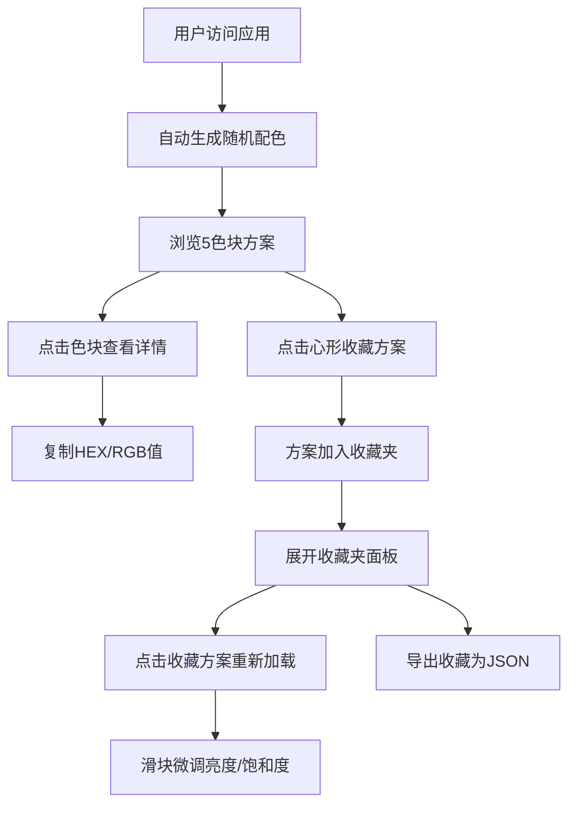

## 1. 产品概述

在线配色方案灵感生成与收藏管理应用，为设计师、开发者和创意工作者提供随机和谐配色方案的浏览、收藏、对比和微调功能。
- 解决创意工作者寻找配色灵感困难的问题，通过色相环算法生成视觉和谐的5色调色板
- 面向UI/UX设计师、前端开发者、插画师等需要配色参考的创意人群

## 2. 核心功能

### 2.1 功能模块
1. **主配色展示模块**：5色横向色块条展示、情感标签、生成时间戳、色值详情面板、一键复制
2. **随机生成模块**：基于色相偏移/互补色规则生成和谐配色、动画过渡效果
3. **收藏管理模块**：心形收藏按钮、收藏夹列表面板、重新加载方案
4. **颜色微调模块**：亮度滑块、饱和度滑块、实时预览
5. **导出模块**：JSON格式导出收藏方案

### 2.2 页面详情
| 页面名称 | 模块名称 | 功能描述 |
|-----------|-------------|---------------------|
| 首页 | 顶部操作区 | 标题、随机生成按钮、导出收藏按钮、收藏夹切换按钮 |
| 首页 | 主配色展示区 | 5个横向色块条、情感标签、时间戳、收藏心形按钮 |
| 首页 | 色值详情面板 | 点击色块展开浮动卡片、显示HEX/RGB值、复制按钮 |
| 首页 | 颜色微调区 | 加载收藏方案后显示、亮度和饱和度滑块 |
| 首页 | 收藏夹面板 | 可折叠、缩略色块条、情感标签、点击重新加载 |

## 3. 核心流程

用户访问应用 → 自动生成随机配色方案 → 浏览色块及情感标签 → 点击色块查看/复制色值 → 喜欢则点击心形收藏 → 展开收藏夹查看历史收藏 → 点击收藏方案重新加载 → 用滑块微调颜色 → 导出所有收藏为JSON文件

## 4. 用户界面设计

### 4.1 设计风格
- **主色调**：深灰背景#212121，按钮深蓝#1E88E5，收藏红#E53935，复制绿#388E3C
- **按钮样式**：胶囊形圆角24px，hover上移2px变亮#42A5F5
- **字体**：现代无衬线字体，Material Design风格
- **布局**：最大宽度960px居中，卡片化设计
- **图标**：心形收藏图标、复制按钮图标、导出图标

### 4.2 页面设计概述
| 页面名称 | 模块名称 | UI元素 |
|-----------|-------------|-------------|
| 首页 | 顶部操作区 | 胶囊按钮、标题文字、深灰背景 |
| 首页 | 色块展示区 | 120×200px圆角8px色块、1px描边、hover上浮4px放大1.03倍、fadeIn逐个动画 |
| 首页 | 色值详情卡片 | 200×120px圆角12px、投影、蓝色复制按钮变绿反馈 |
| 首页 | 情感标签 | 对应颜色30%透明度背景 |
| 首页 | 收藏心形 | 空心轮廓#757575、填充#E53935、弹跳动画 |
| 首页 | 收藏夹面板 | 默认折叠高度0、展开最大400px、0.4s cubic-bezier过渡、浅灰#333333背景、白线#555555分隔 |
| 首页 | 微调滑块 | 范围-20%到+20%、0.1s延迟实时更新 |

### 4.3 响应性
- 桌面端优先设计，最大宽度960px居中
- 中等屏幕色块自适应宽度
- 移动端色块纵向排列
