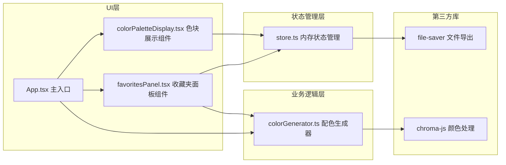

## 1. 架构设计



## 2. 技术说明

- **前端框架**：React 18 + TypeScript 5
- **构建工具**：Vite 5 + @vitejs/plugin-react
- **颜色处理**：chroma-js 2.x（色相转换、明暗饱和度调整）
- **文件导出**：file-saver 2.x（JSON文件下载）
- **样式方案**：CSS-in-JS / 内联样式 + CSS动画
- **状态管理**：自定义内存store（非Redux，轻量方案）

## 3. 文件结构

| 文件路径 | 职责 |
|---------|------|
| package.json | 依赖配置与启动脚本 |
| index.html | 入口HTML页面 |
| vite.config.js | Vite构建配置 |
| tsconfig.json | TypeScript严格模式配置 |
| src/App.tsx | 主应用组件，协调各模块 |
| src/main.tsx | React入口渲染 |
| src/colorGenerator.ts | 随机和谐配色生成算法 |
| src/colorPaletteDisplay.tsx | 5色色块展示组件 |
| src/store.ts | 收藏夹内存状态管理 |
| src/favoritesPanel.tsx | 收藏夹面板与微调组件 |
| src/types.ts | 全局类型定义（可选内嵌） |

## 4. 核心数据类型

```typescript
interface ColorItem {
  hex: string;
  rgb: { r: number; g: number; b: number };
  emotion: string; // 情感标签: 温暖/冷静/活泼/复古/清新/科技感
  hsl: { h: number; s: number; l: number };
}

interface ColorPalette {
  id: string;
  colors: ColorItem[];
  timestamp: number;
  isFavorite: boolean;
}

interface Adjustment {
  lightness: number; // -20 到 +20
  saturation: number; // -20 到 +20
}
```

## 5. 关键算法说明

### 5.1 和谐配色生成算法
- **60度偏移（类比色）**：基础色相 + 0°/30°/60°/90°/120°
- **互补色方案**：基础色相 + 0°/30°/180°/210°/240°
- **分裂互补**：基础色相 + 0°/150°/180°/210°/60°
- 随机选择以上规则之一，饱和度范围55-80%，亮度范围35-70%

### 5.2 情感标签规则
- 色相0°-45°或315°-360°：温暖
- 色相180°-270°：冷静
- 饱和度>70%且亮度>60%：活泼
- 饱和度<50%且亮度40%-55%：复古
- 色相90°-160°且亮度>50%：清新
- 色相200°-240°且饱和度>65%：科技感
