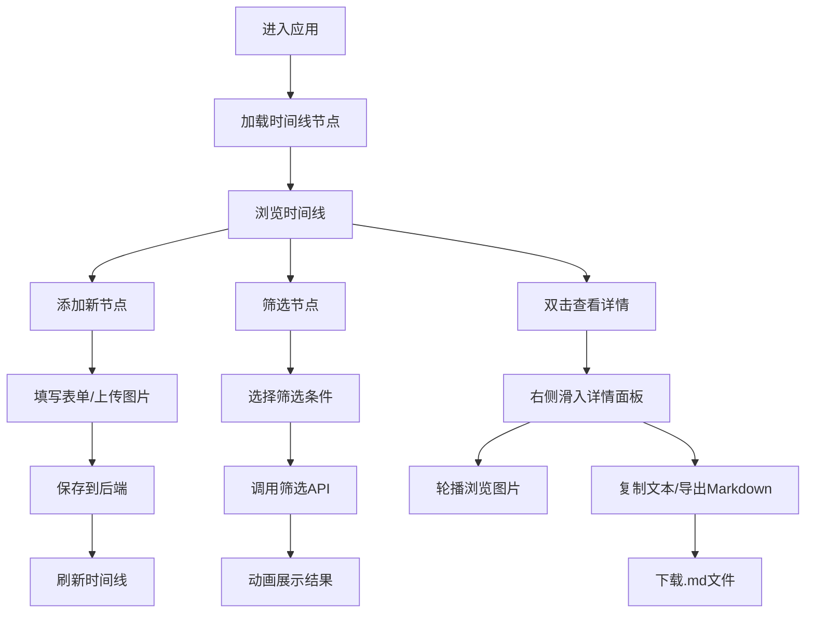

## 1. 产品概述

旅行记忆时间线是一款帮助用户整理和回顾旅行经历的个人应用。解决了旅行后照片、笔记和地点信息散落各处，难以按时间顺序整合成连贯故事的问题。

- 目标用户：热爱旅行、希望以时间线形式留存旅行记忆的用户
- 核心价值：将零散的旅行素材整合成可视化的时间线故事，支持筛选浏览和Markdown导出

## 2. 核心功能

### 2.1 功能模块

1. **时间线主视图**：垂直时间线布局，展示旅行事件节点卡片，支持添加新节点
2. **筛选面板**：左侧面板，按年份、国家、标签过滤节点
3. **详情面板**：右侧滑入面板，展示节点完整信息和图片轮播
4. **导出功能**：将选中节点导出为Markdown格式文档

### 2.2 页面详情

| 页面名称 | 模块名称 | 功能描述 |
|---------|---------|---------|
| 主界面 | 顶部导航栏 | 显示"我的时间线"标题，响应式布局 |
| 主界面 | 时间线容器 | 垂直布局，宽度960px居中，节点按日期自动排序 |
| 主界面 | 节点卡片 | 800px宽，圆角16px，显示日期/地点/描述/缩略图，0.3s展开折叠动画，悬停阴影加深 |
| 主界面 | 添加节点按钮 | 打开新增节点表单 |
| 主界面 | 筛选面板 | 左侧固定，支持多条件筛选，筛选时0.5s淡入淡出过渡，卡片从底部依次飞入 |
| 详情面板 | 图片轮播 | 左右箭头切换，0.3s水平滑动动画 |
| 详情面板 | 内容展示 | 完整文本描述，支持复制纯文本（绿色toast提示） |
| 详情面板 | 导出功能 | Markdown预览和下载 |

## 3. 核心流程

## 4. 用户界面设计

### 4.1 设计风格

- **主色调**：暖灰色背景 #F5F0EB，营造温暖回忆感
- **卡片背景**：纯白 #FFFFFF，清晰干净
- **导航栏**：深灰 #2D2D2D，突出标题
- **面板背景**：浅灰白 #FAFAFA
- **强调色**：
  - 日期：天蓝色 #4A90D9
  - 地点：深绿色 #2E7D32（带小地图图标）
  - 描述：深灰 #333333，行高1.6
- **交互效果**：
  - 按钮悬停：0.2s背景色加深
  - 卡片悬停：阴影加深至8px，上移4px
  - 动画流畅度：时间线滚动60fps

### 4.2 页面设计概览

| 页面名称 | 模块名称 | UI元素 |
|---------|---------|--------|
| 主界面 | 时间线 | 垂直居中布局，左侧时间轴装饰线，卡片错落分布 |
| 主界面 | 筛选面板 | 分类标签组，年份下拉，国家多选 |
| 主界面 | 节点卡片 | 日期标签、地点+地图图标、描述文本、图片缩略图网格 |
| 详情面板 | 轮播区 | 大图展示、左右切换箭头、指示器圆点 |
| 详情面板 | 操作区 | 复制按钮、导出按钮、关闭按钮 |

### 4.3 响应式设计

- **桌面端（≥768px）**：三栏布局，左筛选+中时间线+右详情
- **移动端（<768px）**：
  - 卡片宽度95%
  - 筛选面板折叠为顶部下拉菜单
  - 详情面板改为底部向上滑入

## 5. 性能要求

- 时间线滚动帧率：60fps
- 图片懒加载，加载时显示浅灰占位色块
- 动画使用transform/opacity属性保证GPU加速
