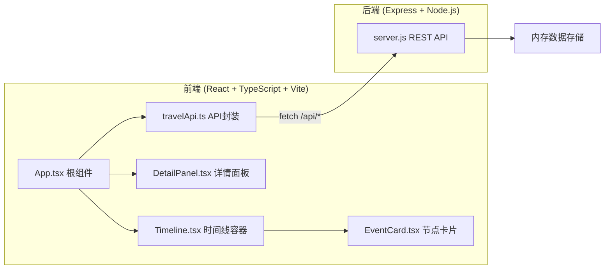
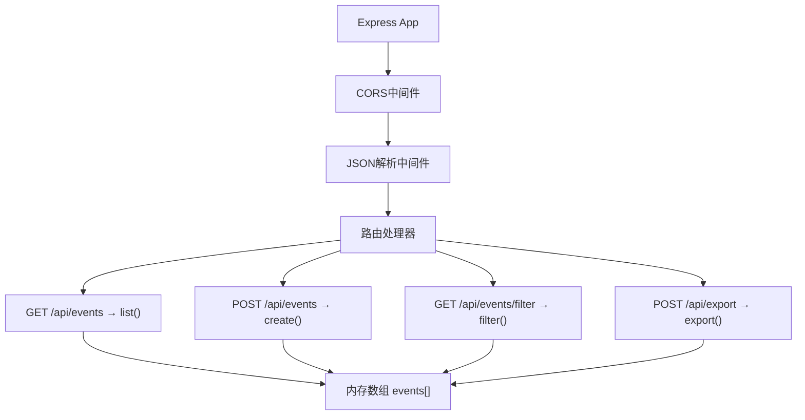

## 1. 架构设计



## 2. 技术说明

- **前端框架**：React 18 + TypeScript 5
- **构建工具**：Vite 5 + @vitejs/plugin-react
- **HTTP代理**：Vite内置代理 /api → localhost:3001
- **后端框架**：Express 4
- **数据存储**：Node.js 内存数组（运行时持久化）
- **跨域支持**：cors 中间件
- **ID生成**：uuid 库

## 3. 路由定义

| 路由 | 用途 |
|------|------|
| / | 主界面（单页应用，无额外路由） |

## 4. API 定义

### 4.1 类型定义

```typescript
interface TravelEvent {
  id: string;
  date: string;           // ISO日期格式 YYYY-MM-DD
  location: string;       // 地点名称
  country: string;        // 国家
  description: string;    // 完整描述
  tags: string[];         // 标签: 美食/风景/人文...
  images: string[];       // 图片URL数组 (最多3张)
}

interface FilterParams {
  year?: string;
  country?: string;
  tag?: string;
}
```

### 4.2 端点列表

| 方法 | 路径 | 说明 | 请求 | 响应 |
|------|------|------|------|------|
| GET | /api/events | 获取全部事件 | - | TravelEvent[] |
| POST | /api/events | 添加新事件 | TravelEvent(无id) | TravelEvent |
| GET | /api/events/filter | 筛选事件 | query: year,country,tag | TravelEvent[] |
| POST | /api/export | 导出Markdown | body: {ids: string[]} | {markdown: string, filename: string} |

## 5. 服务器架构



## 6. 项目文件结构

```
d:\Pro\tasks\auto30\
├── package.json              # 依赖和脚本配置
├── index.html                # 入口HTML
├── vite.config.js            # Vite构建配置(含代理)
├── tsconfig.json             # TypeScript严格模式
├── server/
│   └── server.js             # Express后端服务器
└── src/
    ├── App.tsx               # 根组件，全局状态管理
    ├── api/
    │   └── travelApi.ts      # API调用封装
    └── components/
        ├── Timeline.tsx      # 时间线容器
        ├── EventCard.tsx     # 节点卡片
        └── DetailPanel.tsx   # 详情面板
```

## 7. 启动方式

```bash
# 1. 启动后端 (端口3001)
node server/server.js

# 2. 安装依赖并启动前端 (端口5173)
npm install
npm run dev

# 3. 浏览器访问
http://localhost:5173
```
