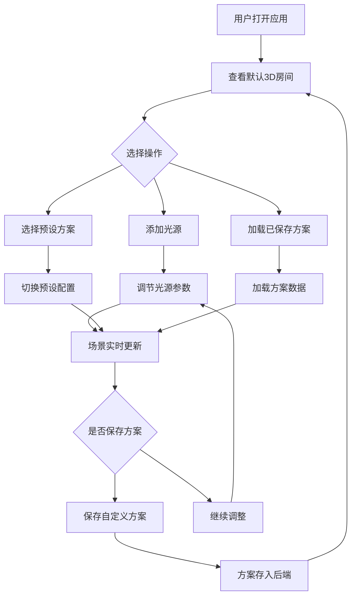

## 1. 产品概述

交互式室内光照方案设计与可视化应用，面向建筑设计师和室内装修用户，解决在规划照明方案时难以直观感受不同光源组合对空间氛围与光影效果影响的问题。用户可在虚拟3D房间中自由布置点光源、聚光灯和平行光，实时观察光影变化，并可保存/加载预设照明方案，无需专业光学模拟软件即可完成照明设计。

## 2. 核心功能

### 2.1 功能模块

1. **光照设计主页面**：3D场景渲染 + 光源控制面板 + 预设方案管理

### 2.2 页面详情

| 页面名称 | 模块名称 | 功能描述 |
|----------|----------|----------|
| 光照设计主页面 | 3D场景区域 | 渲染虚拟房间（墙壁、地板、家具），实时显示光照和阴影效果，支持OrbitControls交互 |
| 光照设计主页面 | 光源控制面板 | 添加/删除/编辑最多6个光源（点光源、聚光灯、平行光），调节位置、方向、强度、色温 |
| 光照设计主页面 | 预设方案区 | 下拉选择3个内置预设，保存自定义方案，卡片展示已保存方案，点击加载/长按删除 |
| 光照设计主页面 | FPS监控 | 左上角实时帧率显示，颜色根据帧率变化 |
| 光照设计主页面 | 色温选择器 | 圆形色盘直径40px，渐变从#FFAA00到#AACCFF，选中时白色光环动画 |

## 3. 核心流程

1. 用户打开应用，看到默认3D房间和侧边栏控制面板
2. 用户在侧边栏添加光源，选择光源类型
3. 通过滑块调节光源位置、方向、强度，通过色温选择器选择色温
4. 3D场景实时更新光照和阴影效果
5. 用户可拖拽3D场景中的光源标记来调整位置
6. 用户可选择内置预设方案快速切换照明配置
7. 用户可保存当前配置为自定义方案
8. 用户可加载已保存方案或长按删除

## 4. 用户界面设计

### 4.1 设计风格

- **主色调**：暗色主题 — 背景#1a1a2e，面板#16213e，文字#e0e0e0，强调色#0f3460
- **按钮样式**：圆角8px，悬停放大1.05倍（0.15s），点击收缩0.95倍（0.1s）
- **字体**：标题使用Outfit，正文使用DM Sans
- **布局**：左侧固定320px控制面板 + 右侧3D场景区域
- **卡片样式**：宽180px，圆角12px，背景#2d2d2d，悬停上移4px + box-shadow渐变0.2s

### 4.2 页面设计概览

| 页面名称 | 模块名称 | UI元素 |
|----------|----------|--------|
| 光照设计主页面 | 控制面板 | 深蓝背景(#16213e)，分为"光源列表"和"预设方案"两个折叠区域，折叠箭头旋转动画0.3s，展开内容最大高度0.4s动画 |
| 光照设计主页面 | 3D场景 | 占据右侧剩余空间，左上角FPS计数器 |
| 光照设计主页面 | 光源条目 | 折叠可展开参数滑块组，类型图标，删除按钮 |
| 光照设计主页面 | 色温选择器 | 圆形色盘40px直径，渐变背景，白色光环0.2s动画 |
| 光照设计主页面 | 预设卡片 | 180px宽，12px圆角，#2d2d2d背景，悬停上移4px |

### 4.3 响应式适配

- 桌面端：左侧固定320px面板 + 右侧3D场景
- 移动端（<768px）：面板变为底部可拖拽抽屉（高度40%），3D场景宽度100%

### 4.4 3D场景指导

- **环境**：室内虚拟房间，白色墙壁和木色地板，自然光照氛围
- **光照**：支持点光源、聚光灯、平行光，阴影贴图1024x1024，软阴影模糊半径0.3
- **摄像机**：透视相机，OrbitControls旋转/缩放/平移
- **构图**：房间居中，家具（桌子、椅子、书架）摆放提供阴影投射面
- **交互**：拖拽光源标记，光源到被照物虚线光路，预设切换淡入淡出0.8s
- **性能**：光源超4个自动启用阴影层叠优化，帧率不低于45FPS

### 4.5 光源视觉标识

| 光源类型 | 3D标记 | 颜色 |
|----------|--------|------|
| 点光源 | 小球体 | 亮黄色 |
| 聚光灯 | 圆锥形引导线 + 小球体 | 紫色 |
| 平行光 | 箭头 + 小球体 | 蓝色 |

- 选中光源时：球体放大1.5倍 + 0.5s脉动光晕动画
- 拖拽光源时：显示从光源到被照物表面的淡黄色虚线光路（透明度0.3）

### 4.6 内置预设方案

| 预设名称 | 光源配置 |
|----------|----------|
| 日间自然光 | 顶部平行光，色温5500K，强度8 |
| 夜间温馨模式 | 左侧点光源，色温2700K，强度5 |
| 展示高冷模式 | 顶部聚光灯，色温6500K，强度10 |
