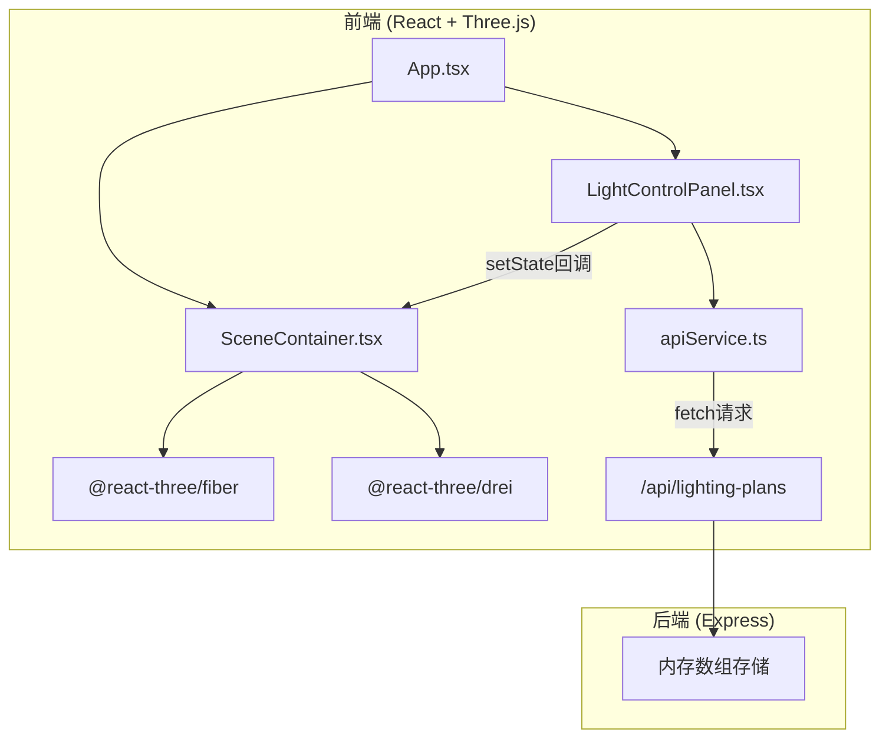
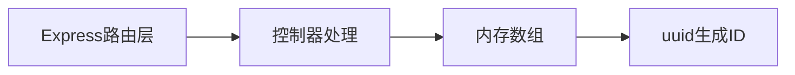

## 1. 架构设计



## 2. 技术说明

- **前端**：React@18 + TypeScript + Vite + Tailwind CSS
- **3D渲染**：Three.js + @react-three/fiber + @react-three/drei
- **状态管理**：Zustand
- **后端**：Express@4 + TypeScript + CORS
- **数据存储**：内存数组（无需数据库）
- **初始化工具**：vite-init (react-express-ts模板)

## 3. 路由定义

| 路由 | 用途 |
|------|------|
| / | 光照设计主页面（3D场景 + 控制面板） |

## 4. API定义

### 4.1 数据类型

```typescript
type LightType = 'point' | 'spot' | 'directional'

interface LightSource {
  id: string
  type: LightType
  position: { x: number; y: number; z: number }
  direction: { x: number; y: number; z: number }
  intensity: number
  colorTemperature: number
}

interface LightingPlan {
  id: string
  name: string
  lights: LightSource[]
  createdAt: string
}
```

### 4.2 接口定义

| 方法 | 路径 | 请求体 | 响应 | 用途 |
|------|------|--------|------|------|
| GET | /api/lighting-plans | - | `LightingPlan[]` | 获取所有预设方案 |
| POST | /api/lighting-plans | `{ name, lights }` | `LightingPlan` | 创建预设方案 |
| PUT | /api/lighting-plans/:id | `{ name, lights }` | `LightingPlan` | 更新预设方案 |
| DELETE | /api/lighting-plans/:id | - | `{ success: boolean }` | 删除预设方案 |

## 5. 服务器架构图



## 6. 文件结构与调用关系

```
project/
├── package.json                      # 依赖与脚本
├── index.html                        # 入口页面
├── vite.config.js                    # Vite构建配置
├── tsconfig.json                     # TypeScript配置
├── server/
│   └── index.ts                      # Express后端，REST API
├── src/
│   ├── main.tsx                      # React入口
│   ├── App.tsx                       # 主应用组件
│   ├── store/
│   │   └── useLightStore.ts          # Zustand状态管理
│   ├── components/
│   │   ├── LightControlPanel.tsx     # 侧边栏控制面板
│   │   ├── SceneContainer.tsx        # Three.js场景容器
│   │   ├── LightMarker.tsx           # 光源3D标记组件
│   │   ├── Room.tsx                  # 房间模型组件
│   │   ├── Furniture.tsx             # 家具模型组件
│   │   ├── FPSCounter.tsx            # FPS计数器
│   │   └── PresetCard.tsx            # 预设方案卡片
│   ├── services/
│   │   └── apiService.ts             # REST API封装
│   ├── utils/
│   │   └── colorUtils.ts             # 色温转换工具
│   └── types/
│       └── index.ts                  # 类型定义
```

### 数据流向

1. **用户交互 → 状态更新**：LightControlPanel中用户操作触发Zustand store更新
2. **状态 → 场景渲染**：SceneContainer订阅store中光源参数，渲染Three.js场景
3. **场景交互 → 状态更新**：拖拽光源标记触发store中position更新
4. **预设方案 → 后端**：apiService发送fetch请求到Express后端
5. **后端 → 前端**：Express返回JSON数据，apiService解析后更新store

## 7. 关键实现细节

### 7.1 阴影配置
- 阴影贴图分辨率：1024x1024
- 软阴影模糊半径：0.3
- 光源超过4个时启用阴影层叠优化

### 7.2 色温映射
- 2700K（暖黄#FFAA00）→ 6500K（冷白#AACCFF）线性插值
- 色温值通过黑体辐射近似公式转换为RGB

### 7.3 预设切换过渡
- 使用Three.js场景透明度插值实现0.8s淡入淡出

### 7.4 性能优化
- requestAnimationFrame帧率监控
- 光源数量>4时仅渲染可见几何体阴影
- 使用useFrame而非固定interval驱动动画
