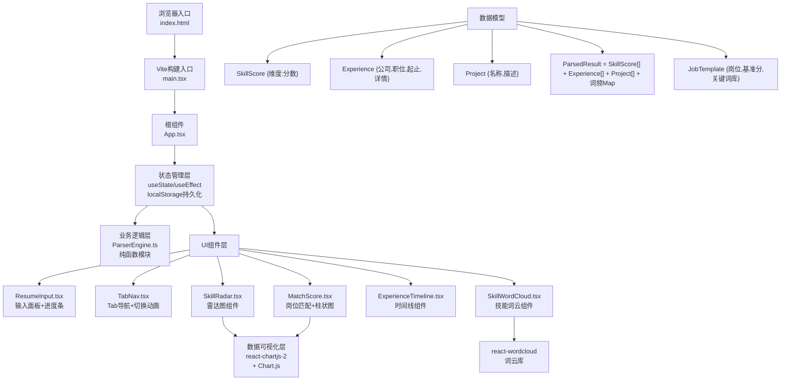

## 1. 架构设计

纯前端应用，无后端依赖。采用分层架构：UI层（React组件）→ 状态管理层（React Hooks + localStorage）→ 业务逻辑层（纯函数引擎）→ 数据可视化层（Chart.js适配层）。



## 2. 技术说明

### 2.1 核心技术栈

| 层级 | 技术选择 | 版本约束 | 用途说明 |
|------|----------|----------|----------|
| 前端框架 | React | ^18.x | 组件化UI构建，使用函数组件+Hooks |
| 语言 | TypeScript | ^5.x | 严格模式（strict:true），完整类型定义 |
| 构建工具 | Vite | ^5.x | 快速HMR，零配置TS支持 |
| Vite插件 | @vitejs/plugin-react | ^4.x | React JSX/TSX转换，Fast Refresh |
| 图表库 | Chart.js | ^4.x | 雷达图、柱状图核心渲染引擎 |
| React图表适配 | react-chartjs-2 | ^5.x | Chart.js的React封装，ref调用动画 |
| 词云库 | react-wordcloud | ^1.2.x | D3驱动的响应式词云组件 |
| ID生成 | uuid | ^9.x | 生成时间线节点唯一key |
| 状态管理 | React Hooks | 内置 | useState/useEffect/useRef/useCallback |
| 持久化 | localStorage | 浏览器API | 解析结果和用户选择的本地存储 |

### 2.2 项目初始化方式

使用用户指定的手动创建项目结构方式（不使用pnpm create vite-init），按需求文件清单逐个创建，确保精确匹配：

- 根目录直接创建package.json、vite.config.js、tsconfig.json、index.html
- src目录下按模块创建App.tsx、ParserEngine.ts、SkillRadar.tsx、ExperienceTimeline.tsx、MatchScore.tsx等
- 通过`npm install`一次性安装全部依赖
- 通过`npm run dev`启动Vite开发服务器

## 3. 路由定义

纯单页面应用（SPA），无多页路由。所有内容通过Tab导航切换展示在主区域内，使用组件内部state管理Tab选中状态，而非URL路由。

| 逻辑路由 | 对应组件 | 状态值 |
|----------|----------|--------|
| 初始输入态 | ResumeInput（占满左侧）+ 空态提示 | parsing=false, parsed=false |
| 解析进行态 | 进度条覆盖层 | parsing=true |
| 技能分析Tab | SkillRadar + SkillWordCloud | activeTab="skills" |
| 经历时间线Tab | ExperienceTimeline | activeTab="timeline" |
| 岗位匹配Tab | MatchScore + JobSelect | activeTab="matching" |
| 移动端折叠输入 | 汉堡菜单展开面板 | mobileInputOpen=true/false |

## 4. 数据模型定义

### 4.1 TypeScript核心类型

```typescript
// 技能维度枚举
type SkillDimension = '前端' | '后端' | '数据库' | '设计' | '项目管理' | '沟通';

// 技能评分对象
interface SkillScores {
  前端: number;
  后端: number;
  数据库: number;
  设计: number;
  项目管理: number;
  沟通: number;
}

// 词云数据项
interface WordFrequency {
  text: string;
  value: number;
}

// 工作经历项
interface ExperienceItem {
  id: string;
  company: string;
  position: string;
  startDate: string;
  endDate: string;
  description: string;
  projects: string[];
}

// 解析结果总对象
interface ParsedResult {
  skillScores: SkillScores;
  wordFrequencies: WordFrequency[];
  experiences: ExperienceItem[];
  rawText: string;
  parsedAt: number;
}

// 岗位模板
type JobRole = '前端工程师' | '数据工程师' | '产品经理';

interface JobBenchmark {
  baseline: SkillScores;
  keywords: string[];
  description: string;
}

// 匹配结果项
interface MatchComparison {
  dimension: SkillDimension;
  resumeScore: number;
  baselineScore: number;
  diffPercent: number;
  hasWarning: boolean;
}

// 岗位匹配总结果
interface MatchResult {
  totalScore: number;
  scoreColor: 'red' | 'orange' | 'green';
  comparisons: MatchComparison[];
  matchedKeywords: string[];
  missingKeywords: string[];
}

// 应用全局State
interface AppState {
  resumeText: string;
  parsedResult: ParsedResult | null;
  isParsing: boolean;
  parseProgress: number;
  activeTab: 'skills' | 'timeline' | 'matching';
  selectedJob: JobRole;
  mobileInputOpen: boolean;
}
```

### 4.2 localStorage存储结构

```typescript
// localStorage key 常量
const STORAGE_KEYS = {
  RESUME_TEXT: 'resume_dashboard:text',
  PARSED_RESULT: 'resume_dashboard:parsed',
  ACTIVE_TAB: 'resume_dashboard:tab',
  SELECTED_JOB: 'resume_dashboard:job',
} as const;

// 序列化策略：JSON.stringify / JSON.parse
// 失效策略：parsedAt超过7天自动清除（下次加载时判断）
```

## 5. 文件结构清单

```
auto37/
├── package.json                  # 依赖+启动脚本
├── index.html                    # Vite入口HTML
├── vite.config.js                # Vite构建配置
├── tsconfig.json                 # TypeScript严格模式
└── src/
    ├── main.tsx                  # React入口（挂载点）
    ├── App.tsx                   # 主组件（状态中枢）
    ├── styles/
    │   └── globals.css           # 全局样式+CSS变量+响应式
    ├── types/
    │   └── index.ts              # 集中类型定义
    ├── engine/
    │   └── ParserEngine.ts       # 纯函数解析引擎
    ├── constants/
    │   ├── skillKeywords.ts      # 各维度关键词库
    │   └── jobTemplates.ts       # 岗位基准模板
    ├── components/
    │   ├── ResumeInput.tsx       # 左侧输入面板+解析按钮
    │   ├── ParseProgress.tsx     # 进度条+过渡动画
    │   ├── TabNav.tsx            # Tab导航栏+选中动画
    │   ├── SkillRadar.tsx        # 雷达图（Chart.js）
    │   ├── SkillWordCloud.tsx    # 技能词云
    │   ├── ExperienceTimeline.tsx# 垂直时间线
    │   ├── TimelineCard.tsx      # 单个经历卡片（子组件）
    │   ├── MatchScore.tsx        # 岗位匹配主容器
    │   ├── MatchBarChart.tsx     # 柱状图对比（Chart.js）
    │   ├── KeywordComparison.tsx # 高频匹配/缺失关键词展示
    │   └── MobileHeader.tsx      # 移动端汉堡菜单
    └── hooks/
        ├── useLocalStorage.ts    # localStorage读写Hook
        └── useResponsive.ts      # 视窗尺寸监听Hook
```

## 6. 关键实现要点

### 6.1 ParserEngine解析算法

- **维度评分算法**：基于关键词词频加权，每个维度预设30~50个关键词，命中次数×权重系数，Sigmoid归一化至0~100区间
- **工作经历提取**：正则匹配日期模式（YYYY-MM、YYYY.MM、YYYY年MM月等），前后文提取公司名（紧邻「公司/科技/集团/有限」等后缀）和职位（紧邻「工程师/经理/主管/总监」等后缀）
- **项目名称提取**：识别「项目名称：」「负责项目：」等关键字，或匹配引号内/书名号内的专有名词

### 6.2 动画实现策略

| 动画 | 实现方式 | 性能说明 |
|------|----------|----------|
| 雷达图数据点依次缩放 | Chart.js animation选项 + 自定义onProgress回调，每个维度延迟delay=i×80ms | 使用requestAnimationFrame，GPU加速 |
| 雷达图整体淡入 | CSS opacity + keyframes fadeIn 0.6s | transform+opacity合成层 |
| 柱状图柱体上升 | Chart.js默认animation，duration=600ms，easing=easeOutCubic | Canvas原生绘制 |
| 超差柱抖动 | CSS @keyframes shake 0.3s，检测到diff>20%时添加className | 纯CSS合成动画 |
| Tab内容水平滑入 | CSS transform: translateX(-20px→0) + opacity，配合transition 0.3s | 左→右方向，每次切换重设translateX |
| Tab下划线宽度过渡 | position:absolute的伪元素::after，width从0→100%，transition: width .3s cubic-bezier | 避免回流，仅重绘 |
| 时间线卡片展开 | max-height: 0 → max-height: 1000px过渡0.4s ease，同时overflow:hidden | 使用max-height而非height:auto避免过渡无效 |
| 卡片闪烁提示 | @keyframes flashBg 0.2s 从#FFFFFF到#E3F2FD再回 | 背景色过渡，仅触发paint |
| 词云悬停放大 | :hover { transform: scale(1.15); transition: transform .2s; } | transform独立合成层，不回流 |
| 按钮悬停右移 | :hover { transform: translateX(3px); box-shadow: 0 6px 16px rgba(...); } | 双属性同步过渡，GPU加速 |
| 左侧淡出/主区域淡入 | 条件渲染配合CSS class切换，opacity 0→1过渡0.6s | 分层容器，各自独立过渡 |

### 6.3 Chart.js配置关键点

```typescript
// Chart.js全局注册
import {
  Chart, RadialLinearScale, PointElement, LineElement,
  Filler, Tooltip, Legend, CategoryScale, LinearScale,
  BarElement
} from 'chart.js';
Chart.register(RadialLinearScale, PointElement, LineElement,
  Filler, Tooltip, Legend, CategoryScale, LinearScale, BarElement);
```

### 6.4 响应式与性能优化

- **Chart.js响应式**：maintainAspectRatio=true，responsive=true，父容器用padding-top百分比保持宽高比
- **词云响应式**：监听window.resize，debounce 16ms后重算容器宽度
- **重渲染控制**：useMemo缓存解析结果、匹配计算，useCallback传递事件处理函数
- **localStorage读写**：读写操作包裹try/catch，避免隐私模式异常；写入时合并更新，避免频繁序列化
- **初始加载性能**：react-wordcloud延迟到Tab首次切换时再挂载（懒挂载），避免首屏同步计算词布局
