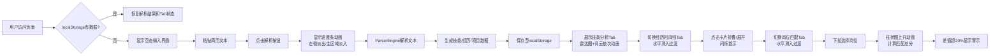

## 1. 产品概述

智能简历解析与可视化仪表盘是一款面向求职者的简历自我分析工具，通过自动化文本解析技术将简历内容拆解为结构化数据，并以可视化图表形式直观展示技能分布、工作经历脉络及岗位匹配程度，帮助求职者精准定位自身短板并制定提升方向。

- **核心价值**：解决求职者海投简历后对自身竞争力认知模糊、缺乏系统性岗位匹配分析的痛点
- **目标用户**：正在求职的各层级职场人士，尤其适用于转行、跨领域求职者
- **产品定位**：轻量级、纯前端、零配置即可使用的个人简历诊断工具

## 2. 核心功能

### 2.1 功能模块总览

| 模块名称 | 核心能力 | 关键技术 |
|----------|----------|----------|
| 简历文本解析 | 提取技能标签、工作经历、项目名称 | 正则匹配 + 关键词库 |
| 技能雷达图 | 6维度技能评分可视化 | Chart.js 雷达图 |
| 技能词云 | 高频技能关键词可视化 | react-wordcloud |
| 经历时间线 | 垂直时间线展示工作经历节点 | CSS动画 + React状态管理 |
| 岗位匹配评分 | 与预设岗位模板对比评分 | Chart.js 柱状图 |
| 数据持久化 | localStorage存储解析结果和选择 | 浏览器本地存储 |

### 2.2 页面详情

| 页面区域 | 模块名称 | 功能描述 |
|----------|----------|----------|
| 左侧面板 | 简历输入模块 | 文本输入框（30%宽度，#F5F5F5背景，#1565C0边框，圆角8px），解析按钮（#1565C0→#42A5F5渐变，悬停右移3px） |
| 左侧面板 | 进度条模块 | 解析中显示进度条，左侧面板淡出、主区域0.6s淡入 |
| 主区域顶部 | Tab导航 | 三个Tab（技能分析、经历时间线、岗位匹配），选中态底部2px #1565C0下划线（宽度随文字过渡），未选中灰#BDBDBD |
| Tab-技能分析 | 雷达图模块 | 6维度：前端、后端、数据库、设计、项目管理、沟通；半透明白#FFFFFF90底色，浅灰#E0E0E0网格，浅蓝#90CAF950填充，深蓝#1565C0描边；数据点0.5s依次缩放动画 |
| Tab-技能分析 | 技能词云模块 | 字号10~24px根据频率，颜色#3F51B5→#FF9800渐变，悬停scale=1.15显示频次 |
| Tab-经历时间线 | 时间线模块 | 垂直布局，圆点节点（12px，#1565C0），左侧日期，右侧卡片（400px宽，#FFFFFF背景，圆角12px，2px #E3F2FD边框）；卡片展开高度0→auto 0.4s过渡，点击折叠/展开，展开卡片#E3F2FD背景闪烁提示 |
| Tab-岗位匹配 | 下拉选择 | 可选前端工程师、数据工程师、产品经理三个职位 |
| Tab-岗位匹配 | 柱状图对比 | 左侧简历得分（#1565C0柱，30px宽，0→目标高度0.6s上升），右侧岗位基准（#BDBDBD虚线）；差值超20%时顶部红色感叹号+0.3s抖动动画 |
| Tab-岗位匹配 | 匹配总分 | 0~100分，<60红#F44336，>80绿#4CAF50，中间橙黄#FF9800 |

## 3. 核心流程

### 3.1 主用户流程

用户打开页面 → 粘贴简历文本到左侧输入框 → 点击「解析」按钮 → 系统展示进度条（左侧淡出、主区域淡入）→ 自动进入技能分析Tab → 用户可切换至经历时间线查看详情 → 用户切换至岗位匹配Tab → 选择目标岗位 → 查看柱状图对比和匹配总分 → 刷新页面后数据保留

### 3.2 流程图

## 4. 用户界面设计

### 4.1 设计风格

- **主色调**：深蓝 #1565C0（品牌色）、浅蓝 #42A5F5、淡蓝 #E3F2FD、填充蓝 #90CAF950
- **辅助色**：红 #F44336（警示）、绿 #4CAF50（优秀）、橙黄 #FF9800（中等）、蓝紫 #3F51B5
- **中性色**：浅灰 #F5F5F5、灰 #BDBDBD、浅灰线 #E0E0E0、白 #FFFFFF
- **按钮风格**：渐变背景（#1565C0→#42A5F5），悬停右移3px+加深阴影，150px固定宽度
- **字体**：使用系统无衬线字体栈，正文14px，标题18px~24px
- **布局风格**：桌面端左右分栏（30%:70%），移动端（<768px）顶部折叠面板
- **卡片风格**：白色背景，圆角12px，2px浅蓝边框，带阴影层次

### 4.2 页面设计概览

| 页面区域 | 模块名称 | UI元素要点 |
|----------|----------|------------|
| 全局布局 | 响应式容器 | 宽度1024~1920px范围内自适应，图表随视窗等比缩放 |
| 左侧输入 | 文本框 | #F5F5F5背景，2px #1565C0边框，圆角8px，占30%宽度 |
| 左侧输入 | 解析按钮 | 150px宽，#1565C0→#42A5F5渐变，悬停transform:translateX(3px)，阴影加深 |
| 进度条 | 过渡动画 | 左侧面板opacity淡出，主区域0.6s opacity淡入，进度条线性动画 |
| Tab导航 | 选中态 | 底部2px #1565C0下划线，宽度从文字宽度自适应过渡（transition: width .3s） |
| Tab切换 | 内容过渡 | transform: translateX水平滑动0.3s，进入方向左→右 |
| 雷达图 | 动画细节 | 6个数据点依次延迟scale动画（0→1，每个间隔0.08s），总时长0.5s |
| 词云 | 悬停效果 | transform: scale(1.15) transition，tooltips显示频次 |
| 时间线 | 节点卡片 | 圆点12px，卡片展开时max-height过渡0.4s，展开态背景闪烁0.2s |
| 柱状图 | 动画细节 | 柱体从y=0上升至目标高度0.6s，超差柱抖动animation 0.3s |
| 匹配分数 | 颜色规则 | 阈值着色，数字加粗显示 |
| 移动端 | 折叠面板 | <768px时左侧变顶部汉堡菜单，点击展开/收起 |

### 4.3 响应式设计

- **桌面优先**：1024px~1920px宽度范围内图表容器等比缩放，使用max-width限制最大宽度
- **断点768px**：左侧输入框从30%宽度变为顶部折叠面板，通过汉堡图标按钮展开/收起，主区域占满全屏宽度
- **触控优化**：移动端时间线节点增大点击区域（padding至少44x44px），按钮最小尺寸适配手指触控

### 4.4 性能要求

| 指标 | 目标值 | 说明 |
|------|--------|------|
| 雷达图渲染 | ≤500ms | 含首次绘制和动画完成 |
| 柱状图渲染 | ≤500ms | 含首次绘制和动画完成 |
| 动画帧率 | ≥40fps | 所有过渡/动画CSS或Canvas渲染 |
| 页面初始加载 | ≤2s | 不含首次解析延迟，首屏TTI |
| 内存占用 | ≤200MB | 页面空闲时 |
