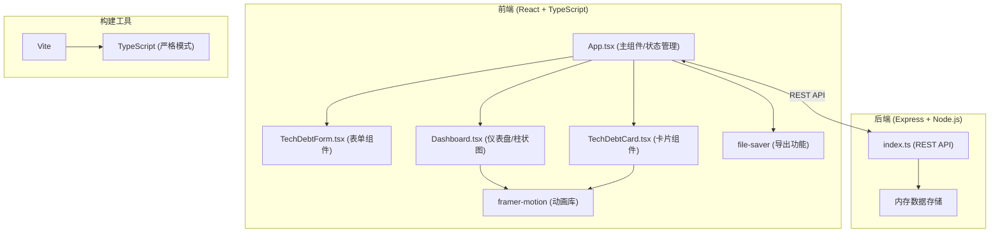
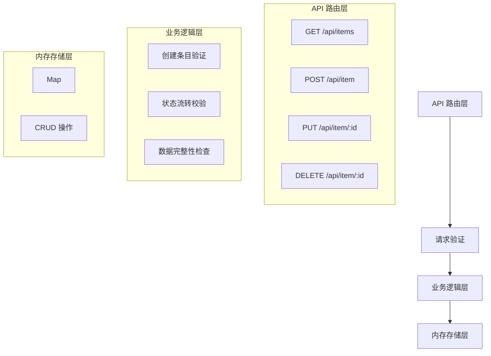
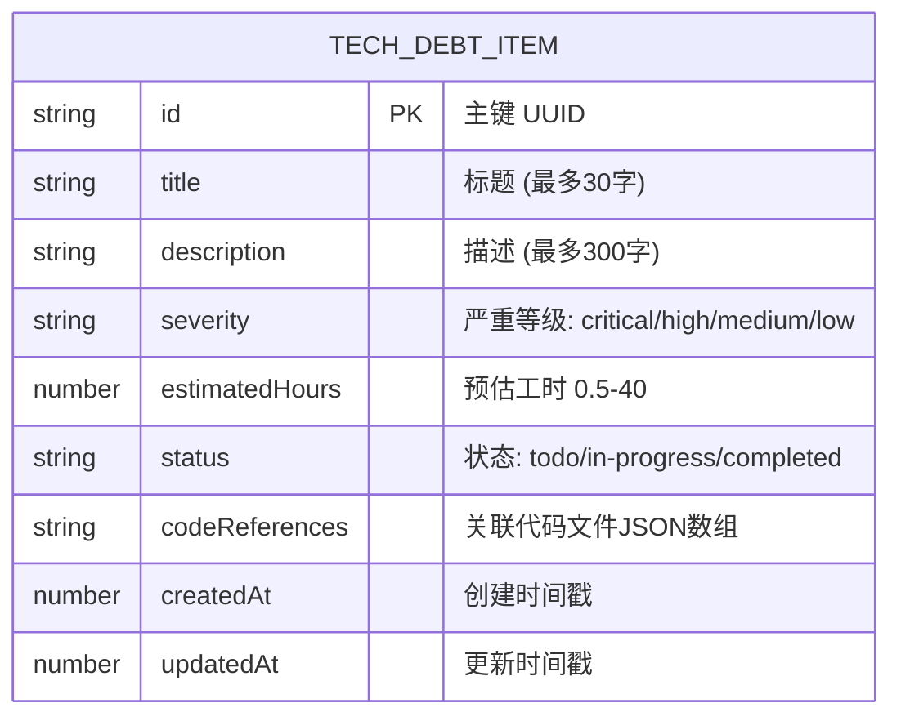

## 1. 架构设计



## 2. 技术描述

- **前端**：React@18 + TypeScript@5 + Vite@5
- **后端**：Express@4 + Node.js + 内存数据存储
- **动画库**：framer-motion@11（拖拽、过渡、弹性动画）
- **导出功能**：file-saver@2
- **HTTP客户端**：内置fetch API
- **ID生成**：uuid@9
- **跨域**：cors@2
- **初始化工具**：Vite脚手架
- **包管理器**：npm

## 3. 目录结构

```
auto38/
├── package.json
├── index.html
├── vite.config.js
├── tsconfig.json
├── src/
│   ├── App.tsx
│   ├── types.ts          (类型定义)
│   ├── utils/
│   │   ├── healthScore.ts (健康度计算)
│   │   └── fileStats.ts  (文件统计)
│   └── components/
│       ├── TechDebtForm.tsx
│       ├── TechDebtCard.tsx
│       └── Dashboard.tsx
└── server/
    └── index.ts
```

## 4. 路由定义

| 路由 | 目的 |
|------|------|
| / | 主应用页面，包含完整看板功能 |

## 5. API 定义

### 5.1 TypeScript 类型定义

```typescript
type SeverityLevel = 'critical' | 'high' | 'medium' | 'low';
type ItemStatus = 'todo' | 'in-progress' | 'completed';

interface CodeReference {
  filePath: string;
  lineNumber?: number;
}

interface TechDebtItem {
  id: string;
  title: string;
  description: string;
  severity: SeverityLevel;
  estimatedHours: number;
  status: ItemStatus;
  codeReferences: CodeReference[];
  createdAt: number;
  updatedAt: number;
}

interface FileStats {
  filePath: string;
  totalItems: number;
  totalHours: number;
  maxSeverity: SeverityLevel;
}

interface HealthScore {
  score: number;
  comment: string;
  breakdown: {
    critical: number;
    high: number;
    medium: number;
    low: number;
  };
}
```

### 5.2 API 端点

| 方法 | 路径 | 描述 | 请求体 | 响应 |
|------|------|------|--------|------|
| GET | `/api/items` | 获取所有债务条目 | - | `TechDebtItem[]` |
| POST | `/api/item` | 创建新债务条目 | `Omit<TechDebtItem, 'id' \| 'createdAt' \| 'updatedAt' \| 'status'>` | `TechDebtItem` |
| PUT | `/api/item/:id` | 更新债务条目 | `Partial<TechDebtItem>` | `TechDebtItem` |
| DELETE | `/api/item/:id` | 删除债务条目 | - | `{ success: boolean }` |

## 6. 服务端架构



## 7. 数据模型

### 7.1 ER 图



### 7.2 严重等级配置

| 等级 | 值 | 颜色 | 权重 | 描述 |
|------|----|------|------|------|
| 严重 | critical | #E53935 | 4 | 必须立即修复的严重问题 |
| 高 | high | #FB8C00 | 3 | 重要问题，需要尽快修复 |
| 中 | medium | #FDD835 | 2 | 中等问题，计划修复 |
| 低 | low | #C0CA33 | 1 | 轻微问题，可延后处理 |

### 7.3 健康度计算公式

```
健康度得分 = 100 - Σ(每个待处理条目权重 × 归一化工时)

其中:
- 权重: critical=4, high=3, medium=2, low=1
- 归一化工时 = estimatedHours / 40 (最大工时归一化到[0,1])
- 最低得分0分，最高得分100分
```

评分等级：
- 90-100: 健康 - "项目状态良好，技术债务可控"
- 70-89: 良好 - "存在少量技术债务，建议关注"
- 40-69: 中等 - "技术债务较多，建议制定清理计划"
- 0-39: 危险 - "债务风险高，需本周复盘"

## 8. 性能优化策略

1. **虚拟列表**：使用 `react-window` 实现大数据量下的虚拟滚动
2. **React.memo**：卡片组件使用 memo 优化避免不必要重渲染
3. **useCallback/useMemo**：合理使用缓存函数和计算结果
4. **GPU 加速动画**：仅使用 transform 和 opacity 属性做动画
5. **will-change**：对拖拽元素提前声明优化
6. **事件委托**：减少事件监听器数量
7. **防抖处理**：表单输入和搜索框防抖
8. **分批加载**：数据过多时分批渲染
