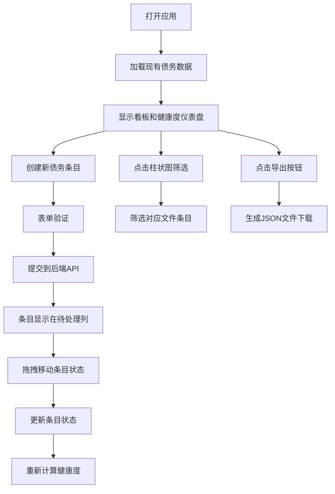

## 1. 产品概述

技术债务管理系统是一款帮助开发团队高效记录、追踪和评估技术债务的Web应用。解决技术债务分散在代码注释、脑图和需求文档中难以统一管理的问题，避免长期积累拖慢开发节奏和降低代码质量。

- 核心价值：统一管理技术债务，可视化评估项目健康度，提升代码质量
- 目标用户：开发团队、技术负责人、架构师
- 产品定位：轻量级、可视化、高性能的技术债务看板工具

## 2. 核心特性

### 2.1 用户角色

| 角色 | 注册方式 | 核心权限 |
|------|----------|----------|
| 开发人员 | 无需注册，本地使用 | 创建、编辑、删除、拖拽移动债务条目 |
| 技术负责人 | 无需注册，本地使用 | 查看健康度仪表盘，导出数据，管理所有条目 |

### 2.2 功能模块

1. **债务条目管理**：创建、编辑、删除技术债务条目，支持拖拽状态流转
2. **看板视图**：三列看板（待处理、进行中、已完成），卡片式展示
3. **健康度仪表盘**：半圆弧形仪表盘展示债务健康度得分，自动计算评级
4. **文件关联统计**：关联代码文件路径，柱状图展示各文件债务工时分布
5. **数据导出**：一键导出所有条目为JSON文件

### 2.3 页面详情

| 页面名称 | 模块名称 | 功能描述 |
|----------|----------|----------|
| 主页面 | 顶部导航栏 | 应用标题、健康度得分预览、导出按钮 |
| 主页面 | 左侧表单面板 | 新建债务条目表单（标题、描述、严重等级、预估工时、文件路径） |
| 主页面 | 顶部统计区 | 关联文件柱状图、健康度仪表盘 |
| 主页面 | 右侧看板区域 | 三列拖拽看板，展示债务卡片，支持筛选 |
| 主页面 | 债务卡片组件 | 展示条目详情，拖拽交互，存档标记 |

## 3. 核心流程

### 3.1 主要用户流程

用户打开应用 → 查看当前债务状态和健康度 → 在左侧表单创建新债务条目 → 条目出现在待处理列 → 拖拽条目到进行中/已完成 → 点击柱状图筛选特定文件的债务 → 导出数据进行存档

### 3.2 流程图

## 4. 用户界面设计

### 4.1 设计风格

- **主题**：深色工业风，强调专业感和数据可视化
- **主色调**：深灰背景#1E1E1E，卡片背景#2D2D2D，强调色蓝紫#7C4DFF
- **严重等级色**：红#E53935、橙#FB8C00、黄#FDD835、浅绿#C0CA33
- **文字颜色**：主色浅灰#E0E0E0，次要文字#9E9E9E
- **按钮风格**：深蓝#1976D2背景，白色文字，圆角8px，悬停有微妙阴影
- **字体**：使用JetBrains Mono作为等宽字体展示代码路径，Inter作为正文，Geist作为标题字体
- **布局风格**：左右分栏布局，左侧30%表单，右侧70%看板，卡片式设计
- **动效风格**：framer-motion实现流畅拖拽动画，弹性回弹效果，淡入过渡

### 4.2 页面设计概览

| 页面名称 | 模块名称 | UI元素 |
|----------|----------|--------|
| 主页面 | 导航栏 | 高度56px，左侧应用标题，右侧导出按钮（宽140px），健康度预览 |
| 主页面 | 左侧表单 | 插槽式面板，输入框带标签，严重等级用彩色圆点选择器，滑块选择工时 |
| 主页面 | 仪表盘 | 半圆弧形进度条（红到绿渐变），指针旋转动画0.8s，文字评语 |
| 主页面 | 柱状图 | 柱高按工时比例，柱色按严重等级，点击有淡入筛选过渡0.3s |
| 主页面 | 看板卡片 | 深色卡片，左上角严重等级色条，右上角严重等级标签，底部文件路径和工时 |
| 主页面 | 拖拽交互 | 拖拽时卡片缩放0.2s，浅灰阴影#BDBDBD，弹性回弹cubic-bezier 0.3s |
| 主页面 | 成功弹窗 | 半透明黑背景，宽300px，圆角12px，0.3s淡入 |

### 4.3 响应式设计

- **桌面端（>768px）**：左右分栏布局，左侧30%表单，右侧70%三列看板
- **移动端（≤768px）**：单列堆叠布局，表单在上，看板三列变为垂直堆叠，卡片宽度自适应
- **触摸优化**：增大点击区域，拖拽有触觉反馈，滚动性能优化
- **看板最小高度**：600px

### 4.4 性能设计

- **虚拟滚动**：200条以上数据时启用虚拟滚动保持60fps
- **GPU加速**：使用transform和opacity属性实现动画
- **防抖节流**：表单输入和拖拽事件防抖处理
- **内存优化**：及时清理事件监听器，使用React.memo优化重渲染
