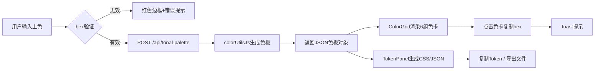

## 1. 产品概述

Material Design 3配色方案生成与设计Token导出工具，旨在解决平面设计师与UI开发人员之间配色衔接效率低下的问题。通过输入主色，系统自动生成完整的M3配色方案，并支持一键导出CSS/JSON设计Token，实现设计到开发的无缝衔接。

- 目标用户：平面设计师、UI开发人员、前端工程师
- 核心价值：快速生成M3标准色板、可视化预览、设计Token一键导出、提高设计开发协作效率

## 2. 核心功能

### 2.1 用户角色
无需用户注册，面向所有用户开放使用。

### 2.2 功能模块
1. **主色输入与控制区**：hex颜色输入、原生取色器、预设色板快捷选择
2. **色板可视化网格**：M3色系分组展示（primary/secondary/tertiary/error/neutral/neutralVariant）、色卡复制、对比度验证标注
3. **设计Token面板**：CSS自定义属性 / JSON格式切换、Token复制、文件导出（.css/.json）
4. **辅助功能**：加载骨架屏、Toast提示、回到顶部按钮、错误提示

### 2.3 页面详情
| 页面名称 | 模块名称 | 功能描述 |
|-----------|-------------|---------------------|
| 主页面 | 主色输入区 | 320px宽输入框，左侧color picker，右侧hex文本，背景实时显示颜色，回车/失焦触发，无效hex红色边框+提示 |
| 主页面 | 预设色板区 | 5个预设主色按钮（#6750A4、#006D40、#BA1A1A、#0267C1、#7C5800），40x40px圆角8px |
| 主页面 | 色板网格区 | 6个色系分组，每组含主色/container/on-色，响应式4列→2列→1列，色卡60x60px圆角12px，hover放大1.05，点击复制 |
| 主页面 | Token面板 | CSS/JSON单选切换，文本展示区，复制Token按钮，导出文件按钮 |
| 主页面 | Toast提示 | 复制成功提示，顶部居中300px宽，深灰半透明，2s消失 |
| 主页面 | 骨架屏 | 3行x6列灰色脉冲方块，加载时显示 |

## 3. 核心流程

用户输入主色hex或使用取色器选择颜色 → 系统验证hex合法性 → 调用后端API `/api/tonal-palette` → chroma-js计算TonalPalette → 返回完整色板JSON → 左侧渲染色卡网格（含对比度标注）→ 右侧生成CSS/JSON Token → 用户可复制单个色值、复制全部Token、导出文件

## 4. 用户界面设计

### 4.1 设计风格
- 配色：浅色模式，背景#FFFBFE，主文本#1C1B1F，分隔线#E7E0EC，色系标题#49454F
- 按钮风格：圆角设计，内联白色背景单选按钮组（CSS/JSON切换）
- 字体：System Font Stack
- 布局：左右双栏（左55% / 右45%），右侧固定高度内部滚动
- 图标风格：取色器原生图标，简洁几何风格

### 4.2 页面设计概述
| 页面名称 | 模块名称 | UI元素 |
|-----------|-------------|-------------|
| 主页面 | 主色输入区 | 320px宽输入框，背景实时预览色，边框错误态#E53935 |
| 主页面 | 色卡网格 | 60x60px色卡圆角12px，hover缩放过渡0.2s ease-out，对比度标注10px浅灰#9E9E9E，低对比度警告色#FF9800 |
| 主页面 | Token面板 | 右侧45%宽度，固定vh高度，内部可滚动 |
| 主页面 | 回到顶部 | 右下角浅灰圆形悬浮按钮，点击smooth滚动 |

### 4.3 响应式设计
- Desktop-first设计
- 色板网格断点：768px变2列，480px变1列
- 小屏设备两栏可改为上下布局

### 4.4 性能指标
- API响应→色板渲染：≤500ms
- 色板网格滚动帧率：60fps
- Token文本更新：流畅无卡顿
- 文件导出触发：≤200ms
