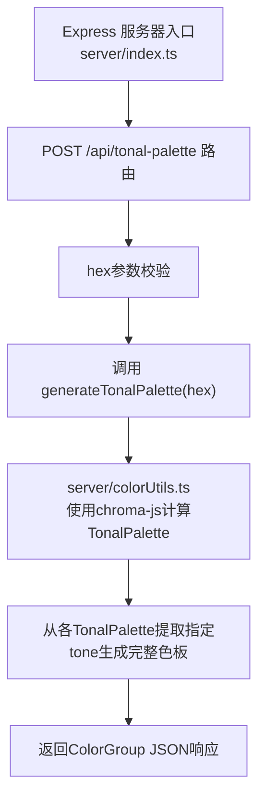
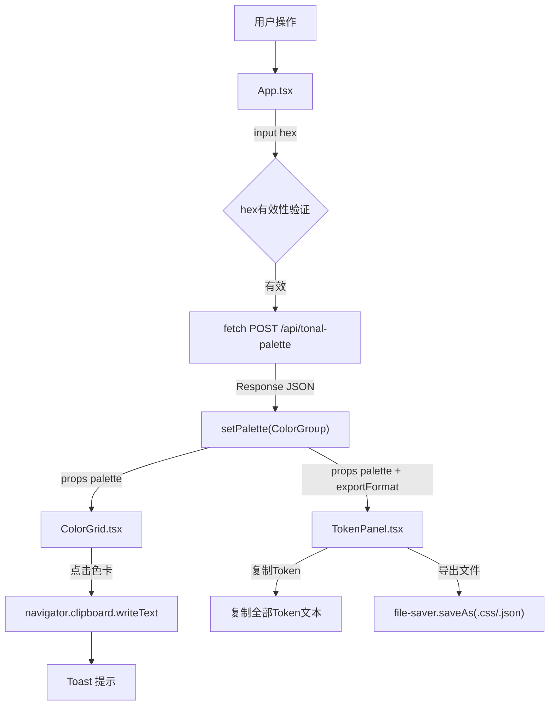

## 1. 架构设计

```mermaid
graph TD
    Browser["浏览器端 React 应用"] -->|HTTP POST| ViteProxy["Vite Dev Proxy :5173"]
    ViteProxy -->|转发请求| Express["Express 服务 :3001"]
    Express -->|调用| ColorUtils["colorUtils.ts 色彩算法"]
    ColorUtils -->|使用| Chroma["chroma-js 库"]
    Chroma -->|TonalPalette算法| ColorUtils
    Express -->|返回JSON| ViteProxy
    ViteProxy -->|响应| Browser

    subgraph 前端 (React + TypeScript + Vite)
        App["App.tsx 主组件"]
        ColorGrid["ColorGrid.tsx 色板网格"]
        TokenPanel["TokenPanel.tsx Token面板"]
        App -->|props传递色板| ColorGrid
        App -->|props传递色板+格式| TokenPanel
    end

    subgraph 后端 (Express + TypeScript)
        Server["server/index.ts Express入口"]
        Utils["server/colorUtils.ts 色彩工具"]
        Server -->|调用| Utils
    end
```

## 2. 技术描述

- **前端框架**：React 18 + TypeScript（严格模式）
- **构建工具**：Vite（配置proxy转发到后端3001端口）
- **后端框架**：Express 4.x + TypeScript + CORS
- **色彩处理**：chroma-js（实现TonalPalette算法）
- **文件导出**：file-saver
- **后端服务端口**：3001
- **前端开发端口**：5173（通过proxy转发/api请求到3001）
- **启动脚本**：`npm run dev` 同时启动前端Vite和后端Express

## 3. 路由定义

| 路由 | 目的 |
|-------|---------|
| / | 单页应用主页面，渲染配色工具UI |
| POST /api/tonal-palette | 接收主色hex，返回完整M3色板对象 |

## 4. API定义

### 4.1 POST /api/tonal-palette

**请求体**：
```typescript
interface TonalPaletteRequest {
  hex: string; // 主色hex值，如 "#6750A4"
}
```

**响应体**：
```typescript
interface ColorGroup {
  primary: string;
  onPrimary: string;
  primaryContainer: string;
  onPrimaryContainer: string;
  secondary: string;
  onSecondary: string;
  secondaryContainer: string;
  onSecondaryContainer: string;
  tertiary: string;
  onTertiary: string;
  tertiaryContainer: string;
  onTertiaryContainer: string;
  error: string;
  onError: string;
  errorContainer: string;
  onErrorContainer: string;
  neutral: string;
  onNeutral: string;
  neutralContainer: string;
  onNeutralContainer: string;
  neutralVariant: string;
  onNeutralVariant: string;
  neutralVariantContainer: string;
  onNeutralVariantContainer: string;
  background: string;
  onBackground: string;
  surface: string;
  onSurface: string;
  surfaceVariant: string;
  onSurfaceVariant: string;
  outline: string;
  shadow: string;
}
```

### 4.2 TonalPalette数据结构（内部）
```typescript
interface TonalPalette {
  [tone: number]: string; // tone: 0-100，值为hex色
}
```

### 4.3 generateTonalPalette函数签名
```typescript
export function generateTonalPalette(hex: string): {
  primary: TonalPalette;
  secondary: TonalPalette;
  tertiary: TonalPalette;
  error: TonalPalette;
  neutral: TonalPalette;
  neutralVariant: TonalPalette;
};
```

## 5. 服务端架构



**数据流**：
1. 接收客户端POST请求，从req.body提取hex参数
2. 验证hex格式有效性（正则匹配/#?[0-9A-Fa-f]{6}/）
3. 调用colorUtils.generateTonalPalette生成6个色系的TonalPalette
4. 从各TonalPalette中按M3规范提取对应tone的色值：
   - primary: tone 40, onPrimary: tone 100, primaryContainer: tone 90, onPrimaryContainer: tone 10
   - secondary: 基于HSL旋转的辅色生成，tone与primary对应
   - tertiary: 再次旋转HSL生成三色
   - error: 固定红色系TonalPalette
   - neutral: 去饱和主色生成
   - neutralVariant: 略微饱和的中性色
5. 组合为ColorGroup对象返回JSON

## 6. 前端组件数据流向



## 7. 文件结构与调用关系

```
auto39/
├── package.json              # 依赖管理（react, vite, express, chroma-js, file-saver等）
├── vite.config.js            # Vite构建+proxy配置
├── tsconfig.json             # TS严格模式配置
├── index.html                # 入口HTML
├── server/
│   ├── index.ts              # Express入口，暴露POST /api/tonal-palette
│   │                         # 调用: colorUtils.generateTonalPalette()
│   └── colorUtils.ts         # 色彩算法核心，export generateTonalPalette()
│                             # 使用: chroma-js 的 TonalPalette 算法
└── src/
    ├── App.tsx               # 主组件：状态管理、API调用、布局
    │                         # 传递props给: ColorGrid, TokenPanel
    ├── main.tsx              # React入口渲染
    └── components/
        ├── ColorGrid.tsx     # 色板网格：色卡渲染、复制、对比度标注
        │                     # 接收props: palette: ColorGroup
        └── TokenPanel.tsx    # Token面板：CSS/JSON切换、复制、导出
                              # 接收props: palette: ColorGroup, format: 'css'|'json'
```
