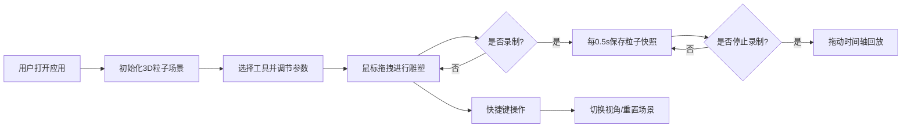

## 1. 产品概述
虚拟雕塑与粒子变化系统是一款基于Web的3D交互创作工具，通过粒子系统模拟黏土雕塑过程，降低3D建模的学习门槛，让用户能像画画一样直觉地进行3D形态创作。
- 面向创意工作者、艺术爱好者和3D建模初学者，提供直观的手势式创作体验
- 核心价值：将复杂的3D建模转化为简单的鼠标拖拽交互，配合实时视觉反馈和动画回放功能

## 2. 核心功能

### 2.1 功能模块
1. **3D粒子雕塑视图**：彩色粒子三维立方体空间，支持雕刻、堆叠、喷色、平滑四种操作
2. **工具控制面板**：右侧工具选择面板，含独立的游标大小和强度调节滑块
3. **回放时间轴**：顶部录制/播放控制条，支持创作过程录制与逐帧回放
4. **视角与快捷键系统**：正交/透视投影切换、场景重置、快捷键提示悬浮窗

### 2.2 功能详情
| 模块名称 | 子功能 | 功能描述 |
|-----------|-------------|---------------------|
| 3D粒子雕塑视图 | 粒子系统 | 8000个暖白色粒子均匀分布在立方体空间，直径3px，背景深灰#1a1a2e |
| 3D粒子雕塑视图 | 雕刻操作 | 鼠标左键拖拽产生凹陷，画笔半径2单位，0.2s弹性过渡动画 |
| 3D粒子雕塑视图 | 堆叠操作 | 鼠标拖拽产生突起，粒子向画笔中心聚拢 |
| 3D粒子雕塑视图 | 喷色操作 | 在选定区域随机改变粒子颜色为预设色板颜色 |
| 3D粒子雕塑视图 | 平滑操作 | 降低粒子突起高度差，使表面更平滑 |
| 工具控制面板 | 工具切换 | 雕刻/堆叠/喷色/平滑四个工具按钮，切换时0.3s ease-out滑入动画 |
| 工具控制面板 | 参数调节 | 每个工具独立的游标大小和强度滑块 |
| 回放时间轴 | 录制功能 | 每0.5s记录一次全局粒子位置快照 |
| 回放时间轴 | 播放控制 | 录制/停止、播放/暂停按钮，时间轴滑块拖动同步更新粒子状态 |
| 回放时间轴 | 渐变显示 | 时间轴背景从绿#4caf50→蓝#2196f3→紫#9c27b0渐变色 |
| 视角系统 | 投影切换 | Shift+空格切换正交/透视投影，1s cubic-bezier平滑过渡 |
| 视角系统 | 景深效果 | 透视模式下场景边缘出现CSS滤镜景深模糊 |
| 视角系统 | 场景重置 | R键一键重置所有粒子，0.8s从外向内收缩聚拢动画 |
| 快捷键系统 | 提示悬浮 | 右下角半透明黑色背景圆角8px悬浮窗，快捷键亮蓝#00bcd4高亮 |

## 3. 核心流程
用户打开应用 → 进入3D粒子视图 → 选择右侧工具并调节参数 → 鼠标拖拽进行雕塑创作 → 点击录制记录创作过程 → 完成后拖动时间轴回放 → 按快捷键切换视角或重置场景

## 4. 用户界面设计

### 4.1 设计风格
- **主色调**：深灰#1a1a2e背景，淡蓝#6c63ff主题色，暖白#e0d6c8粒子色
- **面板风格**：半透明深灰#2d2d44带毛玻璃效果backdrop-filter: blur(10px)
- **按钮风格**：圆角10px胶囊形状，选中填充淡蓝#6c63ff，未选中透明边框#6c63ff
- **字体**：Segoe UI, sans-serif系统字体
- **动效**：所有交互0.2s线性过渡，工具切换0.3s ease-out滑入动画

### 4.2 页面布局
| 区域 | 占比 | 内容 |
|-----------|-------------|-------------|
| 顶部回放控制条 | 10%高度 | 录制按钮、播放按钮、时间轴滑块、帧数显示 |
| 左侧3D视图 | 80%宽度，90%高度 | Three.js粒子立方体渲染区域 |
| 右侧控制面板 | 20%宽度，90%高度 | 工具选择按钮、参数滑块、快捷键提示 |
| 右下角悬浮 | 固定定位 | 快捷键提示卡片 |

### 4.3 响应式设计
- 桌面端（>768px）：左右分栏布局，3D视图占80%，控制面板占20%
- 移动端（≤768px）：上下堆叠布局，3D视图在上，控制面板在下

### 4.4 3D场景指导
- **环境**：深灰#1a1a2e纯色背景，营造沉浸式创作氛围
- **光照**：柔和的环境光 + 方向光，突出粒子立体感
- **摄像机**：默认正交投影，支持透视投影切换，围绕场景中心旋转
- **粒子系统**：Points材质，8000个粒子均匀分布在10x10x10立方体空间
- **性能优化**：Web Worker离线计算粒子位置，保证60fps渲染
