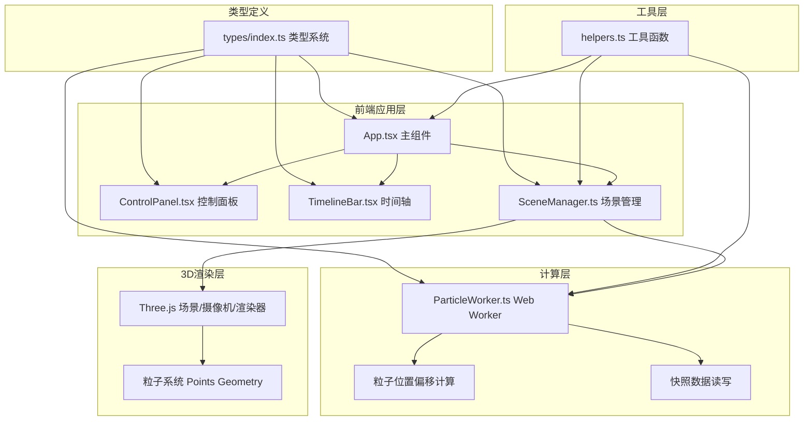

## 1. 架构设计



## 2. 技术描述
- **前端框架**：React@18 + TypeScript@5
- **构建工具**：Vite@5 + @vitejs/plugin-react
- **3D引擎**：Three.js@0.160 + @types/three
- **并行计算**：Web Worker（粒子位置计算与快照处理）
- **状态管理**：React useState/useRef（无需额外状态库）
- **样式方案**：原生CSS + CSS变量 + Flexbox布局

## 3. 文件结构
| 文件路径 | 职责描述 |
|-------|---------|
| package.json | 项目依赖与脚本配置 |
| index.html | 入口HTML，提供挂载容器 |
| vite.config.js | Vite构建配置，路径别名与CommonJS兼容 |
| tsconfig.json | TypeScript严格模式配置 |
| src/main.tsx | React应用入口，渲染App并初始化场景 |
| src/components/App.tsx | 主应用组件，布局与全局状态管理 |
| src/components/ControlPanel.tsx | 右侧工具面板，工具选择与参数调节 |
| src/components/TimelineBar.tsx | 顶部回放控制条，录制播放与时间轴 |
| src/modules/SceneManager.ts | Three.js场景管理，粒子系统与交互 |
| src/modules/ParticleWorker.ts | Web Worker，粒子计算与快照 |
| src/types/index.ts | TypeScript类型定义 |
| src/styles/global.css | 全局样式与CSS变量 |
| src/utils/helpers.ts | 工具函数（颜色转换、插值等） |

## 4. 核心数据类型

### ToolType
```typescript
type ToolType = 'carve' | 'stack' | 'spray' | 'smooth';
```

### ParticleSnapshot
```typescript
interface ParticleSnapshot {
  timestamp: number;
  positions: Float32Array;
  colors: Float32Array;
}
```

### SceneState
```typescript
interface SceneState {
  cameraMode: 'orthographic' | 'perspective';
  currentTool: ToolType;
  isRecording: boolean;
  isPlaying: boolean;
  brushSize: number;
  brushStrength: number;
}
```

### ToolConfig
```typescript
interface ToolConfig {
  brushSize: number;
  brushStrength: number;
}
```

## 5. 关键技术决策

### 5.1 Web Worker 粒子计算
- 主线程发送粒子操作命令（画笔位置、工具类型、参数）
- Worker线程计算粒子位置偏移，处理快照数据的序列化
- 计算完成后通过postMessage返回新位置数据，主线程更新Three.js geometry attributes
- 避免UI阻塞，保证回放时60fps帧率

### 5.2 粒子系统性能优化
- 使用BufferGeometry + PointsMaterial，8000粒子单Draw Call
- 粒子位置存储在Float32Array，直接操作typed array避免GC
- 弹性动画使用requestAnimationFrame + lerp插值，避免DOM重排

### 5.3 录制与回放机制
- 录制模式下每0.5s保存一次完整粒子位置+颜色快照
- 回放时根据时间轴位置在相邻快照间进行lerp插值
- 快照数据存储在内存中，采用增量式存储优化内存占用

### 5.4 摄像机平滑过渡
- 正交/透视切换时同时过渡camera参数（fov, near, far, position）
- 使用cubic-bezier缓动函数，1s过渡时间
- 透视模式下通过CSS filter: blur()在canvas外层实现景深效果
