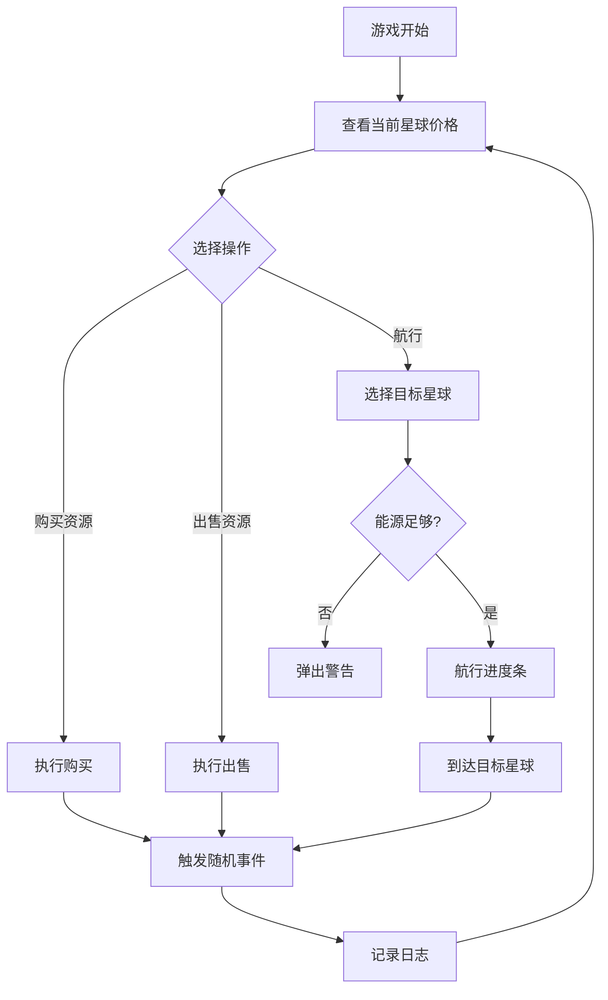

## 1. 产品概述
星际贸易与资源交易系统是一款太空主题的资源交易模拟游戏。玩家扮演星际商人，在不同星球间进行资源买卖、管理飞船仓库并应对随机事件，通过低买高卖获取利润并扩张商业版图。

- 核心玩法：
  - 资源贸易：在5个星球间买卖4种核心资源，利用价格差赚取利润
  - 飞船管理：管理货仓容量与能源消耗
  - 随机事件：遭遇海盗、发现宝藏等增加游戏随机性
  - 目标用户：策略游戏爱好者、模拟经营类玩家

## 2. 核心功能

### 2.1 用户角色
| 角色 | 注册方式 | 核心权限 |
|------|---------|---------|
| 星际商人 | 游戏开始自动创建 | 进行贸易、航行、查看游戏 |

### 2.2 功能模块
1. **主游戏界面**：顶部信息栏、星际地图、交易面板、事件弹窗、游戏日志
2. **交易系统**：资源买卖列表、价格显示、交易操作
3. **星际航行**：星球节点、航行进度、能源消耗
4. **随机事件**：事件触发、事件卡片展示
5. **游戏日志**：操作记录、时间戳、状态图标

### 2.3 页面详情
| 页面名称 | 模块名称 | 功能描述 |
|---------|---------|---------|
| 主游戏界面 | 顶部信息栏 | 显示财富（打字机效果）、货仓容量（进度条）、当前星球（发光效果） |
| 主游戏界面 | 星际地图 | 5个星球节点，点击选中触发交易或航行 |
| 主游戏界面 | 交易面板 | 资源列表、价格显示、买卖按钮、交易操作 |
| 主游戏界面 | 航行系统 | 航行进度条、能源不足警告 |
| 主游戏界面 | 事件弹窗 | 随机事件卡片、滑入动画 |
| 主游戏界面 | 游戏日志 | 最近10条记录、可折叠面板 |

## 3. 核心流程
玩家进入游戏 → 查看当前星球资源价格 → 选择资源进行购买/出售 → 选择目标星球航行 → 航行完成后触发随机事件 → 记录操作日志 → 循环贸易获取利润

## 4. 用户界面设计

### 4.1 设计风格
- 主色调：深空蓝#0B0E27背景，纯黑#0A0A1A主背景
- 辅助色：冷白#E0E0E0文字，青色#00FFFF发光效果
- 星球颜色：#FF6B6B, #4ECDC4, #45B7D1, #96CEB4, #FFEAA7
- 价格动画：涨价绿色#00E676，降价红色#FF5252
- 按钮风格：悬停发光box-shadow: 0 0 8px #00FFFF, 0 0 16px #00FFFF，点击缩小0.95倍
- 字体：无衬线字体，清晰易读
- 布局：桌面端横向布局（星际地图+交易面板，移动端纵向堆叠
- 图标：使用emoji图标（🔹💰✨

### 4.2 页面设计概览
| 页面名称 | 模块名称 | UI元素 |
|---------|---------|---------|
| 主游戏界面 | 顶部信息栏 | 深色背景条，三栏布局：财富（打字机数字）、货仓（彩色进度条、星球名（发光） |
| 主游戏界面 | 星际地图 | 深空背景，5个圆形星球节点（渐变色彩，悬停放大1.2倍显示名称气泡 |
| 主游戏界面 | 交易面板 | 右侧弹出，资源列表，价格动态变色动画，买卖按钮缩放反馈 |
| 主游戏界面 | 航行进度条 | 320x24px，渐变填充，动画匹配航行时间 |
| 主游戏界面 | 事件卡片 | 暗金色#FFC107背景，发光边框，左侧滑入动画 |
| 主游戏界面 | 游戏日志 | 右上角折叠面板，平滑高度过渡，时间戳+状态图标 |

### 4.3 响应式
桌面端优先，宽度小于768px时星际地图与交易面板纵向堆叠布局。

### 4.4 性能要求
- 前端请求响应时间不超过200ms
- 游戏循环帧率稳定30fps以上
- 所有交易操作和航行耗时计算在后端完成
