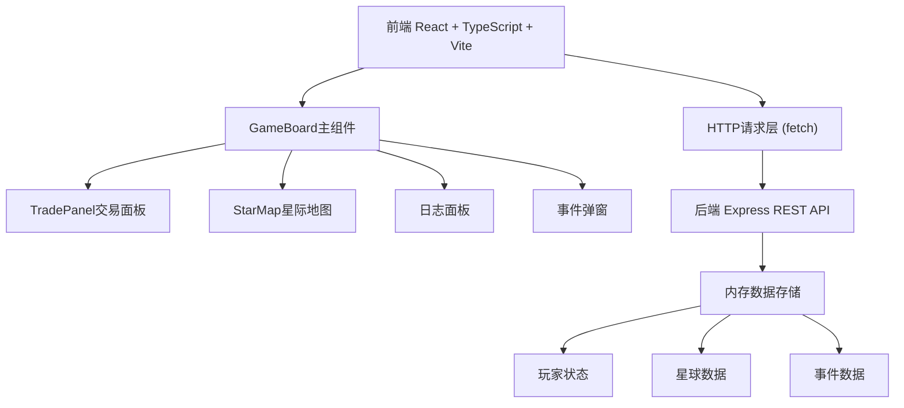
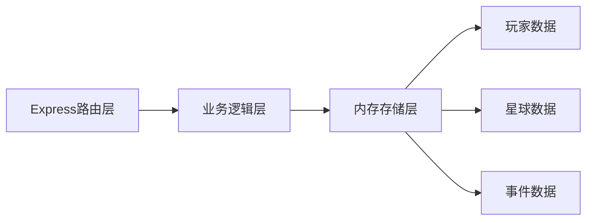
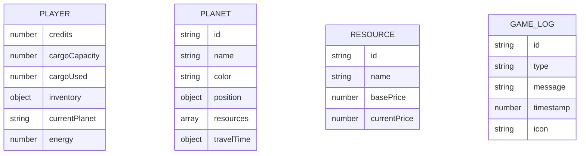

## 1. 架构设计



## 2. 技术说明
- 前端：React@18 + TypeScript + Vite
- 初始化工具：Vite
- 后端：Express@4
- 数据库：内存存储（Node.js内存对象）
- 状态管理：React useState/useEffect
- HTTP客户端：原生fetch API

## 3. 文件结构
```
/
├── package.json
├── index.html
├── vite.config.js
├── tsconfig.json
├── src/
│   ├── client/
│   │   ├── GameBoard.tsx      # 主游戏界面
│   │   ├── TradePanel.tsx     # 交易面板
│   │   └── StarMap.tsx      # 星际地图
│   └── server/
│       └── api.ts             # REST API服务
└── .trae/documents/
```

## 4. API定义

### 4.1 类型定义

```typescript
interface Resource {
  id: string;
  name: string;
  basePrice: number;
  currentPrice: number;
  priceChange: 'up' | 'down' | 'stable';
}

interface Planet {
  id: string;
  name: string;
  color: string;
  position: { x: number; y: number };
  resources: Resource[];
  travelTime: Record<string, number>;
}

interface PlayerState {
  credits: number;
  cargoCapacity: number;
  cargoUsed: number;
  inventory: Record<string, number>;
  currentPlanet: string;
  energy: number;
}

interface GameEvent {
  id: string;
  type: 'trade' | 'travel' | 'event';
  message: string;
  timestamp: number;
  icon: string;
}

interface RandomEvent {
  id: string;
  title: string;
  description: string;
  effect: (player: PlayerState) => PlayerState;
}
```

### 4.2 REST API端点

| 方法 | 路径 | 说明 |
|------|------|------|
| GET | /api/player | 获取玩家状态 |
| GET | /api/planets | 获取所有星球数据 |
| GET | /api/planet/:id | 获取单个星球详情（含价格） |
| POST | /api/trade | 执行交易（买入/卖出 |
| POST | /api/travel | 执行航行 |
| GET | /api/events | 获取游戏日志 |
| POST | /api/trigger-event | 触发随机事件 |
| GET | /api/refresh-prices | 刷新所有星球价格 |

## 5. 服务端架构



## 6. 数据模型

### 6.1 数据模型定义



### 6.2 初始数据

- 玩家：1000信用点，50容量，能源20单位
- 星球：5个星球，每星球4种资源
- 资源：能源块、金属矿石、食物补给、精密零件
