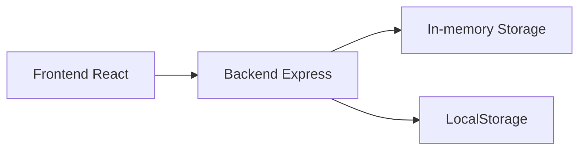

## 1. 架构设计

整体采用前后端分离架构，前端React负责UI展示和用户交互，后端Express提供战斗引擎API和数据存储接口。



## 2. 技术描述

- 前端：React@18 + TypeScript + Vite + Recharts
- 构建工具：Vite
- 后端：Express@4 + TypeScript
- 数据存储：内存存储 + 浏览器LocalStorage
- 状态管理：React useState/useReducer
- 样式：CSS Modules / 内联样式

## 3. 文件结构

```
/
├── package.json
├── vite.config.js
├── tsconfig.json
├── index.html
├── src/
│   ├── App.tsx
│   └── components/
│       ├── CharacterConfig.tsx
│       ├── BattleLog.tsx
│       └── StatsPanel.tsx
└── server/
    ├── battleEngine.ts
    └── storage.ts
```

## 4. API定义

### 4.1 战斗模拟接口

- POST /api/battle/simulate
- 请求体：两个角色的配置对象
- 响应：战斗记录数组 + 统计数据对象

### 4.2 配置存储接口

- GET /api/configs - 获取所有保存的配置
- POST /api/configs - 保存新配置
- DELETE /api/configs/:id - 删除指定配置

## 5. 数据模型

### 5.1 角色配置

```typescript
interface CharacterConfig {
  id: string;
  name: string;
  hp: number;
  attack: number;
  defense: number;
  speed: number;
  skills: SkillConfig[];
}
```

### 5.2 技能配置

```typescript
interface SkillConfig {
  id: string;
  name: string;
  type: 'fire' | 'ice' | 'heal' | 'lightning' | 'shield';
  damage: number;
  cooldown: number;
  cost: number;
  color: string;
}
```

### 5.3 战斗记录

```typescript
interface BattleLogEntry {
  turn: number;
  actor: string;
  action: 'attack' | 'skill' | 'heal';
  target: string;
  value: number;
  remainingHp: number;
  skillName?: string;
}
```

### 5.4 统计数据

```typescript
interface BattleStats {
  totalDamage: number;
  totalHeal: number;
  skillHitRate: number;
  effectiveOutputTime: number;
}
```
