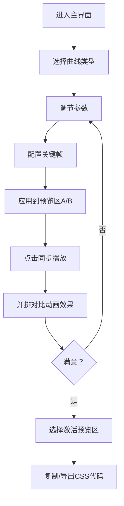

## 1. 产品概述

CSS动画曲线生成与关键帧对比预览工具，为前端开发者提供可视化的贝塞尔曲线/弹簧曲线生成器，支持双预览区并排对比动画效果，可一键导出CSS代码。

- 主要用途：帮助开发者直观调试和对比CSS动画时间函数与关键帧参数
- 目标用户：前端开发者、UI/UX设计师
- 产品价值：将繁琐的手动参数调试变为可视化操作，大幅提升CSS动画调优效率

## 2. 核心功能

### 2.1 功能模块

1. **主界面**：左侧控制面板 + 右侧双预览区并排布局
2. **曲线生成器**：贝塞尔曲线拖拽编辑 + 弹簧曲线滑块调节
3. **关键帧配置面板**：支持最多5个关键帧，配置位移/缩放/旋转/透明度等属性
4. **动画预览引擎**：Canvas驱动的双区域实时动画渲染，带进度条和帧率显示
5. **代码导出工具**：生成CSS代码，支持复制到剪贴板或下载为文件

### 2.3 页面详情

| 页面名称 | 模块名称 | 功能描述 |
|---------|---------|---------|
| 主界面 | 控制面板 | 手风琴式折叠面板，包含贝塞尔曲线、弹簧曲线、关键帧配置三个区域 |
| 主界面 | 贝塞尔编辑器 | 2D坐标网格，拖拽两个控制点生成曲线，实时显示参数值和小球预览动画 |
| 主界面 | 弹簧编辑器 | 三个滑块调节质量、刚度、阻尼，实时显示张力动画预览 |
| 主界面 | 关键帧配置 | 添加/删除关键帧，配置百分比和属性值（位移X/Y、缩放、旋转、透明度） |
| 主界面 | 预览区A | 绑定第一组参数，Canvas渲染移动和缩放动画，显示曲线参数 |
| 主界面 | 预览区B | 绑定第二组参数，Canvas渲染移动和缩放动画，显示曲线参数 |
| 主界面 | 同步控制栏 | 同步播放按钮、进度条（960px宽）、帧率显示 |
| 主界面 | 代码预览区 | 显示生成的@keyframes CSS代码，支持复制和下载 |

## 3. 核心流程

用户进入主界面 → 在控制面板选择曲线类型（贝塞尔/弹簧）→ 调节参数（拖拽控制点或滑动滑块）→ 配置关键帧属性 → 选择要应用到的预览区（A/B）→ 点击"同步播放"同时对比两组动画 → 满意后选择激活预览区 → 点击"复制代码"或"导出CSS文件"

## 4. 用户界面设计

### 4.1 设计风格

- **主色调**：#3f51b5（靛蓝，进度条/交互强调），#4fc3f7（浅蓝，动画方块1），#ff7043（橙红，动画方块2），#4CAF50（成功提示）
- **背景色**：#FAFAFA（主背景），#FFFFFF（内容区），#f0f0f0（网格背景）
- **文字色**：#333（标题），#666（正文），等宽字体monospace（代码/参数显示）
- **按钮风格**：圆角8px，hover时上浮阴影（box-shadow 0 2px 8px rgba(0,0,0,0.1)），0.2s transition过渡
- **布局风格**：左侧固定控制面板（280px）+ 中央主内容区（1200px居中，双预览区各500px，间距40px）

### 4.2 页面设计概述

| 页面名称 | 模块名称 | UI元素 |
|---------|---------|-------|
| 主界面 | 控制面板 | 手风琴折叠面板（高度过渡0.3s ease），滑块组件，输入框，标签页切换 |
| 主界面 | 贝塞尔网格 | 400x400px SVG画布，浅灰网格，深灰坐标轴，可拖拽控制点，曲线实时绘制，小球动画预览 |
| 主界面 | 弹簧滑块 | 三个range滑块带数值标签，弹簧张力可视化预览（小球上下弹跳动画） |
| 主界面 | 预览区卡片 | 标题栏（16px / 600字重 / #333）+ Canvas（400x200px，白底，1px #ddd边框，圆角8px）+ 参数显示区（14px / #666 / monospace） |
| 主界面 | 同步控制栏 | 播放按钮 + 进度条容器（960x6px，#e0e0e0背景，圆角3px）+ 进度填充（#3f51b5）+ 帧率计数器 |
| 主界面 | 代码预览区 | 深色背景代码块 + 复制按钮 + 下载按钮 |
| 主界面 | Toast提示 | 绿色#4CAF50背景，白色文字，0.5s淡入淡出动画 |

### 4.3 响应式

- **桌面端（≥1024px）**：左侧固定控制面板，中央双预览区水平并排（间距40px）
- **平板/移动端（<1024px）**：控制面板折叠为顶部导航下拉菜单，双预览区垂直排列（上下各400px）

### 4.4 动画交互规范

- 折叠面板展开/收起：height 0.3s ease过渡
- 交互元素hover：box-shadow 0 2px 8px rgba(0,0,0,0.1) + 0.2s transition
- 进度条播放完成后闪烁：opacity 1→0.5→1，总时长0.4s
- Toast提示框：0.5s淡入淡出
- 控制点拖拽：requestAnimationFrame驱动，延迟<16ms
- 动画预览帧率≥55fps，使用requestAnimationFrame时间戳差值计算
