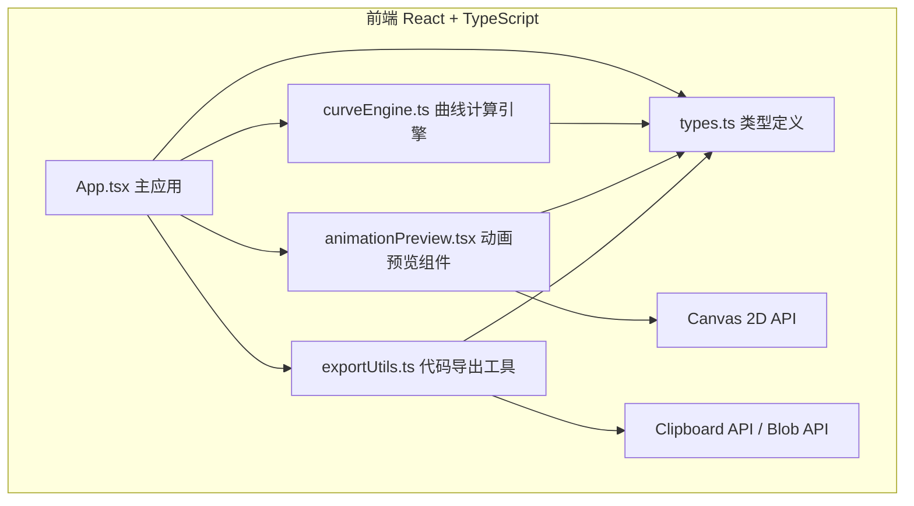

## 1. 架构设计



## 2. 技术描述

- **前端框架**：React@18 + TypeScript（strict严格模式，target ES2020）
- **构建工具**：Vite@5 + @vitejs/plugin-react
- **CSS方案**：原生CSS（内联样式 + CSS变量，按需求指定的颜色/尺寸）
- **状态管理**：React useState/useReducer（组件内局部状态，无需全局状态库）
- **第三方依赖**：
  - lodash（防抖/节流/深拷贝）
  - file-saver（文件下载）
- **后端**：无（纯前端应用）
- **数据库**：无

## 3. 文件结构与调用关系

```
src/
├── types.ts              # 类型定义（被所有模块引用）
│   └── 导出：KeyframeConfig, ControlPoint, SpringParams
├── curveEngine.ts        # 纯函数曲线计算
│   ├── generateBezier(controlPoints) → string
│   ├── generateSpring(mass, stiffness, damping) → string
│   └── 被引用：App.tsx
├── animationPreview.tsx  # Canvas动画预览组件
│   ├── AnimationPreview (React组件)
│   ├── startPreview()    # 内部使用requestAnimationFrame
│   └── 被引用：App.tsx
├── exportUtils.ts        # CSS代码生成与导出
│   ├── generateCssCode(curve, keyframes) → string
│   ├── copyToClipboard(text) → Promise
│   ├── downloadCssFile(filename, content) → void
│   └── 被引用：App.tsx
└── App.tsx               # 主应用（调度所有模块）
    ├── 控制面板（贝塞尔/弹簧/关键帧）
    ├── 双预览区布局
    ├── 同步播放控制
    └── 代码导出区
```

**数据流向**：
1. 用户操作 → App.tsx状态更新
2. App.tsx调用curveEngine → 生成curve字符串
3. App.tsx将curve + keyframes传入animationPreview组件 → Canvas渲染动画
4. App.tsx将curve + keyframes传入exportUtils → 生成CSS代码字符串 → 复制/下载

## 4. 核心接口定义（types.ts）

```typescript
// 控制点坐标（x,y范围0-1）
export interface ControlPoint {
  x: number;
  y: number;
}

// 关键帧属性
export interface KeyframeProperties {
  translateX?: number;  // px
  translateY?: number;  // px
  scale?: number;       // 倍速
  rotate?: number;      // deg
  opacity?: number;     // 0-1
}

// 单个关键帧
export interface Keyframe {
  percentage: number;           // 0-100
  properties: KeyframeProperties;
}

// 关键帧配置（最多5个）
export interface KeyframeConfig {
  name: string;
  duration: number;             // ms
  keyframes: Keyframe[];
}

// 弹簧参数
export interface SpringParams {
  mass: number;      // 0.1-10
  stiffness: number; // 50-300
  damping: number;   // 5-50
}

// 预览区状态
export interface PreviewState {
  curve: string;              // cubic-bezier(...) 或 spring(...)
  keyframes: KeyframeConfig;
}
```

## 5. 性能优化策略

1. **动画引擎**：使用requestAnimationFrame，每次渲染记录performance.now()差值计算dt
2. **拖拽优化**：控制点拖拽使用requestAnimationFrame批量更新，lodash.throttle限制DOM更新频率
3. **Canvas渲染**：离屏计算属性值，每帧只做必要的clearRect + 绘制调用
4. **代码生成**：字符串拼接避免正则回溯，确保生成时间<100ms
5. **React渲染**：使用React.memo包裹AnimationPreview组件，避免不必要的重渲染

## 6. 初始化与构建命令

```bash
# 初始化项目
npm init vite-init@latest -y . -- --template react-ts --force

# 安装额外依赖
npm install lodash file-saver
npm install -D @types/lodash @types/file-saver

# 启动开发服务器
npm run dev
```
