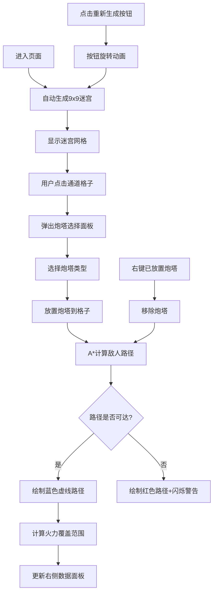

## 1. 产品概述

随机迷宫生成与塔防布局预览应用，将Roguelike迷宫探索与塔防策略结合，玩家在随机生成的迷宫分岔路口布置防御塔，实时预览敌人路径和火力覆盖网，增加策略性和重玩性。

- 主要用途：为Roguelike迷宫冒险Demo提供塔防布局预览功能，让玩家在探索前规划防御策略
- 解决问题：传统地牢关卡重复感强，通过迷宫随机生成+塔防布局增加策略深度
- 目标用户：Roguelike游戏玩家、塔防游戏爱好者

---

## 2. 核心功能

### 2.1 功能模块

1. **迷宫生成模块**：BFS算法生成9x9随机迷宫，确保起点终点连通，支持重新生成
2. **炮塔放置模块**：三种炮塔（箭塔、炮塔、魔法塔）的点击/拖拽放置与右键移除
3. **路径预览模块**：A*算法计算敌人路径，实时更新，路径阻挡时红色警告
4. **火力覆盖模块**：炮塔攻击范围可视化，路径覆盖百分比计算与高亮显示
5. **数据统计模块**：右侧面板显示炮塔总数、覆盖占比、路径步数等实时数据

### 2.2 页面详情

| 页面名称 | 模块名称 | 功能描述 |
|-----------|-------------|---------------------|
| 主页面 | 顶部栏 | 标题"迷宫塔防"、重新生成按钮（带旋转动画） |
| 主页面 | 迷宫网格 | 9x9迷宫可视化，通道/墙壁区分，支持点击交互 |
| 主页面 | 炮塔选择面板 | 点击通道格子弹出，三种炮塔圆形图标选择 |
| 主页面 | 路径绘制 | 蓝色虚线显示敌人路径，阻挡时变红并闪烁光晕 |
| 主页面 | 火力覆盖层 | 半透明圆形显示攻击范围，路径重叠处高亮 |
| 主页面 | 右侧数据面板 | 炮塔总数、覆盖百分比条、路径总步数实时更新 |

---

## 3. 核心流程

---

## 4. 用户界面设计

### 4.1 设计风格

- **主题**：暗色地牢风格，配合Roguelike冒险氛围
- **主色调**：深灰#2C2C2C（网格背景）、浅褐#C4A882（通道）、深褐#4A3728（墙壁）
- **强调色**：灰绿#6B8E23（箭塔）、深灰#555555（炮塔）、淡紫#9370DB（魔法塔）、蓝色#4A90D9（正常路径）、红色#D94A4A（阻挡路径）
- **字体**：采用游戏风格的衬线字体，标题24px #E0D0A0
- **布局**：左侧迷宫（960x960px居中）+ 右侧固定面板（240px宽）
- **动画**：迷宫淡入扩散、炮塔缩放弹性、数字滚动、光晕闪烁

### 4.2 页面设计概述

| 页面名称 | 模块名称 | UI元素 |
|-----------|-------------|-------------|
| 主页面 | 顶部栏 | 居中标题、右侧重新生成按钮（旋转加载动画） |
| 主页面 | 迷宫区域 | 9x9网格，每个格子60px，中心向外扩散淡入动画 |
| 主页面 | 炮塔选择面板 | 三个圆形图标（直径40px），选中放大1.2倍弹性缩放 |
| 主页面 | 炮塔显示 | 24x24px矩形塔身，顶部旋转指示标，中心扩散出现动画 |
| 主页面 | 路径绘制 | stroke-dasharray: 5,5虚线，线宽2px，蓝/红两色 |
| 主页面 | 火力覆盖 | 半透明圆形（半径2.5格），路径重叠处亮白高亮 |
| 主页面 | 右侧面板 | 浅灰#f0f0f0背景，200px宽百分比条（绿到红渐变） |

### 4.3 响应式

- **Desktop-first**：优先设计桌面端体验
- **最小宽度**：1200px，低于此宽度出现水平滚动条
- **自适应缩放**：浏览器窗口缩小时，迷宫格子和右侧面板按比例缩小
- **字体下限**：所有字体不小于12px，确保可读性

### 4.4 交互细节

- **拖拽放置**：鼠标跟随半透明炮塔图标（50%透明度）
- **悬停效果**：通道格子悬停时轻微高亮
- **过渡动画**：炮塔放置/移除0.15s过渡，数据更新0.3s延迟
- **右键菜单**：右键已放置炮塔直接移除
- **性能监控**：计算超时（>50ms）时提示用户缩小迷宫
