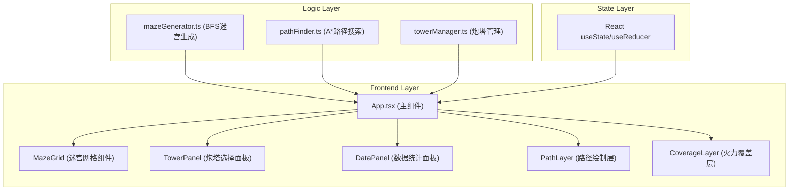

## 1. 架构设计



**数据流向说明：**
1. `App.tsx` 调用 `mazeGenerator.generateMaze()` → 获取二维网格数组 → 存入state → 传给 `MazeGrid` 渲染
2. 用户点击格子 → `App.tsx` 接收事件 → 弹出 `TowerPanel` → 选择炮塔 → 调用 `towerManager.addTower()` → 更新炮塔列表
3. 炮塔列表变化 → `App.tsx` 调用 `pathFinder.findPath()` → 获取路径点集 → 传给 `PathLayer` 绘制
4. 炮塔列表 + 路径 → `towerManager.getCoverage()` → 计算覆盖范围和百分比 → 传给 `CoverageLayer` 和 `DataPanel`

---

## 2. 技术描述

- **前端框架**：React@18 + TypeScript@5
- **构建工具**：Vite@5 + @vitejs/plugin-react@4
- **状态管理**：React useState/useReducer（轻量场景，无需额外状态库）
- **图标库**：lucide-react
- **项目初始化**：vite-init react-ts 模板
- **核心算法**：
  - 迷宫生成：BFS（广度优先搜索）
  - 路径搜索：A*（启发式搜索算法）
- **CSS方案**：原生CSS + CSS变量（用户指定 styles.css）

---

## 3. 目录结构

```
auto53/
├── package.json
├── vite.config.js
├── tsconfig.json
├── index.html
└── src/
    ├── App.tsx              # 主组件，状态管理，事件分发
    ├── main.tsx             # React入口
    ├── styles.css           # 全局样式与CSS变量
    ├── mazeGenerator.ts     # BFS迷宫生成模块
    ├── pathFinder.ts        # A*路径搜索模块
    ├── towerManager.ts      # 炮塔布局管理模块
    └── components/
        ├── MazeGrid.tsx     # 迷宫网格渲染组件
        ├── TowerPanel.tsx   # 炮塔选择面板组件
        ├── DataPanel.tsx    # 右侧数据统计面板
        ├── PathLayer.tsx    # 路径绘制SVG层
        ├── CoverageLayer.tsx # 火力覆盖可视化层
        └── Tower.tsx        # 单个炮塔渲染组件
```

---

## 4. 类型定义

```typescript
// 格子类型
export type CellType = 'wall' | 'path';

// 坐标点
export interface Point {
  x: number;
  y: number;
}

// 迷宫网格
export type MazeGrid = CellType[][];

// 炮塔类型
export type TowerType = 'arrow' | 'cannon' | 'magic';

// 炮塔实例
export interface Tower {
  id: string;
  type: TowerType;
  position: Point;
}

// 炮塔配置
export interface TowerConfig {
  type: TowerType;
  name: string;
  color: string;
  range: number; // 攻击范围（格子单位）
  damage: number;
}

// 覆盖区域
export interface CoverageArea {
  towerId: string;
  center: Point;
  radius: number;
  color: string;
}

// 路径覆盖统计
export interface CoverageStats {
  totalPathLength: number;
  coveredPathLength: number;
  coveragePercent: number;
  coveredPoints: Point[];
}

// 应用状态
export interface AppState {
  maze: MazeGrid;
  towers: Tower[];
  path: Point[];
  isPathBlocked: boolean;
  selectedCell: Point | null;
  showTowerPanel: boolean;
  coverageStats: CoverageStats | null;
  isGenerating: boolean;
}
```

---

## 5. 接口定义

### 5.1 mazeGenerator.ts
```typescript
/**
 * 使用BFS算法生成随机迷宫
 * @param width 迷宫宽度（格子数）
 * @param height 迷宫高度（格子数）
 * @returns 二维网格数组，0=墙壁，1=通道
 * @performance 单帧内完成，耗时 < 50ms
 */
export function generateMaze(width: number, height: number): MazeGrid;
```

### 5.2 pathFinder.ts
```typescript
/**
 * 使用A*算法搜索最短路径
 * @param grid 迷宫网格（含炮塔阻挡）
 * @param start 起点坐标
 * @param end 终点坐标
 * @returns 路径点坐标数组，无路径时返回空数组
 * @performance 单帧内完成，耗时 < 50ms
 */
export function findPath(
  grid: MazeGrid, 
  start: Point, 
  end: Point,
  blockedCells?: Point[]
): Point[];
```

### 5.3 towerManager.ts
```typescript
/**
 * 添加炮塔到指定位置
 * @param type 炮塔类型
 * @param position 放置位置
 * @param existingTowers 现有炮塔列表
 * @returns 新炮塔实例，位置已占用返回null
 */
export function addTower(
  type: TowerType,
  position: Point,
  existingTowers: Tower[]
): Tower | null;

/**
 * 计算所有炮塔的火力覆盖范围
 * @param towers 炮塔列表
 * @param path 敌人路径
 * @returns 覆盖区域数组 + 覆盖统计数据
 */
export function getCoverage(
  towers: Tower[],
  path: Point[]
): {
  areas: CoverageArea[];
  stats: CoverageStats;
};

/**
 * 炮塔配置常量
 */
export const TOWER_CONFIGS: Record<TowerType, TowerConfig>;
```

---

## 6. 性能优化方案

### 6.1 计算性能
- **迷宫生成**：BFS使用队列优化，避免递归栈溢出，预分配数组内存
- **路径搜索**：A*使用二叉堆优化开放列表，曼哈顿距离启发函数
- **缓存机制**：迷宫未变化时缓存路径结果，炮塔变动仅重计算受影响区域

### 6.2 渲染性能
- **requestAnimationFrame**：所有DOM更新和动画通过RAF调度
- **分层渲染**：迷宫、路径、炮塔、覆盖层分离为独立SVG层
- **CSS变换**：动画使用transform和opacity，避免重排重绘
- **shouldComponentUpdate**：子组件实现memo，避免不必要重渲染

### 6.3 性能监控
```typescript
function measurePerformance<T>(fn: () => T, threshold: number = 50): T {
  const start = performance.now();
  const result = fn();
  const duration = performance.now() - start;
  if (duration > threshold) {
    console.warn(`计算超时: ${duration.toFixed(2)}ms，建议缩小迷宫尺寸`);
    // 触发用户提示
  }
  return result;
}
```

---

## 7. 动画实现方案

| 动画效果 | 实现方式 | 时长 |
|---------|---------|------|
| 迷宫中心向外扩散淡入 | CSS scale + opacity，animation-delay按距离递增 | 0.5s |
| 重新生成按钮旋转 | CSS @keyframes rotate | 0.3s |
| 炮塔选中弹性缩放 | CSS transform: scale(1.2) + cubic-bezier | 0.2s |
| 炮塔出现扩散 | CSS transform: scale(0→1) | 0.15s |
| 炮塔顶部指示标旋转 | CSS @keyframes spin | 2s (循环) |
| 数字滚动动画 | requestAnimationFrame 插值计算 | 0.1s |
| 路径阻挡光晕闪烁 | CSS @keyframes pulse | 0.8s (循环) |
| 拖拽半透明跟随 | CSS opacity: 0.5 + pointer-events: none | - |
