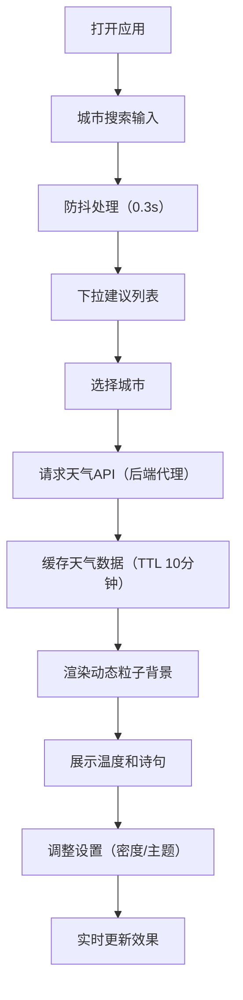

## 1. 产品概述
动态壁纸桌面与天气沉浸是一款基于浏览器的实时天气可视化应用，将天气数据转化为沉浸式动态粒子背景，让用户直观感受窗外真实天气状态。
- 核心价值：通过视觉化方式呈现天气信息，结合诗词文化元素，打造兼具实用性与美感的桌面体验
- 目标用户：追求个性化桌面体验、喜爱天气可视化与传统文化的用户群体

## 2. 核心功能

### 2.1 用户角色
| 角色 | 注册方式 | 核心权限 |
|------|----------|----------|
| 普通用户 | 无需注册 | 浏览动态壁纸、搜索切换城市、调整显示设置 |

### 2.2 功能模块
1. **动态粒子背景**：根据天气状态渲染晴天光斑、阴云、雨滴、雪花效果
2. **天气信息浮层**：实时温度、天气图标、未来三小时短时预报
3. **古诗词展示**：每日随机天气相关诗句，带过渡动画效果
4. **设置面板**：城市搜索、粒子密度调节、主题风格切换

### 2.3 页面详情
| 页面名称 | 模块名称 | 功能描述 |
|----------|----------|----------|
| 主界面 | 动态粒子背景 | Canvas渲染实时天气粒子效果，全屏铺满 |
| 主界面 | 天气信息浮层 | 右下角展示温度和天气图标，点击展开预报 |
| 主界面 | 古诗词展示 | 左下角随机展示天气相关古诗词 |
| 主界面 | 设置按钮 | 左上角齿轮按钮，点击打开设置面板 |
| 设置面板 | 城市搜索 | 带防抖的搜索框，下拉城市建议列表 |
| 设置面板 | 粒子密度 | 滑块调节粒子数量（10%-100%） |
| 设置面板 | 主题选择 | 写实、简约、梦幻三种壁纸风格切换 |

## 3. 核心流程
用户打开页面 → 输入城市搜索 → 选择城市 → 系统获取天气数据 → 渲染对应粒子效果 → 展示温度、诗句 → 用户可调整设置 → 实时更新效果

## 4. 用户界面设计

### 4.1 设计风格
- **主色调**：深色背景配合天气主题色（晴天金色#F5DEB3、阴天灰色#778899、雨雪白色#FFFFFF）
- **字体**：使用优雅的衬线与无衬线组合，诗词部分使用具有文化气息的字体
- **布局**：全屏沉浸式，四个角落分别布置功能元素（左上设置、右下天气、左下诗句）
- **动画**：流畅自然的过渡效果，粒子运动符合物理规律
- **毛玻璃效果**：设置面板使用backdrop-filter: blur(8px)

### 4.2 页面设计概述
| 页面名称 | 模块名称 | UI元素 |
|----------|----------|--------|
| 主界面 | 动态粒子背景 | Canvas全屏、requestAnimationFrame驱动、4种天气效果 |
| 主界面 | 天气浮层 | 半透阴黑背景、圆角16px、温度44px白色带阴影、emoji图标1.5倍 |
| 主界面 | 诗句展示 | 20px半透白、收缩展开过渡动画0.6s |
| 设置面板 | 城市搜索 | 宽280px列表、条目高44px、悬停浅蓝#EBF5FB |
| 设置面板 | 密度滑块 | 轨道高4px、按钮直径18px、范围10%-100% |
| 设置面板 | 主题选择 | 三种主题卡片、选中高亮 |

### 4.3 响应式
- 桌面端优先设计，各元素位置固定
- 移动端适配：调整字体大小、浮层位置优化触屏操作

### 4.4 性能要求
- 使用requestAnimationFrame驱动动画
- 帧率不低于45fps
- 粒子数量上限500个
- 页面滚动时暂停非关键粒子计算
