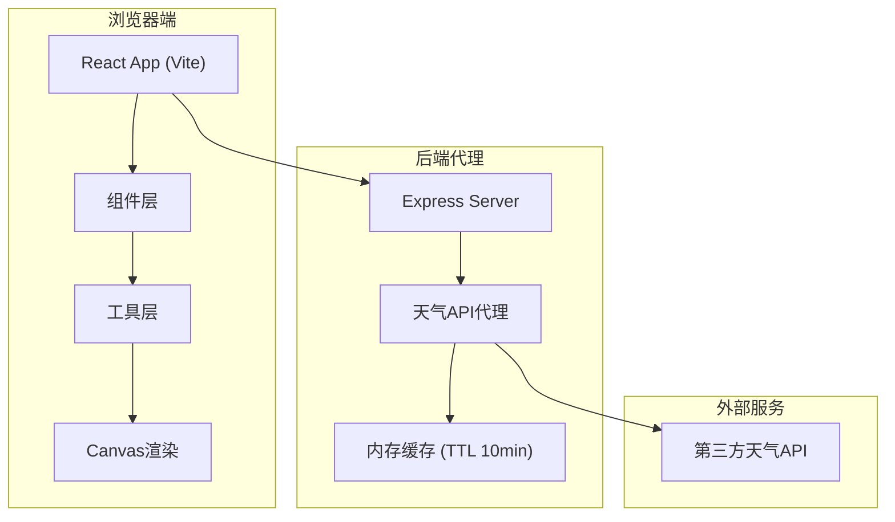
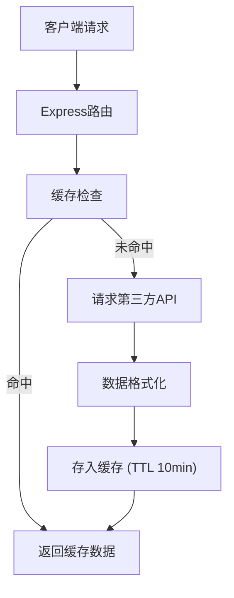

## 1. 架构设计



## 2. 技术描述
- **前端**：React@18 + TypeScript + Vite
- **构建工具**：Vite 5.x
- **后端**：Express@4 + TypeScript + Axios + CORS
- **UI框架**：原生CSS（配合CSS变量）
- **动画**：requestAnimationFrame + CSS Transitions
- **数据**：本地JSON（诗词数据）+ 第三方天气API

## 3. 目录结构
```
auto54/
├── package.json
├── index.html
├── vite.config.js
├── tsconfig.json
├── server/
│   └── weatherProxy.ts
├── public/
│   └── poems.json
└── src/
    ├── App.tsx
    ├── components/
    │   ├── WeatherBackground.tsx
    │   ├── InfoOverlay.tsx
    │   ├── PoemDisplay.tsx
    │   └── SettingsPanel.tsx
    └── utils/
        ├── ParticleSystem.ts
        └── weatherTypes.ts
```

## 4. API 定义

### 4.1 类型定义
```typescript
// src/utils/weatherTypes.ts
interface WeatherData {
  city: string;
  temperature: number;
  condition: 'sunny' | 'cloudy' | 'rainy' | 'snowy';
  humidity: number;
  precipitation: number;
  windSpeed: number;
  icon: string;
  hourlyForecast: HourlyForecast[];
}

interface HourlyForecast {
  time: string;
  temperature: number;
  condition: string;
  icon: string;
}

interface ThemeSettings {
  style: 'realistic' | 'minimal' | 'dreamy';
  particleDensity: number;
}

interface Poem {
  text: string;
  source: string;
}
```

### 4.2 后端API
| 方法 | 路由 | 描述 |
|------|------|------|
| GET | /api/weather?city=xxx | 获取指定城市天气数据 |
| GET | /api/cities?search=xxx | 搜索城市建议列表 |

## 5. 服务器架构



## 6. 性能优化
1. **粒子系统**：requestAnimationFrame驱动，对象池复用粒子
2. **缓存策略**：后端内存缓存天气数据，减少API调用
3. **防抖处理**：城市搜索0.3s防抖
4. **帧率控制**：粒子数量上限500，动态调整
5. **懒加载**：设置面板按需渲染
