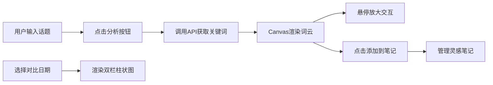

## 1. 产品概述
面向短视频创作者的灵感词云与话题追踪工具，帮助创作者打破思维固化，快速捕捉社交网络内容风向。通过交互式词云可视化热门关键词，并提供历史趋势对比功能，助力创作者高效规划选题。

- 目标用户：短视频内容创作者、新媒体运营人员、自媒体博主
- 核心价值：提供实时热门关键词分析，辅助选题决策，提升内容创作效率

## 2. 核心 Features

### 2.1 用户角色
| 角色 | 注册方式 | 核心权限 |
|------|----------|----------|
| 普通用户 | 无需注册 | 搜索话题、查看词云、对比趋势、管理灵感笔记 |

### 2.2 功能模块
1. **主界面**：话题搜索输入、预设热点标签、词云展示区
2. **趋势对比区**：双栏柱状图、日期选择器、关键词权重对比
3. **灵感笔记区**：关键词列表、复制功能、删除功能

### 2.3 页面详情
| 页面名称 | 模块名称 | 功能描述 |
|----------|----------|----------|
| 主页面 | 搜索模块 | 话题输入框、预设标签滚动列表、分析按钮 |
| 主页面 | 词云模块 | Canvas绘制词云、权重大小映射、悬停放大交互、点击添加笔记 |
| 主页面 | 趋势对比模块 | 7天日期选择、双栏柱状图、权重变化对比、高度动画 |
| 主页面 | 灵感笔记模块 | 关键词列表、复制到剪贴板、删除笔记、悬停效果 |

## 3. 核心流程
用户输入或选择话题 → 点击分析按钮 → 调用后端API获取关键词数据 → 渲染词云（淡入动画）→ 悬停查看详情/点击添加笔记 → 选择日期进行趋势对比 → 管理灵感笔记

## 4. 用户界面设计

### 4.1 设计风格
- 深色主题：背景 #1F2937，左侧面板 #111827，右侧面板 #1F2937
- 主色调：渐变蓝紫色 #667eea → #764ba2，暖色调词云 #FF6B6B、#FCA5A5、#F59E0B
- 边框：2px #374151，悬停变为 #6366F1，12px圆角
- 字体：现代无衬线字体，文字颜色 #F9FAFB
- 动画：0.5s淡入、0.2s悬停过渡、0.3s柱状图高度动画

### 4.2 页面设计概述
| 页面名称 | 模块名称 | UI元素 |
|----------|----------|----------|
| 主页面 | 搜索模块 | 400px宽输入框、圆角12px、浅灰背景 #F0F0F0、聚焦渐变边框、可滚动标签列表、32px高圆角16px标签 |
| 主页面 | 词云模块 | Canvas画布、暖色调随机分配、权重映射字号、悬停缩放1.1倍、0.2s过渡 |
| 主页面 | 趋势对比模块 | 双栏柱状图、左暖色 #FF6B6B、右冷色 #4F46E5、X轴标签旋转30度、0.3s高度渐变 |
| 主页面 | 灵感笔记模块 | 52px高列表项、100%宽度、悬停浅紫 #EDE9FE、复制/删除按钮、对勾反馈 |

### 4.3 响应式设计
- 桌面端（≥768px）：左右双栏布局，左侧搜索+词云，右侧趋势+笔记
- 移动端（<768px）：上下堆叠布局，词云区域自适应缩小
- 触控优化：增大点击区域，优化滚动体验

### 4.4 性能要求
- 词云渲染≤100个词
- 点击分析到完整显示≤800ms（含200ms模拟网络延迟）
- 动画帧率≥60fps
