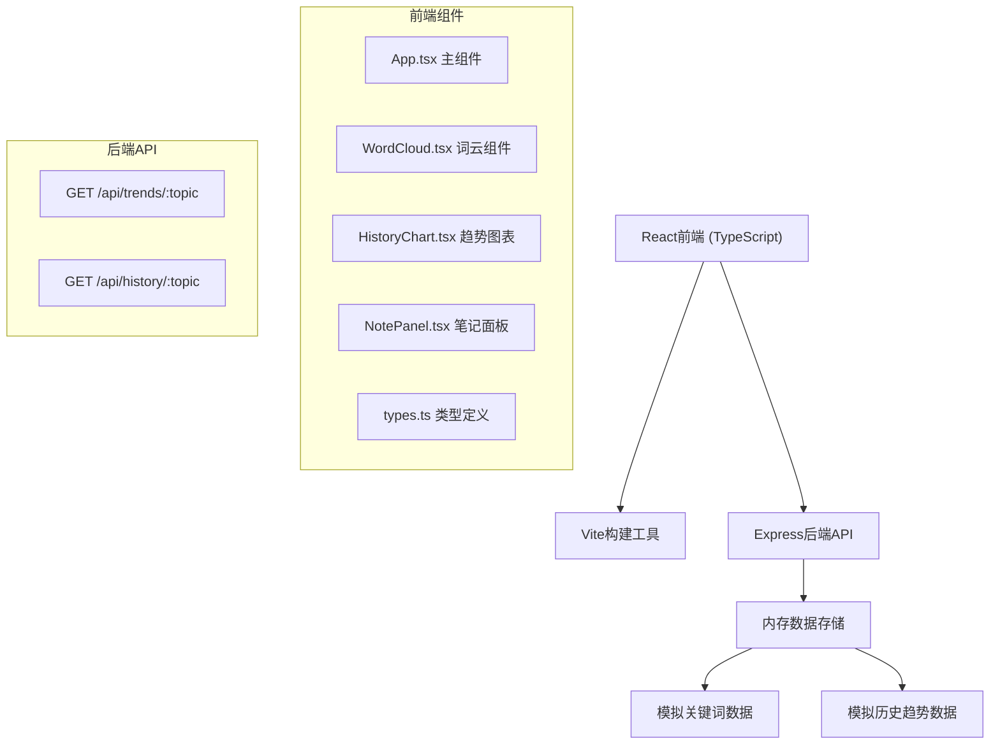
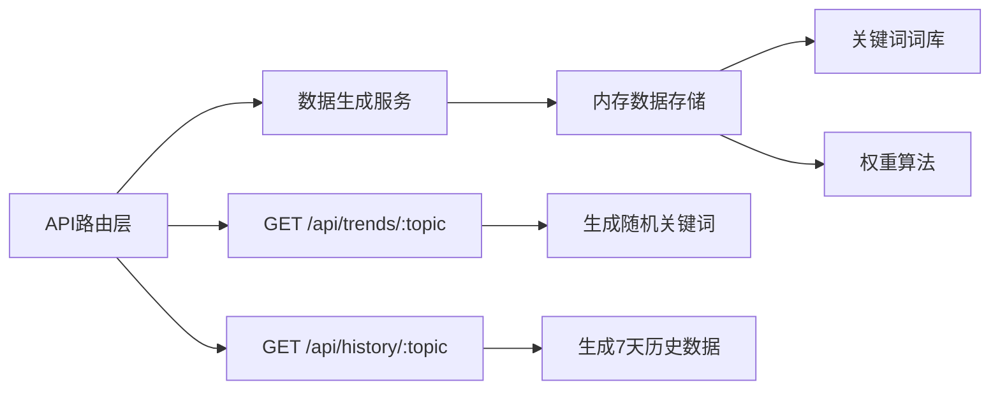

## 1. 架构设计



## 2. 技术描述
- **前端框架**: React 18 + TypeScript
- **构建工具**: Vite 5.x + @vitejs/plugin-react
- **后端框架**: Express 4.x
- **后端语言**: Node.js ESM (.mjs)
- **数据存储**: 内存存储（模拟数据）
- **其他依赖**: cors, uuid
- **包管理器**: npm
- **启动脚本**: `npm run dev` - 同时启动前后端

## 3. 路由定义
| 路由 | 用途 |
|------|------|
| / | 主应用页面 |
| GET /api/trends/:topic | 获取话题关键词列表及权重 |
| GET /api/history/:topic | 获取话题近7天历史数据 |

## 4. API 定义

### 类型定义
```typescript
interface KeywordWeight {
  word: string;
  weight: number;
}

interface HistoryDayData {
  date: string;
  keywords: KeywordWeight[];
}

interface TrendsResponse {
  topic: string;
  keywords: KeywordWeight[];
  timestamp: number;
}

interface HistoryResponse {
  topic: string;
  history: HistoryDayData[];
}
```

### GET /api/trends/:topic
- **请求参数**: topic (string) - 话题关键词
- **响应**: `TrendsResponse`
- **模拟延迟**: 200ms
- **示例**: `/api/trends/旅行`

### GET /api/history/:topic
- **请求参数**: topic (string) - 话题关键词
- **响应**: `HistoryResponse`
- **示例**: `/api/history/旅行`

## 5. 服务端架构图



## 6. 项目文件结构

```
auto57/
├── package.json
├── index.html
├── vite.config.js
├── tsconfig.json
├── server.mjs
└── src/
    ├── App.tsx
    ├── WordCloud.tsx
    ├── HistoryChart.tsx
    ├── NotePanel.tsx
    └── types.ts
```

## 7. 前端组件职责

### App.tsx
- 整体布局与状态管理
- 用户输入处理与API调用
- 组件间数据传递
- 响应式布局控制

### WordCloud.tsx
- Canvas词云渲染
- 权重→字号映射算法
- 鼠标悬停放大交互
- 点击添加到笔记事件

### HistoryChart.tsx
- SVG双栏柱状图绘制
- 日期选择与数据对比
- 柱体高度动画
- X轴标签旋转显示

### NotePanel.tsx
- 灵感笔记列表管理
- 关键词增删操作
- 剪贴板复制功能
- 复制成功反馈动画

## 8. 性能优化策略
1. 词云数量限制≤100个词
2. Canvas分层渲染，减少重绘
3. 使用requestAnimationFrame优化动画
4. 数据请求缓存机制
5. 响应式图片/Canvas自适应
