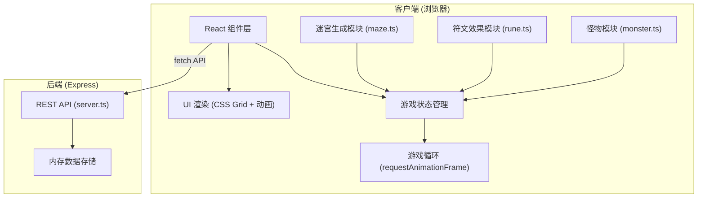

## 1. 架构设计



## 2. 技术描述

- **前端**：React 18 + TypeScript + Vite
  - 状态管理：React useState/useRef 管理游戏状态，useEffect 处理游戏循环
  - 动画：CSS keyframes + requestAnimationFrame 实现60FPS游戏循环
  - 样式：内联样式 + CSS 变量，暗黑地牢主题
- **后端**：Express 4 + TypeScript
  - REST API：提供游戏数据管理接口
  - 数据存储：内存数据结构，无持久化数据库
- **核心算法**：
  - 迷宫生成：随机DFS算法生成连通迷宫
  - 路径寻路：A*算法计算怪物最优路径
  - 碰撞检测：基于网格坐标的符文攻击范围检测

## 3. 项目结构

```
auto58/
├── package.json           # 项目依赖和脚本
├── index.html             # 入口HTML
├── vite.config.js         # Vite配置
├── tsconfig.json          # TypeScript配置
└── src/
    ├── server.ts          # Express后端API
    ├── App.tsx            # 前端主组件
    ├── maze.ts            # 迷宫生成和A*寻路
    ├── rune.ts            # 符文效果定义
    └── monster.ts         # 怪物属性和移动逻辑
```

## 4. API Definitions

### 4.1 类型定义

```typescript
// 通用类型
interface Position {
  x: number;
  y: number;
}

type CellType = 'wall' | 'path';
type RuneType = 'fire' | 'ice' | 'lightning';
type MonsterStatus = 'alive' | 'dead' | 'reached';

// 符文
interface Rune {
  id: string;
  type: RuneType;
  position: Position;
  damage: number;
  range: number;
  cooldown: number;
  lastAttack: number;
}

// 怪物
interface Monster {
  id: string;
  position: Position;
  path: Position[];
  pathIndex: number;
  health: number;
  maxHealth: number;
  speed: number;
  status: MonsterStatus;
  slowEffect: number;
  slowDuration: number;
}

// 游戏状态
interface GameState {
  wave: number;
  monsters: Monster[];
  runes: Rune[];
  health: number;
  score: number;
  kills: number;
  nextWaveTime: number;
  isGameOver: boolean;
  doubleEffect: boolean;
  doubleEffectEndTime: number;
}

// 符文库存
interface RuneInventory {
  fire: number;
  ice: number;
  lightning: number;
}
```

### 4.2 后端API接口

| 方法 | 路径 | 描述 | 请求 | 响应 |
|------|------|------|------|------|
| GET | /api/game/state | 获取游戏状态 | - | GameState |
| POST | /api/game/reset | 重置游戏 | - | GameState |
| POST | /api/game/wave | 触发下一波怪物 | { wave: number } | { monsters: Monster[] } |
| GET | /api/runes/inventory | 获取符文库存 | - | RuneInventory |
| POST | /api/runes/place | 放置符文 | { type: RuneType, position: Position } | { success: boolean, rune: Rune } |
| POST | /api/monsters/kill | 击杀怪物 | { id: string } | { success: boolean, score: number } |
| POST | /api/score/add | 增加分数 | { points: number } | { success: boolean, score: number } |

## 5. 模块接口定义

### 5.1 maze.ts - 迷宫模块

```typescript
// 生成随机迷宫
export function generateMaze(size: number): CellType[][];

// A*路径寻路
export function findPath(
  maze: CellType[][],
  start: Position,
  end: Position
): Position[] | null;

// 检查位置是否可通行
export function isWalkable(maze: CellType[][], pos: Position): boolean;
```

### 5.2 rune.ts - 符文模块

```typescript
// 符文配置
export const RUNE_CONFIG: Record<RuneType, {
  damage: number;
  range: number;
  cooldown: number;
  color: string;
  name: string;
  description: string;
}>;

// 创建符文
export function createRune(type: RuneType, position: Position): Rune;

// 检查符文是否可以攻击
export function canAttack(rune: Rune, currentTime: number): boolean;

// 计算符文伤害
export function calculateDamage(
  rune: Rune,
  monster: Monster,
  doubleEffect: boolean
): { damage: number; effects: MonsterEffect[] };

// 查找攻击范围内的怪物
export function findTargetsInRange(
  rune: Rune,
  monsters: Monster[],
  doubleEffect: boolean
): Monster[];
```

### 5.3 monster.ts - 怪物模块

```typescript
// 创建怪物
export function createMonster(
  id: string,
  path: Position[],
  healthMultiplier: number = 1
): Monster;

// 更新怪物位置
export function updateMonster(
  monster: Monster,
  deltaTime: number,
  currentTime: number
): { moved: boolean; reachedEnd: boolean };

// 对怪物造成伤害
export function damageMonster(
  monster: Monster,
  damage: number
): { killed: boolean };

// 应用减速效果
export function applySlowEffect(
  monster: Monster,
  slowAmount: number,
  duration: number,
  currentTime: number
): void;

// 获取怪物显示颜色
export function getMonsterColor(monster: Monster): string;
```

## 6. 核心游戏循环

```
1. 初始化
   ├── 生成10x10迷宫
   ├── 设置入口(0,0)和宝箱(9,9)
   ├── 计算初始路径
   └── 初始化游戏状态

2. 游戏循环 (requestAnimationFrame, 60FPS)
   ├── 更新倒计时
   │   └── 时间到 → 生成怪物波次
   ├── 更新怪物
   │   ├── 应用减速效果
   │   ├── 沿路径移动
   │   ├── 检查是否到达宝箱
   │   └── 更新怪物状态
   ├── 更新符文攻击
   │   ├── 检查冷却
   │   ├── 查找范围内怪物
   │   ├── 计算伤害
   │   ├── 应用效果(伤害/减速/链式)
   │   └── 更新击杀数和分数
   ├── 检查特殊事件
   │   └── 分数≥50且未触发 → 效果翻倍15秒
   ├── 检查游戏结束
   │   └── 生命≤0 → 显示结算面板
   └── 渲染UI

3. 玩家交互
   ├── 点击符文栏选择符文
   ├── 点击迷宫格子放置符文
   │   ├── 检查是否为通道
   │   ├── 检查库存
   │   ├── 播放放置动画
   │   └── 放置符文
   └── 结算面板点击再来一局
```

## 7. 性能优化

- **游戏循环**：使用 requestAnimationFrame 确保60FPS
- **怪物数量限制**：每帧最多处理100个怪物对象
- **路径缓存**：迷宫生成后预计算路径，怪物共享路径数据
- **攻击优化**：使用空间网格减少距离计算量
- **动画性能**：CSS动画优先于JavaScript动画，使用 transform 和 opacity
- **后端响应**：内存数据存储，所有API响应时间<100ms
