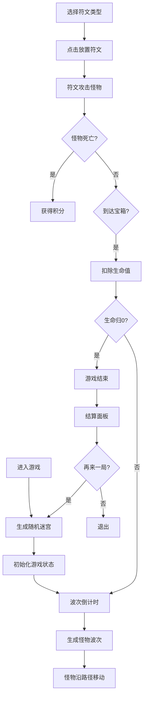

## 1. 产品概述

地牢符文防御是一款暗黑地牢风格的塔防游戏，玩家在10x10的地牢迷宫中布置各类防御符文，抵御怪物入侵保护宝箱。游戏融合了策略布局与实时战斗元素，通过A*路径寻路、符文效果系统和波次怪物生成机制，提供丰富的塔防体验。

- 核心玩法：玩家在迷宫通道中放置火焰、冰冻、闪电三种符文，利用不同符文的特性组合，消灭沿路径移动的怪物
- 目标用户：休闲游戏玩家、塔防游戏爱好者
- 市场价值：提供轻量级但富有策略深度的网页塔防游戏体验

## 2. 核心功能

### 2.1 功能模块

1. **游戏主面板**：10x10迷宫网格渲染、怪物移动动画、符文放置效果、路径轨迹显示
2. **符文栏系统**：符文类型选择、符文库存管理、符文放置交互、特殊状态提示
3. **状态栏系统**：波次信息、怪物存活数、玩家生命值、实时得分显示
4. **怪物系统**：波次生成、A*路径寻路、生命值状态、死亡效果
5. **符文效果系统**：火焰高伤害、冰冻减速、闪电链式伤害、特殊事件效果翻倍
6. **游戏流程系统**：游戏开始、波次倒计时、游戏结束判定、结算面板、重新开始

### 2.2 页面详情

| 页面名称 | 模块名称 | 功能描述 |
|-----------|-------------|---------------------|
| 游戏主页面 | 游戏主面板 | 渲染10x10迷宫网格，显示墙壁/通道，怪物移动动画，符文放置闪烁动画，路径轨迹 |
| 游戏主页面 | 符文栏 | 显示三种符文类型，点击选择，库存显示，特殊事件时闪烁边框 |
| 游戏主页面 | 状态栏 | 顶部显示当前波次、怪物存活数、生命值、得分 |
| 游戏主页面 | 结算面板 | 游戏结束时弹出，显示最终得分、击杀数、波次，重新开始按钮 |

## 3. 核心流程

玩家进入游戏后，系统自动生成随机迷宫并开始第一波怪物倒计时。玩家在符文栏选择符文类型，点击迷宫通道格子放置符文。怪物沿A*路径从入口向宝箱移动，符文自动攻击范围内的怪物。击杀怪物获得积分，怪物到达宝箱扣除生命值。当生命值归0时游戏结束，弹出结算面板，玩家可选择再来一局。

## 4. 用户界面设计

### 4.1 设计风格

- 主色调：深褐 #1A1A2E 渐变为黑色背景，营造暗黑地牢氛围
- 墙壁：深灰 #2C2C2C，通道：浅褐 #C9B79C
- 符文颜色：火焰红 #FF4500，冰冻蓝 #00BFFF，闪电黄 #FFD700
- 符文栏背景：暗紫 #4A235A，状态栏背景：深褐 #3E2723
- 怪物颜色：满血绿 #2ECC71、半血红 #E74C3C、濒死金 #F1C40F
- 宝箱：金色 #FFD700
- 布局：桌面端左侧70%游戏面板，右侧30%符文栏，顶部状态栏；移动端垂直堆叠
- 动画：符文微光脉冲（0-0.2-0透明度，2秒周期），放置闪烁扩散（0.3秒），怪物移动平滑过渡，路径褪色轨迹（0.5秒），结算面板缩放（0.4秒）

### 4.2 页面设计概述

| 页面名称 | 模块名称 | UI Elements |
|-----------|-------------|-------------|
| 游戏主页面 | 状态栏 | 顶部全宽，深褐背景，白色文字，显示波次/怪物数/生命/得分 |
| 游戏主页面 | 游戏面板 | 10x10网格，CSS Grid布局，墙壁/通道/符文/怪物分层渲染 |
| 游戏主页面 | 符文栏 | 右侧240px，暗紫背景，三种符文卡片，悬停效果，选中高亮 |
| 游戏主页面 | 结算面板 | 半透明黑色遮罩，居中白色卡片，圆角16px，缩放动画 |

### 4.3 响应式

- 桌面端（≥768px）：左侧70%游戏面板，右侧30%符文栏，顶部状态栏
- 移动端（<768px）：垂直堆叠，状态栏顶部，游戏面板居中，符文栏底部
- 所有交互元素适配触摸操作，确保可点击区域足够大

### 4.4 视觉特效

- 符文微光脉冲动画：使用CSS keyframes实现opacity循环
- 符文放置动画：transform: scale配合opacity实现闪烁扩散
- 怪物移动：requestAnimationFrame实现平滑60FPS动画
- 路径轨迹：rgba颜色透明度渐变实现0.5秒褪色
- 结算面板：transform: scale从0.8到1，配合opacity实现缩放动画
- 特殊事件：符文栏边框box-shadow闪烁动画
