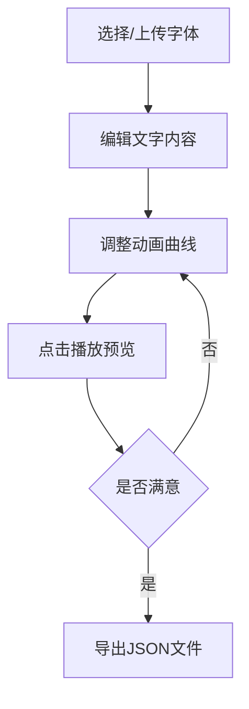

## 1. 产品概述

交互式字体变形与动画生成器是一款面向设计师和前端开发者的Web工具，解决在制作Web标题或Logo动画时，不同字体风格之间平滑形变动画的设计难题。用户可选择或上传两种字体，实时预览字形轮廓的逐帧变形过程，自定义动画时间曲线，导出动画参数供开发使用。

## 2. 核心功能

### 2.1 用户角色

| 角色 | 注册方式 | 核心权限 |
|------|----------|----------|
| 设计师/开发者 | 无需注册 | 使用所有功能，上传字体，导出动画参数 |

### 2.2 功能模块

1. **字体选择与控制面板**：内置字体选择、自定义字体上传、参数设置
2. **预览画布**：文字编辑、变形动画实时预览
3. **贝塞尔曲线编辑器**：动画时间曲线调整、控制点拖拽
4. **工具栏**：播放/暂停控制、动画参数导出

### 2.3 页面详情

| 页面名称 | 模块名称 | 功能描述 |
|---------|----------|----------|
| 主页面 | 字体选择与控制面板 | 下拉选择起始/结束字体（5种内置字体），上传woff2自定义字体（5MB限制），显示加载进度 |
| 主页面 | 预览画布 | 编辑文字内容（20字符限制），显示水蓝色"Hello"样例，3秒平滑变形动画，弹性缓入缓出效果 |
| 主页面 | 贝塞尔曲线编辑区 | 300x300坐标系，拖拽两个蓝色控制点调整时间曲线，实时显示坐标，重置按钮 |
| 主页面 | 顶部工具栏 | 渐变播放按钮（循环播放/暂停），红色暂停状态，导出JSON动画参数 |

## 3. 核心流程

用户选择或上传起始字体和结束字体 → 编辑预览文字 → 调整贝塞尔曲线控制点 → 点击播放预览变形动画 → 满意后导出动画参数JSON文件

## 4. 用户界面设计

### 4.1 设计风格

- 主色调：深灰#1E1E1E（画布背景）、浅灰#F8F9FA（面板背景）、水蓝色#4FC3F7（文字/控制点）
- 强调色：渐变#667EEA到#764BA2（播放按钮）、红色#E53935（暂停按钮）
- 分隔线：淡灰#DEE2E6（1px）、深色#2C3E50（2px可拖拽分隔条）
- 字体：系统默认字体，界面简洁专业
- 布局：三栏式布局，顶部工具栏，可拖拽调整宽度
- 交互：悬停反馈、拖拽光标、平滑过渡动画

### 4.2 页面设计概述

| 页面名称 | 模块名称 | UI元素 |
|---------|----------|--------|
| 主页面 | 字体选择面板 | 浅灰背景（25%宽度）、下拉选择框、文件上传区域、进度条、参数标签 |
| 主页面 | 预览画布 | 深灰背景（60%宽度）、圆角12px、水蓝色文字、播放状态指示 |
| 主页面 | 曲线编辑区 | 300x300坐标系、参考对角线、蓝色控制点（8px半径）、坐标显示、重置按钮 |
| 主页面 | 顶部工具栏 | 高度64px、白色背景、底部1px阴影、渐变播放按钮、导出按钮 |

### 4.3 响应性

- Desktop-first设计，支持窗口大小调整
- 分隔条可拖拽调整各区域宽度比例
- 画布区域自适应容器大小，保持文字居中显示
- 触摸设备支持控制点拖拽操作

### 4.4 性能要求

- 动画60fps流畅运行
- WebGL2优先，自动降级到Canvas2D
- 控制台输出渲染模式提示
- 字体加载异步处理，显示进度
