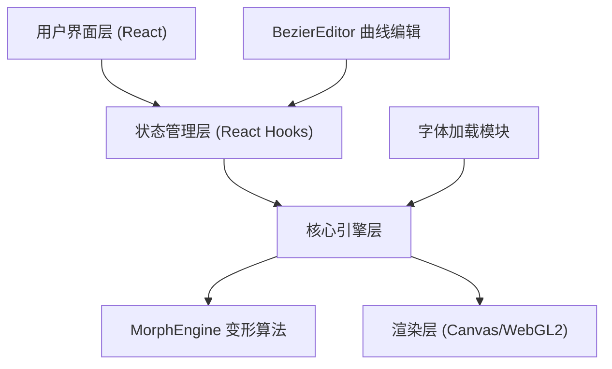

## 1. 架构设计



## 2. 技术描述

- 前端框架：React 18 + TypeScript
- 构建工具：Vite 5
- 渲染技术：Canvas2D（默认），WebGL2（可选，自动检测）
- 状态管理：React Hooks (useState, useRef, useEffect)
- 字体处理：Font Face API + Canvas 2D Context测量

## 3. 目录结构

```
auto60/
├── src/
│   ├── MorphEngine.ts      # 核心变形算法模块
│   ├── BezierEditor.tsx    # 贝塞尔曲线编辑组件
│   ├── App.tsx             # 主应用组件
│   └── main.tsx            # 应用入口
├── package.json
├── index.html
├── vite.config.js
└── tsconfig.json
```

## 4. 核心模块定义

### 4.1 MorphEngine 模块

**类型定义：**
```typescript
interface Point {
  x: number;
  y: number;
}

interface MorphOptions {
  controlPoints: number;
  easing?: (t: number) => number;
}

interface MorphEngine {
  morph(
    startVerts: Point[][],
    endVerts: Point[][],
    progress: number,
    easingFn?: (t: number) => number
  ): Point[][];
  resamplePath(path: Point[], targetLength: number): Point[];
}
```

**方法说明：**
- `morph()`：接收起始和结束字体的轮廓顶点数组，通过线性插值生成中间帧
- `resamplePath()`：重采样路径，确保起始和结束路径顶点数量一致

### 4.2 BezierEditor 组件

**Props：**
```typescript
interface BezierEditorProps {
  controlPoints: [Point, Point];
  onChange: (points: [Point, Point]) => void;
  onReset: () => void;
}
```

**功能：**
- 渲染300x300坐标系和参考对角线
- 支持拖拽两个控制点
- 实时输出easing函数
- 坐标值实时显示

### 4.3 App.tsx 状态管理

```typescript
interface AppState {
  startFont: string;
  endFont: string;
  customFonts: Map<string, FontFace>;
  text: string;
  isPlaying: boolean;
  controlPoints: [Point, Point];
  animationProgress: number;
}
```

## 5. 渲染流程

1. 字体加载 → 2. Canvas测量文字轮廓 → 3. 提取路径顶点 → 4. MorphEngine插值计算 → 5. Canvas/WebGL2渲染 → 6. requestAnimationFrame循环

## 6. 性能优化策略

- 使用requestAnimationFrame实现60fps动画循环
- 路径顶点预计算，避免每帧重复计算
- WebGL2硬件加速（自动检测支持）
- Canvas2D降级方案
- 字体加载进度条反馈
