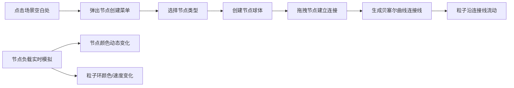

## 1. 产品概述
交互式3D数据管道流与节点负载可视化应用，用于直观展示有向图中的数据流动与节点处理能力。
- 面向数据流可视化领域的开发者和工程师，帮助理解复杂数据管道的运行状态
- 通过动态粒子流和节点负载颜色编码，实时呈现系统运行状况

## 2. 核心功能

### 2.1 用户角色
| 角色 | 注册方式 | 核心权限 |
|------|----------|----------|
| 普通用户 | 无需注册 | 创建节点、连接节点、查看运行状态 |

### 2.2 功能模块
1. **3D场景主界面**：节点渲染、连接线、粒子流、交互操作
2. **节点管理**：创建/删除节点、编辑节点属性、节点类型选择
3. **连接线系统**：贝塞尔曲线连接、有向边、粒子流动画
4. **节点负载可视化**：动态颜色变化、粒子环、吞吐量/延迟显示
5. **全局控制面板**：全选/删除节点、重置视角、FPS统计

### 2.3 页面详情
| 页面名称 | 模块名称 | 功能描述 |
|-----------|-------------|---------------------|
| 主场景 | 3D渲染区 | Three.js场景渲染节点、连接线、粒子系统，支持鼠标交互 |
| 主场景 | 节点创建菜单 | 点击空白处弹出，选择节点类型（数据源/处理/汇聚） |
| 主场景 | 节点详情面板 | 点击节点弹出，显示名称、负载、吞吐量、延迟，支持拖拽 |
| 主场景 | 全局控制面板 | 左下角，全选/删除节点、重置视角 |
| 主场景 | 状态指示器 | 右上角，FPS计数器、节点总数 |

## 3. 核心流程
用户点击空白场景弹出节点创建菜单 → 选择节点类型创建节点 → 从节点拖拽到另一节点建立连接 → 系统实时模拟负载变化 → 粒子沿连接线流动 → 节点颜色和粒子环随负载动态变化

## 4. 用户界面设计

### 4.1 设计风格
- 主色调：深空渐变背景（#0f0c29 → #302b63 → #24243e）
- 节点状态色：低负载蓝色#00d2ff、中负载黄色#ffd700、高负载红色#ff4757
- 选中状态：金色#ffd700发光光环
- 按钮风格：半透明深色毛玻璃背景、圆角、悬停变亮30%、点击缩放反馈0.15s
- 字体：现代无衬线字体（Space Grotesk或JetBrains Mono风格）
- 布局：沉浸式3D场景覆盖全屏，UI控件浮于场景之上

### 4.2 页面设计概述
| 页面名称 | 模块名称 | UI元素 |
|-----------|-------------|-------------|
| 主场景 | 3D渲染区 | 深空渐变背景、球体节点、贝塞尔连接线、流动粒子、轨道控制器 |
| 主场景 | 节点创建菜单 | 半透明深色面板、3个类型按钮、悬停效果 |
| 主场景 | 节点详情面板 | 毛玻璃背景、可编辑名称、负载进度条、吞吐量/延迟数值、可拖拽 |
| 主场景 | 全局控制面板 | 宽240px、圆角12px、3个功能按钮 |
| 主场景 | 状态指示器 | 右上角、FPS数字、节点总数数字 |

### 4.3 响应性
- 桌面端优先，全屏沉浸式体验
- UI控件使用固定像素位置，不依赖响应式布局
- 场景自适应窗口大小变化

### 4.4 3D场景指导
- 环境：深空渐变背景，营造科技感/未来感氛围
- 光照：多点环境光 + 方向光，突出节点球体的立体感
- 相机：默认正对原点，透视相机，支持OrbitControls拖拽旋转和滚轮缩放
- 旋转阻尼0.95，缩放范围3-20单位
- 后处理：Bloom发光效果用于选中节点光环
- 性能预算：20节点+50连接线时≥30FPS，粒子总数≤2000
