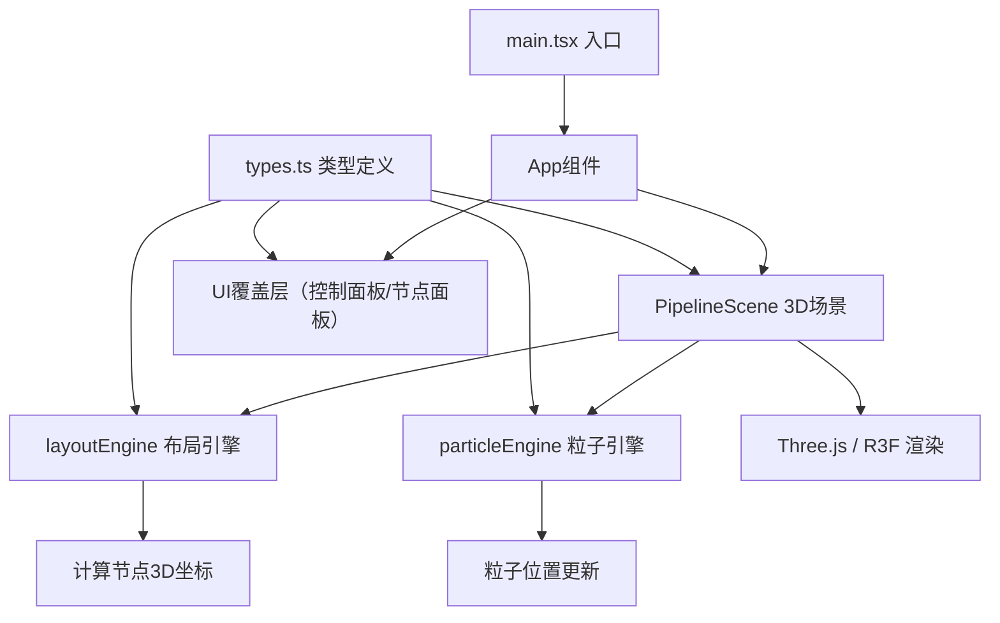

## 1. 架构设计



## 2. 技术描述
- 前端：React@18 + TypeScript + Vite
- 3D渲染：Three.js + @react-three/fiber + @react-three/drei
- 状态管理：React useState/useRef（轻量场景）
- 工具库：uuid
- 初始化工具：vite-init

## 3. 文件结构与调用关系

```
src/
├── main.tsx              # React入口，挂载App
├── App.tsx               # 顶层组件，组合3D场景与UI
├── types.ts              # 共享类型定义（NodeData, Edge, Particle等）
├── components/
│   └── PipelineScene.tsx # 核心3D场景组件（调用layoutEngine和particleEngine）
└── utils/
    ├── layoutEngine.ts   # 节点布局模块（被PipelineScene调用）
    └── particleEngine.ts # 粒子动画模块（被PipelineScene每帧调用）
```

**数据流向：**
1. 用户交互 → App.tsx状态更新 → PipelineScene接收props
2. PipelineScene → layoutEngine → 输出节点位置数组 → 渲染节点
3. PipelineScene → particleEngine（每帧） → 输出粒子位置 → 更新粒子系统
4. 节点负载模拟 → 触发particleEngine参数更新 → 粒子密度/速度变化

## 4. 类型定义

```typescript
interface NodeData {
  id: string;
  name: string;
  type: 'source' | 'processor' | 'sink';
  position: [number, number, number];
  load: number;           // 0-100
  throughput: number;     // 粒子/秒
  latency: number;        // ms
}

interface Edge {
  id: string;
  sourceId: string;
  targetId: string;
}

interface Particle {
  id: string;
  edgeId: string;
  progress: number;       // 0-1 沿路径进度
  speed: number;
}
```

## 5. 核心模块职责

### 5.1 layoutEngine.ts
- 输入：节点数量
- 输出：节点3D坐标数组（随机分布于半径5的球壳内）
- 提供函数：`generateNodePositions(count: number): [number, number, number][]`

### 5.2 particleEngine.ts
- 输入：边列表、节点负载数据、时间增量
- 输出：每帧粒子位置更新
- 负责：粒子创建/销毁、沿贝塞尔曲线运动、速度/密度随负载调整
- 粒子上限：2000个

### 5.3 PipelineScene.tsx
- 管理Three.js场景、相机、渲染器
- 节点球体渲染 + 选中发光效果
- 贝塞尔曲线连接线渲染
- 节点周围粒子环渲染
- 连接线粒子流渲染
- 处理点击创建节点、拖拽连接节点交互
