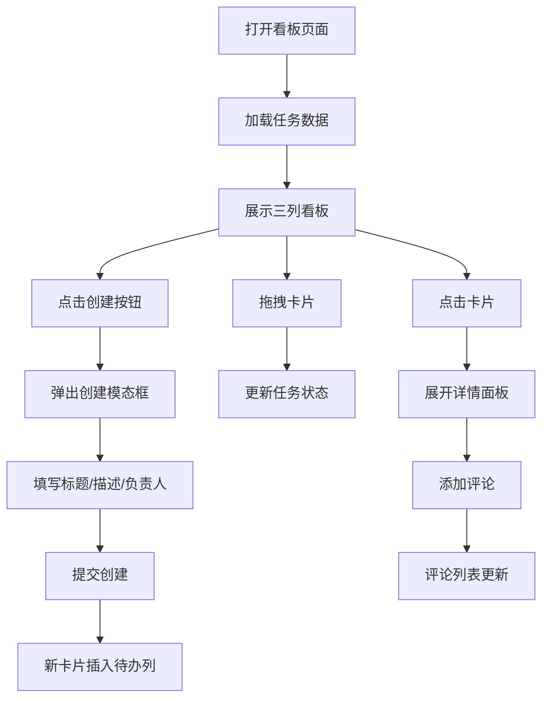

## 1. 产品概述

远程团队协作看板与工作流追踪系统，为分布式团队提供直观的任务管理工具。解决现有数字看板工具过于复杂或协作反馈不够直观的问题，模拟物理白板贴便签的使用体验，让团队成员能够快速跟踪任务进度。

- 主要用途：远程团队任务跟踪、工作流可视化、团队协作管理
- 目标用户：远程办公团队、项目管理者、产品开发团队
- 市场价值：提供简洁高效的看板体验，降低团队协作工具的学习成本

## 2. 核心功能

### 2.1 用户角色
| 角色 | 注册方式 | 核心权限 |
|------|----------|----------|
| 团队成员 | 预设用户列表 | 查看看板、创建任务、拖拽更新状态、添加评论 |

### 2.2 功能模块
1. **看板主界面**：三列布局（待办、进行中、已完成），任务卡片展示，拖拽交互
2. **任务管理**：创建新任务卡片，输入标题、描述、负责人
3. **详情面板**：卡片点击展开，查看完整信息、评论区
4. **评论系统**：任务评论提交与展示
5. **侧边栏**：团队成员列表、本周完成统计

### 2.3 页面详情
| 页面名称 | 模块名称 | 功能描述 |
|---------|---------|---------|
| 看板主页 | 三列看板 | 展示待办、进行中、已完成三列任务，支持拖拽更新状态 |
| 看板主页 | 创建卡片按钮 | 右上角渐变按钮，点击弹出模态框创建新任务 |
| 看板主页 | 创建模态框 | 输入标题（≤50字）、描述（≤200字）、选择负责人 |
| 看板主页 | 任务卡片 | 展示标题、负责人、彩色竖条，悬停显示拖拽手柄 |
| 看板主页 | 详情面板 | 底部滑入，展示完整描述、负责人头像、创建时间、评论区 |
| 看板主页 | 评论区 | 评论输入、评论列表展示、自动滚动到最新 |
| 看板主页 | 侧边栏 | 团队成员列表、本周完成数量统计 |

## 3. 核心流程

用户打开看板页面 → 查看三列任务分布 → 点击右上角按钮创建新任务 → 填写信息提交 → 新卡片出现在待办列 → 拖拽卡片到进行中/已完成列 → 点击卡片查看详情 → 添加评论 → 团队成员实时同步更新

## 4. 用户界面设计

### 4.1 设计风格
- 主色调：灰白背景 #F5F7FA，卡片白色 #FFFFFF
- 状态标识色：待办浅蓝 #E3F2FD，进行中浅黄 #FFF8E1，已完成浅绿 #E8F5E9
- 卡片竖条色：红 #E53935、蓝 #1E88E5、绿 #43A047、橙 #FB8C00（随机）
- 按钮渐变：蓝紫 #667eea 到 #764ba2
- 圆角规范：列头标签8px、按钮24px、模态框12px、卡片8px、详情面板16px 16px 0 0
- 字体：清晰现代的无衬线字体，层次分明的字号体系

### 4.2 页面设计概述
| 页面名称 | 模块名称 | UI元素 |
|---------|---------|--------|
| 看板主页 | 三列看板 | 每列宽280px，列头彩色标签，列间距24px，背景高亮动画 |
| 看板主页 | 创建卡片按钮 | 宽160px高48px，渐变背景，圆角24px，悬停上移3px加深投影 |
| 看板主页 | 创建模态框 | 宽480px，白色背景，圆角12px，中心放大动画0.3s ease-out |
| 看板主页 | 任务卡片 | 宽260px，最小高120px，白色背景2px淡灰边框，左侧4px彩色竖条 |
| 看板主页 | 拖拽手柄 | 卡片底部悬停0.2s后出现 |
| 看板主页 | 详情面板 | 从下向上滑入，占40%高度，圆角16px 16px 0 0，动画0.3s cubic-bezier |
| 看板主页 | 评论输入框 | 高80px，圆角8px，聚焦边框变蓝 #1E88E5 |
| 看板主页 | 评论列表 | 每条高50px，左侧首字母圆形图标，右侧内容和时间戳 |
| 看板主页 | 侧边栏 | 宽280px，白色背景，1px分隔线，顶部成员列表（每人高48px），底部统计数字48px加粗绿色 |

### 4.3 响应式
- 桌面端：三列并排+右侧固定侧边栏
- 平板端（≤768px）：三列垂直堆叠，侧边栏折叠为右上角图标按钮
- 触摸优化：拖拽手势支持，触摸目标尺寸≥48px

### 4.4 动效设计
- 模态框进入：中心从200%放大到100%，0.3s ease-out
- 详情面板：从下向上滑入，0.3s cubic-bezier(0.4, 0, 0.2, 1)
- 拖拽时：卡片跟随鼠标，透明度0.8，目标列背景高亮0.3s
- 按钮悬停：上移3px，投影加深
- 拖拽手柄：延迟0.2s渐入
- 评论区：自动滚动到最新评论
