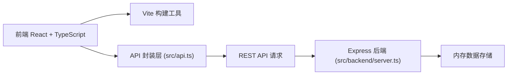
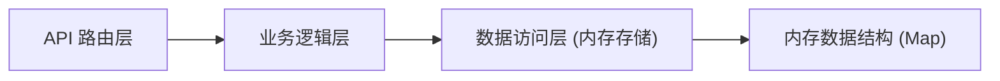
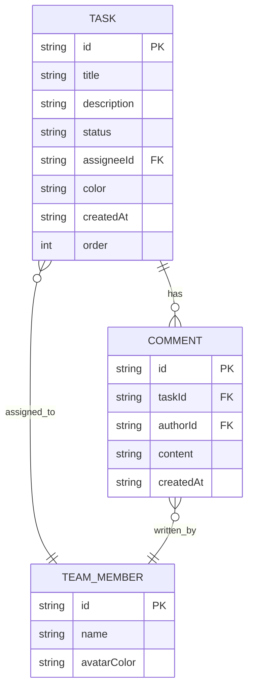

## 1. 架构设计



## 2. 技术描述
- 前端：React 18 + TypeScript + Vite
- 状态管理：React Hooks (useState, useEffect, useCallback, useRef)
- 样式：CSS Modules 或 styled-components（遵循视觉规范）
- 后端：Express 4 + TypeScript
- 数据存储：内存存储（Map 对象）
- 跨域：cors 中间件
- 唯一ID：uuid 库
- 图标：lucide-react
- 拖拽实现：原生 HTML5 Drag and Drop API + 自定义鼠标事件（确保帧率≥55fps）

## 3. 目录结构
```
auto63/
├── package.json
├── index.html
├── vite.config.js
├── tsconfig.json
├── src/
│   ├── types.ts          # 类型定义
│   ├── api.ts            # API请求封装
│   ├── App.tsx           # 主组件
│   ├── KanbanColumn.tsx  # 看板列组件
│   ├── TaskCard.tsx      # 任务卡片组件
│   ├── TaskDetail.tsx    # 详情面板组件
│   ├── Sidebar.tsx       # 侧边栏组件
│   └── backend/
│       └── server.ts     # Express后端
```

## 4. API 定义

### 类型定义
```typescript
interface TeamMember {
  id: string;
  name: string;
  avatarColor: string;
}

interface Comment {
  id: string;
  taskId: string;
  author: TeamMember;
  content: string;
  createdAt: string;
}

interface Task {
  id: string;
  title: string;
  description: string;
  status: 'todo' | 'inProgress' | 'done';
  assignee: TeamMember;
  color: string;
  createdAt: string;
  comments: Comment[];
  order: number;
}
```

### 接口定义
| 方法 | 路径 | 描述 | 请求体 | 响应 |
|------|------|------|--------|------|
| GET | /api/tasks | 获取所有任务 | - | Task[] |
| POST | /api/tasks | 创建新任务 | { title, description, assigneeId } | Task |
| PUT | /api/tasks/:id/status | 更新任务状态 | { status, order } | Task |
| POST | /api/tasks/:id/comments | 添加评论 | { content, authorId } | Comment |
| GET | /api/members | 获取团队成员 | - | TeamMember[] |
| GET | /api/stats | 获取统计数据 | - | { completedThisWeek: number } |

## 5. 服务器架构



- **API 路由层**：Express 路由处理 HTTP 请求，参数校验
- **业务逻辑层**：处理任务创建、状态更新、评论添加的业务规则
- **数据访问层**：封装对内存存储的 CRUD 操作，确保数据一致性
- **内存数据结构**：使用 Map 存储 tasks 和 members，按 status 和 order 排序

## 6. 数据模型

### 6.1 数据模型定义


### 6.2 初始数据
- 预设团队成员：张三、李四、王五、赵六（4人）
- 初始化示例任务：每个状态列2-3个示例任务
- 示例评论：每个任务1-2条示例评论

## 7. 性能优化
- **拖拽性能**：使用 requestAnimationFrame 确保帧率≥55fps
- **避免重排**：拖拽时使用 transform 而非 top/left
- **事件节流**：高频拖拽事件节流处理
- **组件优化**：使用 React.memo 避免不必要重渲染
- **样式优化**：使用 CSS 变量，避免频繁样式计算
