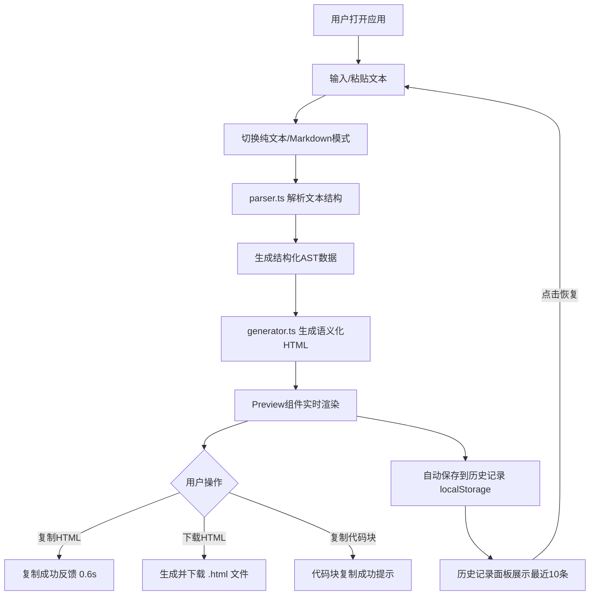

## 1. 产品概述
智能文本样式识别与格式化导出工具，帮助UI设计师和内容创作者快速将设计稿中的文本结构自动转换为语义化HTML代码。
- 核心目标：解决手动复制粘贴和调整文本样式耗时的痛点，通过智能识别实现一键格式化导出
- 目标用户：UI设计师、前端开发者、技术文档作者、内容创作者
- 产品价值：提升文本格式化效率80%以上，减少重复劳动，保证HTML语义化一致性

## 2. 核心功能

### 2.1 功能模块
1. **文本输入模块**：支持粘贴/手动输入，纯文本/Markdown模式切换，输入区样式提示
2. **智能解析模块**：自动识别六种文本结构（标题、无序列表、有序列表、引用、代码块、段落）
3. **实时预览模块**：左右并排布局，预览区淡入淡出动画，字符/行数统计
4. **导出功能模块**：一键复制HTML、下载HTML文件、复制代码块内容
5. **代码高亮模块**：基于highlight.js的多语言语法高亮，语言标签显示
6. **历史记录模块**：localStorage持久化存储最近10条记录，一键恢复

### 2.2 页面详情
| 页面名称 | 模块名称 | 功能描述 |
|-----------|-------------|---------------------|
| 主工作区 | 顶部导航栏 | 应用名称展示、导出统计数据、56px高度深蓝色背景 |
| 主工作区 | 文本输入区 | 800x300输入框、模式切换、格式提示标签、左侧装饰条高亮 |
| 主工作区 | 实时预览区 | 语义化HTML渲染、淡入淡出动画、字符/行数统计栏 |
| 主工作区 | 导出操作区 | 复制HTML按钮（成功态反馈）、下载HTML按钮 |
| 主工作区 | 代码块组件 | 语法高亮、语言标签、复制代码按钮 |
| 主工作区 | 历史记录面板 | 底部展开、10条记录列表、输入/输出预览、点击恢复 |
| 主工作区 | 底部页脚 | 操作提示文字、浅灰色分隔条 |

## 3. 核心流程
用户打开应用后，在左侧输入区粘贴或输入文本，系统自动识别文本结构并在0.3秒内完成HTML生成，右侧预览区实时渲染结果。用户可通过复制或下载按钮导出HTML，同时系统自动保存转换记录。

## 4. 用户界面设计

### 4.1 设计风格
- **主色调**：深蓝#1E3A5F（顶部导航）、浅灰#F3F4F6（背景）、白色#FFFFFF（卡片）
- **结构色标**：标题金色#F59E0B、列表蓝色#3B82F6、引用绿色#10B981、代码紫色#8B5CF6、段落灰色#6B7280
- **按钮风格**：圆角6px，白色背景1px边框，悬停加深0.1亮度，点击0.1s缩放效果
- **字体**：标题使用"SF Pro Display"增强现代感，正文使用"PingFang SC"保证中文可读性
- **布局风格**：卡片式布局，圆角12px，柔和阴影0 2px 8px rgba(0,0,0,0.08)，16px间距
- **动效风格**：预览更新0.2s淡出+0.3s淡入，复制成功0.6s绿色反馈

### 4.2 页面设计概览
| 页面名称 | 模块名称 | UI元素 |
|-----------|-------------|-------------|
| 主工作区 | 顶部导航栏 | 56px高度、深蓝背景、白色文字、左侧应用名、右侧统计信息 |
| 主工作区 | 输入卡片 | 白色背景、24px内边距、圆角12px、柔和阴影、模式切换Tab |
| 主工作区 | 预览卡片 | 白色背景、24px内边距、圆角12px、柔和阴影、统计+操作顶栏 |
| 主工作区 | 文本结构装饰条 | 左侧彩色竖线（金/蓝/绿/紫/灰），4px宽度 |
| 主工作区 | 代码块容器 | 紫色装饰条、右上角语言标签+复制按钮、深色代码背景 |
| 主工作区 | 历史记录面板 | 底部展开式、卡片列表、输入50字符预览+输出100字符预览 |
| 主工作区 | 页脚分隔 | 浅灰#E5E7EB横线、居中小字号操作提示文字 |

### 4.3 响应式
- **桌面端（≥900px）**：左右并排布局，各占50%宽度，撑满可用高度
- **移动端（<900px）**：上下堆叠布局，输入区60%高度在上，预览区40%高度在下
- **触控优化**：按钮最小点击区域40x40px，关键操作按钮尺寸保证触控友好

### 4.4 性能指标
- 5000字符以内文本：解析+生成耗时≤100ms
- 预览渲染帧率：≥30FPS
- 使用防抖优化输入响应，避免频繁重渲染
