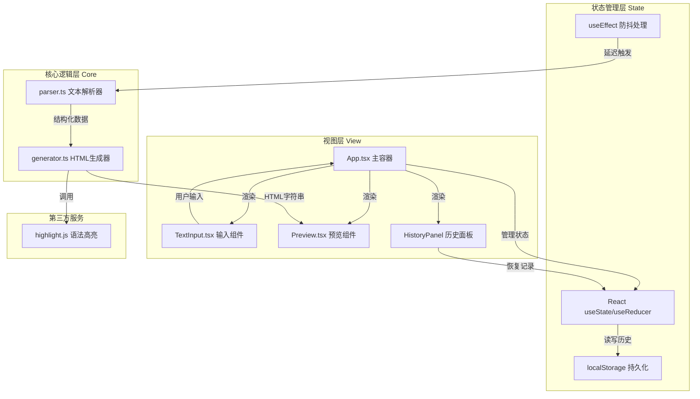

## 1. 架构设计



## 2. 技术说明
- **前端框架**：React@18 + TypeScript@5
- **构建工具**：Vite@5 + @vitejs/plugin-react@4
- **语法高亮**：highlight.js@11
- **样式方案**：CSS Modules + CSS 变量（全局变量控制主题色）
- **数据持久化**：浏览器 localStorage API
- **初始化方式**：手动创建配置文件（package.json、tsconfig.json、vite.config.js）

## 3. 文件结构与调用关系

| 文件路径 | 职责说明 | 输入 | 输出 | 被谁调用 | 调用谁 |
|----------|----------|------|------|----------|--------|
| `package.json` | 项目依赖与脚本配置 | - | - | npm | - |
| `vite.config.js` | Vite构建配置（React+TS支持） | - | - | vite | - |
| `tsconfig.json` | TypeScript严格模式配置 | - | - | tsc | - |
| `index.html` | 入口HTML页面 | - | - | 浏览器 | App.tsx |
| `src/App.tsx` | 主应用组件：状态管理、组件组装、防抖调度 | - | 完整UI | index.html | TextInput, Preview, HistoryPanel, parser, generator |
| `src/parser.ts` | 文本解析器：6种结构识别、层级关系构建 | rawText: string | BlockNode[] AST节点数组 | App.tsx | - |
| `src/generator.ts` | HTML生成器：AST转语义化HTML | blocks: BlockNode[] | htmlString: string | App.tsx, Preview.tsx | highlight.js |
| `src/components/TextInput.tsx` | 文本输入组件：粘贴/输入/模式切换/装饰条渲染 | value, mode, onChange, onModeChange | 输入交互事件 | App.tsx | - |
| `src/components/Preview.tsx` | 预览组件：HTML渲染/字符统计/复制下载/动画效果 | htmlString, rawText | 复制/下载事件 | App.tsx | generator.ts |
| `src/components/HistoryPanel.tsx` | 历史面板：记录展示/恢复操作 | historyList, onRestore, onClear | 恢复事件 | App.tsx | - |
| `src/styles/global.css` | 全局样式：CSS变量、重置、布局、动画 | - | - | App.tsx | - |
| `src/types/index.ts` | TypeScript类型定义 | - | BlockNode, HistoryItem等类型 | parser.ts, generator.ts, App.tsx | - |

**数据流向**：
```
用户输入 → TextInput → App.state.rawText → 防抖300ms → parser.parse() 
→ BlockNode[] → generator.generate() → HTML字符串 → Preview渲染
→ 自动保存 → localStorage(HistoryItem[]) → HistoryPanel展示
```

## 4. 核心数据结构定义

```typescript
// 文本块类型枚举
enum BlockType {
  HEADING = 'heading',
  UNORDERED_LIST = 'ul',
  ORDERED_LIST = 'ol',
  QUOTE = 'quote',
  CODE_BLOCK = 'code',
  PARAGRAPH = 'paragraph'
}

// 解析后的AST节点
interface BlockNode {
  id: string;
  type: BlockType;
  content: string;
  level?: number;          // 标题层级 1-6 / 列表层级
  language?: string;       // 代码块语言
  children?: BlockNode[];  // 嵌套子节点（列表项）
}

// 历史记录条目
interface HistoryItem {
  id: string;
  timestamp: number;
  inputPreview: string;   // 输入前50字符
  outputPreview: string;  // 输出前100字符
  rawText: string;        // 完整输入文本
  htmlString: string;     // 完整输出HTML
}
```

## 5. 解析算法设计

**parser.ts 处理流程**：
1. 将输入文本按行分割，去除首尾空白行
2. 维护状态机：当前上下文（段落/列表/代码块）
3. 逐行正则匹配：
   - `/^#{1,6}\s/` → HEADING，提取level和内容
   - `/^```\s*(\w+)?/` → CODE_BLOCK开始/结束标记
   - `/^>\s?/` → QUOTE块
   - `/^-\s/` → UNORDERED_LIST项
   - `/^\d+\.\s/` → ORDERED_LIST项
   - 其他 → PARAGRAPH（连续非空行合并）
4. 合并相邻同类型列表项
5. 为每个节点生成唯一ID并返回BlockNode数组

**generator.ts 处理流程**：
1. 遍历BlockNode数组，根据type映射HTML标签
2. HEADING → `<h1>`~`<h6>` 带金色装饰条容器
3. UL/OL → 递归处理children生成嵌套列表
4. QUOTE → `<blockquote>` 带绿色装饰条
5. CODE_BLOCK → `<pre><code>` 调用highlight.js高亮，注入语言标签和复制按钮
6. PARAGRAPH → `<p>` 带灰色装饰条
7. 拼接所有HTML片段返回完整字符串
