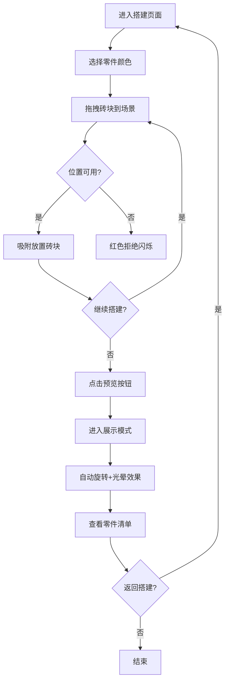

## 1. 产品概述

创意乐高虚拟搭建与效果预览平台，为乐高爱好者提供在购买实体套装前进行虚拟拼搭验证的3D交互工具，解决现有工具复杂难用、无法分享的痛点。

- 面向乐高爱好者、创意设计师，提供零门槛的3D虚拟搭建体验
- 核心价值：降低创意验证成本，提升搭建乐趣，支持作品展示分享

## 2. 核心功能

### 2.1 用户角色

| 角色 | 注册方式 | 核心权限 |
|------|----------|----------|
| 普通用户 | 无需注册 | 自由搭建、预览展示、历史操作 |

### 2.2 功能模块

1. **3D搭建场景**：等轴测视角、20x20网格地面、实时渲染
2. **零件库系统**：左侧面板、多规格砖块、颜色过滤、拖拽交互
3. **搭建操作**：拖拽吸附、碰撞检测、撤销重做、新建清空
4. **展示模式**：自动旋转、光晕特效、零件清单、缩放交互

### 2.3 页面详情

| 页面名称 | 模块名称 | 功能描述 |
|----------|----------|----------|
| 主搭建页面 | 3D场景模块 | 等轴测45度视角、#f0f4f8背景、20x20网格地面 |
| 主搭建页面 | 零件库面板 | 占20%宽度、#fafafa背景、1px边框、圆角12px、卡片投影 |
| 主搭建页面 | 颜色过滤栏 | 右侧竖排水色块、16x16px、选中3px白边 |
| 主搭建页面 | 操作按钮组 | 撤销/重做/新建（圆形44px）、预览按钮（200x56px渐变） |
| 展示模式页面 | 旋转动画 | Y轴匀速旋转、周期8秒 |
| 展示模式页面 | 光晕特效 | 砖块边缘脉冲光晕、独立周期2-4s、透明度0.2-0.6 |
| 展示模式页面 | 零件清单 | 底部显示、按颜色规格分类统计 |
| 展示模式页面 | 缩放控制 | 鼠标滚轮、范围0.5x-3x |

## 3. 核心流程

用户从左侧零件库选择砖块颜色和规格，拖拽到3D场景中的网格上，系统自动吸附并检测碰撞，完成搭建后点击预览按钮进入展示模式，查看旋转动画和零件清单。

## 4. 用户界面设计

### 4.1 设计风格

- **主色调**：浅灰背景#f0f4f8、面板浅灰#fafafa
- **乐高经典色**：红#c41e3a、黄#ffd500、蓝#0054a6、绿#287c37、白#ffffff、黑#1c1c1c
- **强调色**：按钮渐变#ff6b6b→#ee5a24、悬停浅蓝#e3f2fd
- **按钮风格**：预览按钮圆角28px、操作按钮圆形44px
- **布局风格**：极简卡片式、圆角12px、轻微投影#0000001a
- **动效风格**：拖拽放大1.1倍(0.15s)、拒绝闪烁(0.3s)、光晕脉冲(2-4s随机)
- **交互反馈**：50ms内响应、60fps流畅渲染

### 4.2 页面设计概览

| 页面名称 | 模块名称 | UI元素 |
|----------|----------|--------|
| 主搭建页面 | 全局布局 | 左侧20%零件库、右侧80%3D场景、顶部操作栏 |
| 主搭建页面 | 零件库 | 砖块预览卡片、颜色过滤条、自定义滚动条 |
| 主搭建页面 | 3D场景 | 等轴测相机、网格地面、砖块实例、拖拽悬停效果 |
| 主搭建页面 | 顶部操作区 | 撤销/重做/新建按钮组（左侧）、预览按钮（右侧） |
| 展示模式页面 | 3D场景 | 旋转动画、光晕后处理、缩放控制 |
| 展示模式页面 | 零件清单 | 底部半透明面板、分类统计列表 |
| 确认对话框 | 模态框 | 340px宽、圆角16px、半透明遮罩#00000066 |

### 4.3 响应性

- 桌面端优先设计，固定布局比例
- 3D画布自适应容器大小
- 最小窗口宽度1280px，保证操作区域充足

### 4.4 3D场景设计指导

- **环境**：纯色背景#f0f4f8、柔和环境光+方向光
- **光照**：AmbientLight(0xffffff, 0.6) + DirectionalLight(0xffffff, 0.8) + 半球光补色
- **相机**：PerspectiveCamera、等轴测45度视角、初始位置(15, 15, 15)看向原点
- **地面**：20x20网格、线宽1px、颜色#d0d5dd
- **砖块材质**：MeshStandardMaterial、轻微金属感0.1、粗糙度0.5
- **后处理**：展示模式下添加Bloom光晕效果、砖块边缘发光
- **性能**：实例化渲染(InstancedMesh)、视锥剔除、目标60fps
