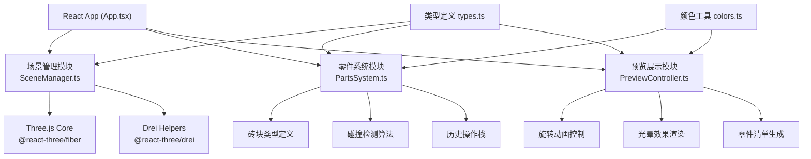

## 1. 架构设计



## 2. 技术描述

- **前端框架**：React 18 + TypeScript 5 + Vite 5
- **3D渲染**：Three.js 0.160 + @react-three/fiber 8.15 + @react-three/drei 9.92
- **状态管理**：React useState/useReducer（轻量级场景）
- **唯一标识**：uuid 9.0
- **构建工具**：Vite 5.0 + @vitejs/plugin-react 4.2
- **代码规范**：TypeScript 严格模式 (strict: true)

## 3. 目录结构

```
auto66/
├── package.json
├── index.html
├── vite.config.js
├── tsconfig.json
├── src/
│   ├── main.tsx                 # React入口
│   ├── components/
│   │   └── App.tsx              # 主应用组件
│   ├── modules/
│   │   ├── scene/
│   │   │   └── SceneManager.ts  # 场景管理模块
│   │   ├── parts/
│   │   │   └── PartsSystem.ts   # 零件系统模块
│   │   └── preview/
│   │       └── PreviewController.ts  # 预览展示模块
│   └── utils/
│       ├── colors.ts            # 颜色常量
│       └── types.ts             # 类型定义
```

## 4. 模块接口定义

### 4.1 SceneManager 接口

```typescript
interface ISceneManager {
  getScene(): THREE.Scene;
  getCamera(): THREE.PerspectiveCamera;
  getRenderer(): THREE.WebGLRenderer;
  setGrid(size: number, divisions: number): void;
  setBackgroundColor(color: string): void;
  updateCameraPosition(x: number, y: number, z: number): void;
  startRenderLoop(callback: (delta: number) => void): void;
  stopRenderLoop(): void;
  worldToScreen(worldPos: THREE.Vector3): { x: number; y: number };
  screenToWorld(screenX: number, screenY: number, planeY: number): THREE.Vector3;
}
```

### 4.2 PartsSystem 接口

```typescript
interface IPartsSystem {
  getBricks(): Brick[];
  addBrick(type: BrickType, position: GridPosition, color: string): Brick | null;
  removeBrick(id: string): Brick | null;
  undo(): Brick | null;
  redo(): Brick | null;
  canUndo(): boolean;
  canRedo(): boolean;
  checkCollision(position: GridPosition, size: BrickSize): boolean;
  snapToGrid(worldPos: THREE.Vector3): GridPosition;
  clearAll(): void;
  getHistory(): HistoryState;
}
```

### 4.3 PreviewController 接口

```typescript
interface IPreviewController {
  startPreview(scene: THREE.Scene, bricks: Brick[]): PreviewState;
  stopPreview(): void;
  updateRotation(delta: number): void;
  updateGlowEffects(delta: number): void;
  generatePartsList(bricks: Brick[]): PartsListItem[];
  setZoom(scale: number): void;
  getZoomRange(): { min: number; max: number };
  isActive(): boolean;
}
```

## 5. 核心数据模型

### 5.1 类型定义

```typescript
// 砖块规格类型
type BrickType = '1x1' | '1x2' | '2x2' | '2x4' | '1x3' | '2x3';

// 砖块尺寸
interface BrickSize {
  width: number;   // X方向单位数
  depth: number;   // Z方向单位数
  height: number;  // Y方向固定为1
}

// 网格位置
interface GridPosition {
  x: number;
  y: number;  // 层高度
  z: number;
}

// 砖块实例
interface Brick {
  id: string;
  type: BrickType;
  position: GridPosition;
  color: string;
  size: BrickSize;
  glowPhase?: number;     // 光晕动画相位
  glowPeriod?: number;    // 光晕周期
}

// 历史操作
type HistoryAction = 'ADD' | 'REMOVE';

interface HistoryEntry {
  action: HistoryAction;
  brick: Brick;
}

interface HistoryState {
  past: HistoryEntry[];
  future: HistoryEntry[];
  maxHistory: number;
}

// 场景状态
interface SceneState {
  cameraPosition: { x: number; y: number; z: number };
  cameraTarget: { x: number; y: number; z: number };
  gridSize: number;
  backgroundColor: string;
}

// 预览状态
interface PreviewState {
  isActive: boolean;
  rotationAngle: number;
  rotationSpeed: number;
  zoomLevel: number;
  bricks: Brick[];
}

// 零件清单项
interface PartsListItem {
  type: BrickType;
  color: string;
  colorName: string;
  count: number;
}
```

## 6. 性能优化策略

### 6.1 渲染性能

- 使用 `InstancedMesh` 批量渲染同类型砖块，减少Draw Call
- 视锥剔除 (Frustum Culling) 优化不可见对象
- 拖拽时使用 `requestAnimationFrame` 保证60fps
- 碰撞检测使用空间哈希 (Spatial Hash) 优化查询速度

### 6.2 交互响应

- 拖拽状态使用React ref存储，避免频繁重渲染
- 网格吸附计算使用整数运算，保证<50ms响应
- 历史操作栈限制最大10步，避免内存占用

### 6.3 动画优化

- Three.js `Clock` 统一管理时间增量
- 光晕效果使用ShaderMaterial实现GPU计算
- 旋转动画使用矩阵变换而非逐帧更新位置

## 7. 构建配置

### 7.1 Vite配置要点

- React Fast Refresh 开发热更新
- 生产构建启用 Tree Shaking
- Three.js 按需导入减少包体积
- Source Map 开发环境启用

### 7.2 TypeScript配置

- `strict: true` 严格类型检查
- `jsx: react-jsx` 新JSX转换
- `moduleResolution: bundler` Vite优化
- `skipLibCheck: true` 加快编译速度
