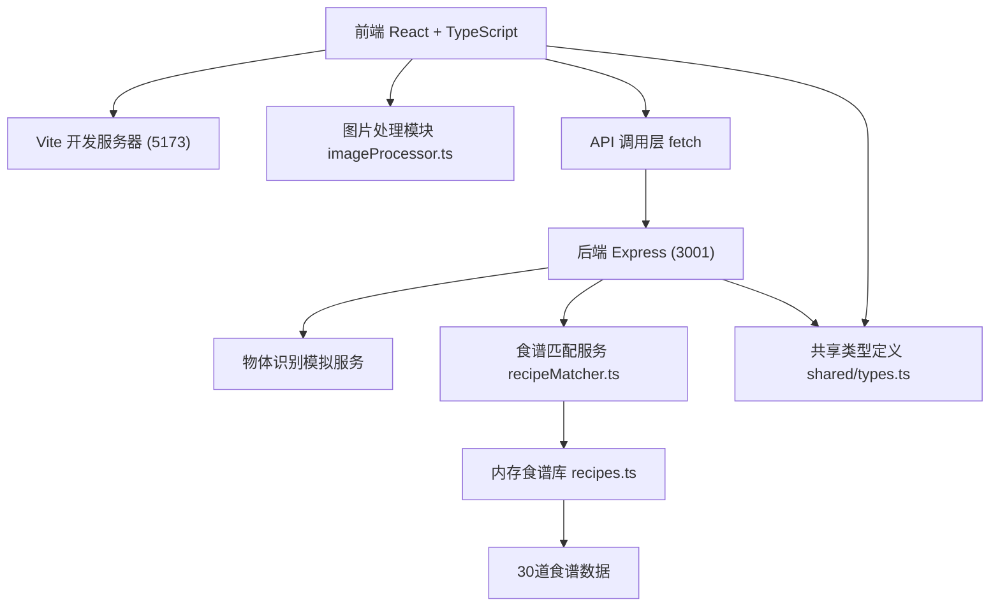

## 1. 架构设计



## 2. 技术描述

- **前端**：React 18 + TypeScript + Vite 5
  - 状态管理：React useState/useEffect（轻量场景无需额外状态库）
  - 样式方案：原生 CSS + CSS 变量 + CSS Modules
  - 图标库：lucide-react
- **后端**：Express 4 + TypeScript
  - 中间件：cors、multer（图片上传）、uuid
  - 数据存储：内存数组（模拟数据）
- **构建工具**：Vite 5，前端代理后端 API
- **开发模式**：concurrently 同时启动前端和后端

## 3. 目录结构

```
auto67/
├── package.json
├── index.html
├── vite.config.js
├── tsconfig.json
├── src/
│   ├── frontend/
│   │   ├── App.tsx              # 主应用组件
│   │   ├── components/
│   │   │   ├── ImageUploader.tsx    # 图片上传组件
│   │   │   ├── RecipeCard.tsx       # 食谱卡片组件
│   │   │   └── RecipeDetail.tsx     # 食谱详情面板
│   │   └── utils/
│   │       └── imageProcessor.ts    # 图片处理工具
│   ├── backend/
│   │   ├── server.ts            # Express 服务器入口
│   │   ├── services/
│   │   │   └── recipeMatcher.ts # 食谱匹配服务
│   │   └── data/
│   │       └── recipes.ts       # 模拟食谱库
│   └── shared/
│       └── types.ts             # 共享类型定义
```

## 4. 路由定义

| 路由 | 方法 | 目的 |
|------|------|------|
| / | GET | 前端主页面（Vite 提供） |
| /api/identify | POST | 上传图片进行物体识别，返回食材列表 |
| /api/recipes | POST | 根据食材列表获取匹配的食谱 |

## 5. API 定义

### 5.1 POST /api/identify

**请求**：`multipart/form-data`
- `images`: File[] - 上传的图片文件数组

**响应**：
```typescript
interface IdentifyResponse {
  success: boolean;
  ingredients: string[];
  processingTime: number;
}
```

### 5.2 POST /api/recipes

**请求**：`application/json`
```typescript
interface RecipeRequest {
  ingredients: string[];
}
```

**响应**：
```typescript
interface RecipeResponse {
  success: boolean;
  recipes: MatchedRecipe[];
  total: number;
}

interface MatchedRecipe extends Recipe {
  matchRate: number;
  matchedIngredients: string[];
  missingIngredients: string[];
}
```

### 5.3 共享类型定义

```typescript
interface Ingredient {
  name: string;
  category: string;
}

interface Recipe {
  id: string;
  name: string;
  ingredients: string[];
  duration: number;
  difficulty: 1 | 2 | 3 | 4 | 5;
  steps: string[];
  imageGradient: string;
}

interface IdentifyResult {
  ingredients: string[];
  confidence: number;
}
```

## 6. 核心模块说明

### 6.1 图片处理模块 (imageProcessor.ts)
- `validateImage(file: File): { valid: boolean; error?: string }`
  - 校验格式：jpg/png
  - 校验大小：最大 5MB
- `processImage(file: File): Promise<{ thumbnail: string; original: File }>`
  - 生成 120x120 缩略图 base64
  - 使用 Canvas API 压缩
  - 200ms 内完成

### 6.2 物体识别模拟服务
- 预设 20 种常见食材：鸡蛋、番茄、鸡胸肉、洋葱、土豆、胡萝卜、牛肉、面条、米饭、猪肉、白菜、豆腐、黄瓜、茄子、青椒、豆角、西兰花、蘑菇、虾、鱼
- 根据上传图片数量随机返回 3-8 种食材
- 模拟 0.8-1.2s 处理延迟

### 6.3 食谱匹配服务 (recipeMatcher.ts)
- `matchRecipes(ingredients: string[]): MatchedRecipe[]`
- 匹配规则：可用食材覆盖率 ≥ 60%
- 排序规则：先按覆盖率降序，再按难度升序
- 返回匹配度、已匹配食材、缺失食材

## 7. 性能指标

| 指标 | 要求 | 实现方案 |
|------|------|----------|
| 缩略图生成 | ≤ 200ms | Canvas 同步压缩处理 |
| 识别+渲染总时长 | ≤ 2.5s | 后端模拟延迟 0.8-1.2s，前端渲染优化 |
| 瀑布流滚动帧率 | ≥ 55fps | CSS contain: layout paint; will-change: transform |
| 首屏加载 | ≤ 1.5s | 代码分割，按需加载 |

## 8. 开发脚本

```json
{
  "scripts": {
    "dev": "concurrently \"npm run dev:frontend\" \"npm run dev:backend\"",
    "dev:frontend": "vite",
    "dev:backend": "tsx watch src/backend/server.ts",
    "build": "tsc && vite build",
    "check": "tsc --noEmit"
  }
}
```
