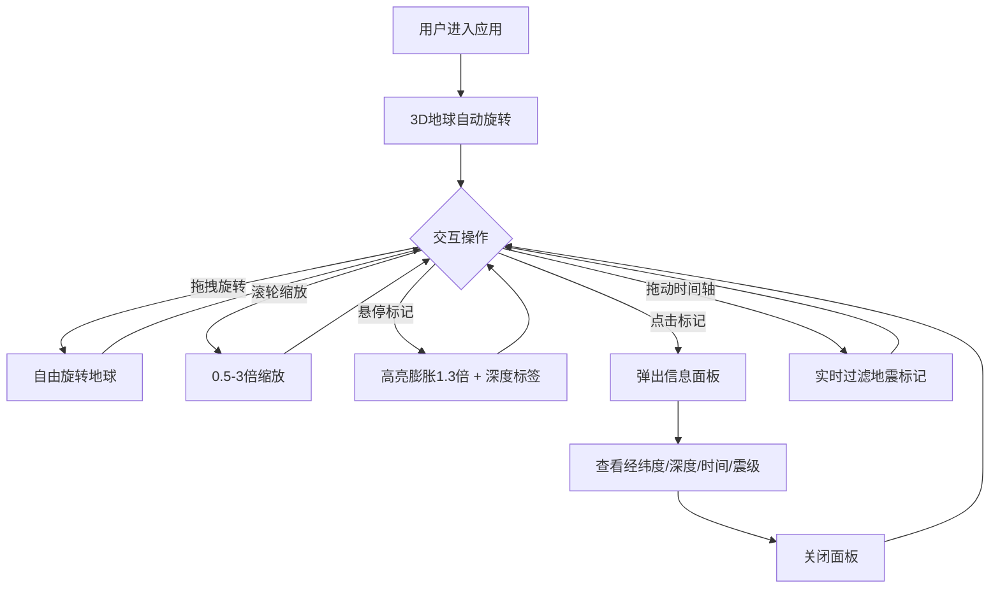

## 1. 产品概述
交互式3D地震活动时空可视化应用，在三维地球球体上呈现近30天全球地震事件的空间分布，让用户直观感知震源深度、震级与板块边界的时空关系，面向地理数据分析者和科研人员。
- 解决2D地图无法展示震源深度和震级三维分布规律的问题
- 目标价值：通过沉浸式3D交互提升地震数据分析的直观性和效率

## 2. 核心功能

### 2.1 用户角色
| 角色 | 注册方式 | 核心权限 |
|------|----------|----------|
| 访客 | 无需注册 | 浏览和交互全部可视化功能 |

### 2.2 功能模块
1. **3D地球场景页**：旋转地球、大气层辉光、地震脉冲标记、自由旋转与缩放
2. **时间轴控制面板**：日期范围滑块筛选、实时地震标记过滤

### 2.3 页面详情
| 页面名称 | 模块名称 | 功能描述 |
|----------|----------|----------|
| 3D地球场景页 | 旋转地球 | 带半透明大气辉光的3D地球，鼠标拖拽旋转、滚轮缩放（0.5-3倍），初始视角对准太平洋板块区域（经度150，纬度0） |
| 3D地球场景页 | 地震脉冲标记 | 震级映射大小（4.0→0.15，9.0→0.6）和颜色（绿#00ff88→红#ff0044），呼吸动画1.0-1.2倍循环（1.5秒），深度偏移（浅源外凸、中源内缩0.02、深源内缩0.05） |
| 3D地球场景页 | 悬停交互 | 悬停标记高亮膨胀1.3倍，显示深度标签 |
| 3D地球场景页 | 点击信息面板 | 点击标记弹出详情面板（经纬度、深度、UTC时间、震级），0.3秒弹性动画升起，关闭按钮 |
| 3D地球场景页 | 左上角标题 | 显示应用标题和当前筛选地震总数 |
| 时间轴控制面板 | 日期范围滑块 | 宽800px，可拖动选择起止日期，实时过滤地震标记，两端显示日期，金色滑块把手#e94560 |

## 3. 核心流程

用户进入应用 → 3D地球自动旋转展示全球地震分布 → 拖拽旋转/缩放探索不同区域 → 悬停标记查看深度标签 → 点击标记弹出详细信息面板 → 拖动时间轴滑块筛选时间范围 → 地震标记实时增减

## 4. 用户界面设计

### 4.1 设计风格
- 主色调：深蓝黑色#0a0b1a（太空背景）、#1a1a2e（面板背景）
- 强调色：#00ff88（低震级绿）→ #ff0044（高震级红）、#e94560（金色把手/边框）、#88ccff（大气辉光）
- 按钮风格：圆角胶囊形，半透明毛玻璃效果
- 字体：16px，font-weight 600，浅灰#e0e0e0
- 布局：全屏3D画布 + 覆盖层UI（左上标题、底部时间轴）
- 图标风格：简洁线性图标

### 4.2 页面设计概述
| 页面名称 | 模块名称 | UI元素 |
|----------|----------|--------|
| 3D地球场景页 | 3D画布 | 深蓝黑#0a0b1a背景，淡蓝大气辉光#88ccff，脉冲球体渐变绿→红 |
| 3D地球场景页 | 左上标题 | 浅灰#e0e0e0文字，16px，font-weight 600，显示地震总数 |
| 3D地球场景页 | 信息面板 | 宽300px，#1a1a2e背景90%不透明，圆角12px，1px边框#e94560，0.3秒弹性动画 |
| 时间轴控制面板 | 滑块容器 | 宽800px，高48px，圆角24px，背景#1a1a2e，毛玻璃blur(8px) |
| 时间轴控制面板 | 滑块轨道 | 渐变#16213e到#0f3460 |
| 时间轴控制面板 | 滑块把手 | 直径20px，金色#e94560，悬停外发光，0.15秒过渡 |

### 4.3 响应式
- 桌面优先，全屏3D渲染
- 时间轴居中底部，信息面板浮动于3D画布上方
- 触摸设备支持拖拽旋转和双指缩放

### 4.4 3D场景指引
- 环境：深空背景#0a0b1a，无HDRI
- 灯光：环境光+方向光模拟太阳照射
- 相机：透视相机，初始视角对准太平洋区域（经度150，纬度0），缩放0.5-3倍
- 构图：地球居中，地震标记沿球面分布
- 交互：OrbitControls拖拽旋转+缩放，标记点击/悬停
- 动画：地球缓慢自转、标记呼吸脉冲、大气层辉光旋转（12秒周期）
- 后处理：无（保证性能）
- 资源：纯程序化生成，无外部3D模型
