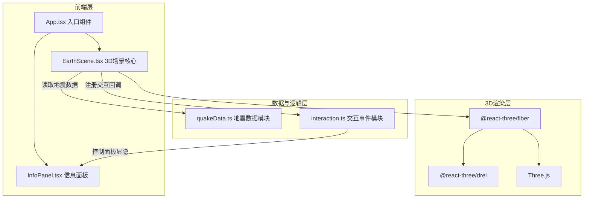
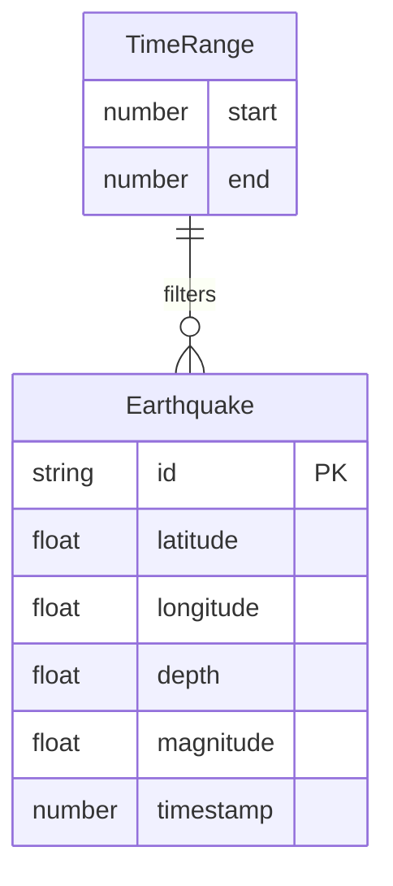

## 1. 架构设计



## 2. 技术说明
- 前端：React@18 + TypeScript + Vite
- 初始化工具：vite-init（react-ts模板）
- 3D渲染：Three.js + @react-three/fiber + @react-three/drei
- 后端：无（纯前端，模拟数据）
- 数据库：无（quakeData.ts 生成模拟地震数据）

## 3. 路由定义
| 路由 | 用途 |
|------|------|
| / | 3D地震可视化主页面（单页应用） |

## 4. API定义
无后端API。地震数据由 `quakeData.ts` 模块在前端生成。

### 数据类型定义
```typescript
interface Earthquake {
  id: string;
  latitude: number;    // -90 ~ 90
  longitude: number;   // -180 ~ 180
  depth: number;       // km, 0 ~ 700
  magnitude: number;   // 4.0 ~ 9.0
  timestamp: number;   // Unix时间戳，近30天内
}

interface TimeRange {
  start: number;       // 起始时间戳
  end: number;         // 结束时间戳
}
```

## 5. 服务端架构图
无后端服务。

## 6. 数据模型

### 6.1 数据模型定义


### 6.2 数据定义
无数据库表。`quakeData.ts` 导出：
- `generateEarthquakes(): Earthquake[]` — 生成120条近30天模拟地震记录
- `filterByTimeRange(data: Earthquake[], range: TimeRange): Earthquake[]` — 按时间范围过滤

### 文件间调用关系与数据流向

```
quakeData.ts ──(地震数据数组)──→ EarthScene.tsx ──(鼠标事件)──→ interaction.ts
                                       ↑                              │
                                       │────(回调：面板显隐)────────────┘
                                       │
                                       └──(选中地震数据)──→ InfoPanel.tsx
```

- `quakeData.ts`：生成模拟数据，提供过滤方法 → 数据流向 `EarthScene.tsx`
- `interaction.ts`：处理点击/悬停事件，通过回调通知 `EarthScene.tsx` 控制面板
- `EarthScene.tsx`：3D场景核心，读取数据并渲染，委托交互逻辑给 `interaction.ts`
- `InfoPanel.tsx`：信息面板UI，由 `interaction.ts` 逻辑控制显隐

### 依赖版本
- react: ^18.2.0
- react-dom: ^18.2.0
- typescript: ^5.3.0
- vite: ^5.0.0
- @vitejs/plugin-react: ^4.2.0
- three: ^0.160.0
- @react-three/fiber: ^8.15.0
- @react-three/drei: ^9.92.0
- @types/three: ^0.160.0
