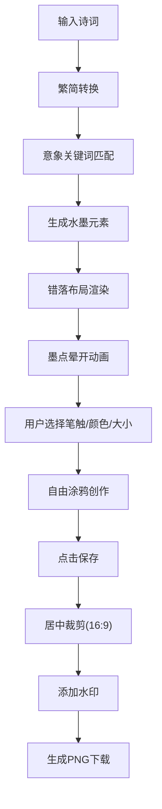

## 1. 产品概述
诗词意境可视化涂鸦墙是一款将中国古典诗词与水墨绘画艺术相结合的创意应用。用户输入喜爱的古诗词，系统自动提取诗句中的意象元素，在画布上生成水墨风格的动态插画，支持用户自由涂鸦创作，最终形成诗词与绘画交融的艺术作品。

- **核心价值**：让古诗词以可视化的方式呈现，降低诗词欣赏门槛，提供创意表达空间
- **目标用户**：诗词爱好者、艺术创作者、学生及教育工作者
- **使用场景**：诗词学习、创意涂鸦、艺术创作、社交分享

## 2. 核心功能

### 2.1 用户角色
| 角色 | 注册方式 | 核心权限 |
|------|----------|----------|
| 普通用户 | 无需注册，直接使用 | 输入诗词、渲染意象、自由涂鸦、保存作品 |

### 2.2 功能模块
1. **诗词输入模块**：诗词文本输入、繁简转换、意象解析、渲染触发
2. **画布渲染模块**：水墨意象绘制、墨点晕开动画、宣纸背景、元素错落布局
3. **涂鸦交互模块**：多种笔触（毛笔/铅笔/喷枪）、传统色选择、笔刷大小调节、压感效果
4. **作品保存模块**：PNG截图生成、水印添加、居中裁剪（16:9）

### 2.3 页面详情
| 页面名称 | 模块名称 | 功能描述 |
|----------|----------|----------|
| 主页面 | 标题栏 | 应用名称（毛笔字体）、示例诗词加载 |
| 主页面 | 诗词输入区 | 文本输入框、渲染按钮、意象关键词展示 |
| 主页面 | 画布区域 | 水墨意象渲染、用户涂鸦绘制、压痕阴影 |
| 主页面 | 底部操作栏 | 笔触选择、颜色选择、笔刷大小滑块、保存按钮 |

## 3. 核心流程

用户输入诗词 → 系统解析意象 → 生成水墨插画 → 用户涂鸦创作 → 保存作品图片

## 4. 用户界面设计

### 4.1 设计风格
- **主色调**：宣纸米色 #f5f0e1（背景）、墨黑 #2c2c2c（文字）
- **强调色**：朱砂 #cc3d0f（按钮悬停、重点元素）
- **水墨渐变**：浓墨 #1a1a1a → 淡墨 #8a8a8a
- **传统色板**：花青 #2b4f6c、藤黄 #d4a017、胭脂 #c0392b、赭石 #7d4e24、石绿 #4a7c59、钛白 #ffffff、朱砂 #cc3d0f、墨黑 #2c2c2c
- **字体**：标题使用 Ma Shan Zheng（毛笔字体），正文使用楷体/系统字体
- **按钮风格**：圆形按钮（直径40px），悬停朱砂色背景 + scale 1.1 缩放动画（0.2s）
- **背景纹理**：宣纸纹理（SVG生成的微弱纸纤维效果）
- **整体调性**：雅致、古典、水墨意境、诗意留白

### 4.2 页面设计概述
| 页面名称 | 模块名称 | UI元素 |
|----------|----------|--------|
| 主页面 | 标题栏 | 毛笔字体标题、简约布局 |
| 主页面 | 诗词输入区 | 多行文本框、圆角设计、渲染按钮、意象标签 |
| 主页面 | 画布区域 | 宣纸背景、内阴影压痕、意象元素错落分布 |
| 主页面 | 底部操作栏 | 圆形按钮组、颜色色板、滑块控件 |

### 4.3 响应式设计
- **桌面端（≥768px）**：左右分栏布局，左侧诗词输入区（280px），右侧画布区
- **移动端（<768px）**：上下布局，顶部输入区（60px高度），下方画布区占满剩余空间
- **触摸优化**：移动端支持手指涂鸦，增大按钮点击区域

### 4.4 动画效果
- **意象出现**：墨点晕开动画，从中心向外扩散，0.6s ease-out
- **墨色浓淡过渡**：0.5s 渐变动画
- **按钮悬停**：0.2s 缩放动画（scale 1.1）+ 朱砂色背景
- **涂鸦笔迹**：两端细中间粗的压感效果，与鼠标/触摸速度联动
