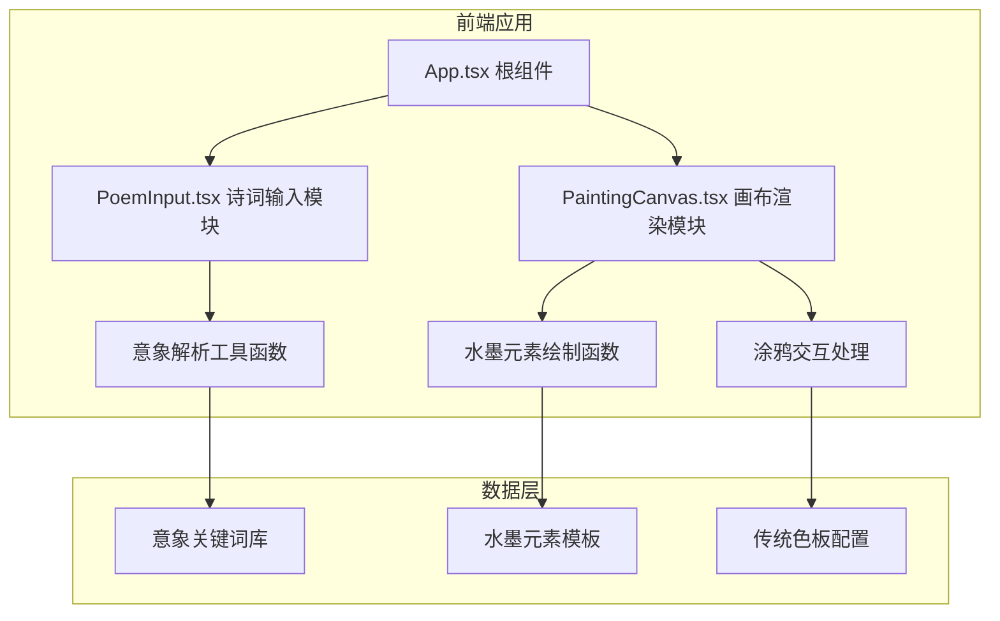

## 1. 架构设计



## 2. 技术描述

- **前端框架**：React 18 + TypeScript
- **构建工具**：Vite 5 + @vitejs/plugin-react
- **样式方案**：原生 CSS（CSS Modules / 内联样式），不引入 Tailwind
- **画布技术**：HTML5 Canvas 2D API
- **字体方案**：Google Fonts (Ma Shan Zheng)
- **状态管理**：React useState / useRef（轻量状态，无需 Redux）
- **无后端、无数据库**：纯前端应用，本地运行

### 核心技术要点
- **Canvas 双层设计**：底层画布渲染意象元素，顶层画布处理涂鸦交互，合并导出
- **requestAnimationFrame**：确保涂鸦 60fps 采样率，延迟 <50ms
- **离屏 Canvas**：用于保存时的图像合成与裁剪处理
- **繁简转换**：内置轻量繁简转换映射表
- **压感模拟**：基于鼠标移动速度计算线宽，实现毛笔笔触效果

## 3. 文件结构

| 路径 | 用途 |
|------|------|
| `package.json` | 项目依赖与脚本配置 |
| `vite.config.js` | Vite 构建配置 |
| `tsconfig.json` | TypeScript 严格模式配置 |
| `index.html` | 入口 HTML 页面 |
| `src/App.tsx` | 根组件，管理主布局和全局状态 |
| `src/PoemInput.tsx` | 诗词输入与解析模块 |
| `src/PaintingCanvas.tsx` | 画布渲染与涂鸦交互模块 |
| `src/utils/imagery.ts` | 意象关键词库与解析函数 |
| `src/utils/inkElements.ts` | 水墨元素绘制函数集合 |
| `src/utils/brush.ts` | 笔触工具函数（压感、速度计算） |
| `src/styles/App.css` | 全局样式 |
| `src/types/index.ts` | TypeScript 类型定义 |

## 4. 核心数据结构

### 意象元素
```typescript
interface ImageryElement {
  keyword: string;      // 意象关键词
  category: string;     // 分类：天文/植物/景物/动物等
  drawFn: string;       // 对应绘制函数名
  defaultInk: number;   // 默认墨色浓度 (0-1)
}
```

### 涂鸦点
```typescript
interface DrawPoint {
  x: number;
  y: number;
  pressure: number;     // 模拟压感 (0-1)
  timestamp: number;
}
```

### 笔触配置
```typescript
interface BrushConfig {
  type: 'brush' | 'pencil' | 'spray';  // 笔触类型
  color: string;                        // 颜色
  size: number;                         // 基础大小
}
```

### 意象匹配结果
```typescript
interface ImageryMatch {
  keyword: string;
  position: number;     // 在诗句中的位置索引
  lineIndex: number;    // 所属诗句索引
  element: ImageryElement;
}
```

## 5. 性能优化策略

1. **Canvas 分层渲染**：意象层（静态）与涂鸦层（动态）分离，减少重绘
2. **离屏渲染**：复杂水墨元素预渲染到离屏 Canvas，使用时直接贴图
3. **节流与防抖**：涂鸦输入使用 requestAnimationFrame 节流
4. **对象池**：复用绘制路径对象，减少 GC 压力
5. **渐进渲染**：意象元素逐个出现，避免一次性大量绘制造成卡顿
6. **DPR 适配**：根据设备像素比设置 Canvas 分辨率，保证清晰度同时控制性能
