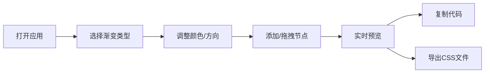

## 1. 产品概述

CSS渐变生成器是一款面向前端开发者的可视化工具，帮助用户快速生成和预览线性、径向、圆锥三种CSS渐变配色方案，并导出为干净的CSS代码。解决日常开发中手动调整渐变方向和颜色节点效率低、难以即时预览多种组合效果的问题。

- 目标用户：前端开发者、UI设计师
- 核心价值：提升CSS渐变开发效率，提供直观的可视化调整体验

## 2. 核心功能

### 2.1 用户角色

| 角色 | 注册方式 | 核心权限 |
|------|---------|---------|
| 访客用户 | 无需注册 | 使用全部渐变生成、预览、导出功能 |

### 2.2 功能模块

1. **主界面**：控制面板、预览画布、顶部导航、底部预设
2. **控制面板**：渐变类型选择、颜色选择器、方向控制、颜色节点管理
3. **预览画布**：实时渐变预览、CSS代码显示、一键复制
4. **导出功能**：完整CSS代码模态框、下载为.css文件
5. **预设模板**：5个精选渐变模板快速切换

### 2.3 页面详情

| 页面名称 | 模块名称 | 功能描述 |
|---------|---------|---------|
| 主界面 | 控制面板 | 渐变类型切换（linear/radial/conic）、双颜色选择器、方向控制滑块、颜色节点添加与拖拽 |
| 主界面 | 预览画布 | 70%宽度实时预览、三行CSS代码显示、点击复制到剪贴板 |
| 主界面 | 顶部导航 | 导出按钮，点击弹出完整CSS代码模态框 |
| 主界面 | 底部预设 | 5个预设渐变卡片，点击快速应用参数 |
| 模态框 | 导出弹窗 | 展示带浏览器前缀的完整CSS代码、提供下载.css文件功能 |

## 3. 核心流程

用户打开应用 → 选择渐变类型 → 调整颜色和方向参数 → 添加/拖拽颜色节点 → 实时预览渐变效果 → 点击代码复制或使用导出功能下载CSS文件

## 4. 用户界面设计

### 4.1 设计风格

- 主背景色：#ffffff（白色）
- 控制面板背景：#F8F9FA（浅灰）
- 分割线：#DEE2E6（淡灰）
- 主题渐变色：#667eea → #764ba2
- 导出按钮渐变：#43e97b → #38f9d7
- 圆角风格：统一使用圆角设计（画布12px、卡片12px、按钮21px、模态框16px）
- 动效：所有交互控件0.2-0.3s平滑过渡，悬停/聚焦/拖拽状态动画

### 4.2 页面设计概述

| 页面名称 | 模块名称 | UI元素 |
|---------|---------|--------|
| 主界面 | 控制面板 | 30%宽度浅灰背景，下拉菜单、颜色选择器、角度/位置滑块、圆形添加按钮（渐变背景，悬停放大旋转）、可拖拽圆点节点 |
| 主界面 | 预览画布 | 70%宽度白色背景圆角12px，下方CSS代码区（点击复制带绿色勾号提示） |
| 主界面 | 顶部导航 | 右侧导出按钮（绿色渐变，悬停上移加深投影） |
| 主界面 | 底部预设 | 5张160×60px渐变预览卡片，圆角12px带名称 |
| 模态框 | 导出弹窗 | 480px宽白色背景圆角16px，0.3s弹性缩放进入，代码块+下载按钮 |

### 4.3 响应式设计

- 桌面端（≥1024px）：左右布局，控制面板30%在左，画布70%在右
- 移动端（≥375px）：纵向布局，控制面板在上，画布在下
- 所有控件适配触摸操作

### 4.4 性能要求

- 实时更新（颜色、角度、节点变化）渲染响应时间 ≤ 50ms
- 画布预览帧率稳定在60fps
