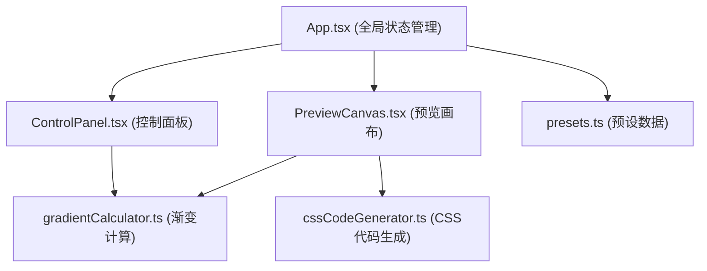

## 1. 架构设计



## 2. 技术描述

- 前端框架：React 18 + TypeScript
- 构建工具：Vite
- 状态管理：React useState/useCallback（轻量级场景，无需额外状态库）
- 样式方案：原生CSS（模块化样式文件）
- 图标：lucide-react

## 3. 文件结构

```
d:\Pro\tasks\auto70/
├── package.json
├── index.html
├── vite.config.js
├── tsconfig.json
└── src/
    ├── App.tsx                    # 主应用组件，全局状态管理
    ├── components/
    │   ├── ControlPanel.tsx       # 控制面板组件
    │   └── PreviewCanvas.tsx      # 预览画布组件
    ├── utils/
    │   ├── gradientCalculator.ts  # 渐变参数计算（纯函数）
    │   └── cssCodeGenerator.ts    # CSS代码生成（含浏览器前缀）
    └── data/
        └── presets.ts             # 预设模板数据
```

## 4. 数据模型定义

### 4.1 核心类型

```typescript
type GradientType = 'linear' | 'radial' | 'conic';

interface ColorStop {
  id: string;
  color: string;
  position: number; // 0-100
}

interface GradientConfig {
  type: GradientType;
  colors: ColorStop[];
  // linear
  angle?: number; // 0-360
  // radial
  shape?: 'circle' | 'ellipse';
  centerX?: number; // 0-100
  centerY?: number; // 0-100
  // conic
  startAngle?: number; // 0-360
}

interface Preset {
  name: string;
  gradientConfig: GradientConfig;
}
```

## 5. 模块职责

### 5.1 gradientCalculator.ts
- 输入：GradientConfig对象
- 输出：标准CSS渐变字符串（如 `linear-gradient(135deg, #667eea 0%, #764ba2 100%)`）
- 包含linear、radial、conic三种渐变的计算逻辑

### 5.2 cssCodeGenerator.ts
- 输入：GradientConfig、presetName（可选）
- 输出：完整CSS代码块，包含：
  - fallback纯色（取第一个颜色）
  - -webkit-前缀版本
  - -moz-前缀版本
  - 标准版本

### 5.3 presets.ts
- 导出5个预设模板数组
- 包含：日落、海洋、极光、薰衣草、火焰等主题

### 5.4 ControlPanel.tsx
- 内部管理局部UI状态
- 通过回调将GradientConfig传递给App.tsx
- 处理颜色节点的增删和拖拽逻辑

### 5.5 PreviewCanvas.tsx
- 接收GradientConfig作为props
- 渲染渐变背景预览
- 显示CSS代码并处理复制逻辑

### 5.6 App.tsx
- 管理全局GradientConfig状态
- 整合控制面板和画布组件
- 处理预设模板切换
- 管理导出模态框
