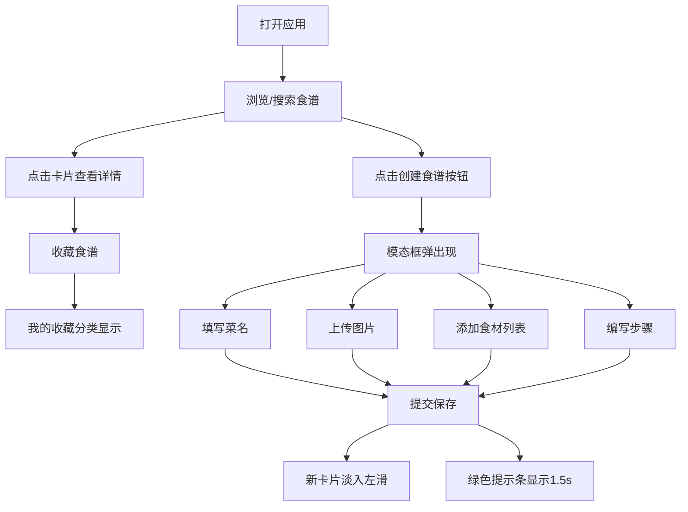

## 1. 产品概述

数字化食谱管家是一款帮助烹饪爱好者记录、检索和分享个人食谱的 Web 应用。解决用户做饭时遗忘独门配方、难以系统化管理菜谱的痛点，目标用户为家庭厨师和烹饪爱好者。产品价值在于提供美观、流畅的食谱管理体验，支持分类浏览、智能搜索、一键收藏和快速创建。

## 2. 核心功能

### 2.1 用户角色
本产品为单用户本地应用，无需登录注册。

| 角色 | 核心权限 |
|------|----------|
| 使用者 | 创建、查看、搜索、收藏食谱 |

### 2.2 功能模块
1. **主页面**：左侧分类搜索面板、食谱卡片网格、右侧详情滑出面板、顶部创建按钮和提示条
2. **创建食谱**：模态框表单（菜名、图片、食材、步骤）
3. **食谱详情**：大图展示、完整食材列表、步骤详解、收藏切换
4. **收藏管理**：我的收藏分类、数量徽章、卡片红心图标

### 2.3 页面详情
| 页面名称 | 模块名称 | 功能描述 |
|-----------|-------------|---------------------|
| 主页面 | 左侧面板 | 分类树（可折叠，0.3s过渡）、搜索框（防抖300ms、聚焦变橙红）、我的收藏（带数量徽章） |
| 主页面 | 食谱卡片列表 | 280px卡片、120x120缩略图、悬停上移5px加深阴影、三列布局 |
| 主页面 | 创建食谱按钮 | 180x48px圆角按钮、渐变#FF8A65→#FF7043、悬停变亮放大1.02倍 |
| 主页面 | 详情滑出面板 | 400px宽、右侧0.3s滑入、大图+食材+步骤+收藏按钮 |
| 创建模态框 | 表单 | 600px宽、弹性缩放0.3s出现、菜名/图片上传/食材列表/步骤编辑器 |
| 全局 | 提示条 | #43A047绿色、1.5s自动消失、圆角8px |

## 3. 核心流程

用户打开应用 → 浏览分类或搜索食谱 → 点击卡片查看详情（右侧滑出）→ 收藏食谱（红心+加入我的收藏）→ 点击创建按钮（模态框弹出）→ 填写菜名/上传图片/添加食材/编写步骤 → 提交保存 → 新卡片淡入左滑出现 + 绿色成功提示

## 4. 用户界面设计

### 4.1 设计风格
- **主色调**：#FF7043（橙红）、辅助色 #FFF8E1（米黄）、文字 #3E2723（深棕）、背景 #FBE9E7（暖橙淡色）
- **按钮风格**：圆角渐变按钮，柔和投影，悬停变亮+微放大
- **字体**：标题使用温暖衬线字体（如 'Noto Serif SC'），正文使用清晰无衬线（如 'Noto Sans SC'）
- **布局风格**：三栏布局（左25%分类面板 + 中卡片网格 + 右400px详情面板），卡片式设计
- **图标风格**：Lucide React 线性图标，收藏状态用实心红心

### 4.2 页面设计概述
| 页面名称 | 模块名称 | UI 元素 |
|-----------|-------------|-------------|
| 主页面 | 左侧分类面板 | #F5F5F5 背景、#E0E0E0 右边框、42px高分类项、8px圆角、悬停#FFF8E1、0.3s高度过渡 |
| 主页面 | 搜索框 | 44px高、12px圆角、100%宽、聚焦边框#FF7043 |
| 主页面 | 食谱卡片 | 280px宽、120x120px缩略图、菜名、难度星星、烹饪时间、悬停translateY(-5px)、0.25s过渡 |
| 主页面 | 创建按钮 | 180x48px、24px圆角、渐变#FF8A65→#FF7043、阴影、悬停brightness(1.1) scale(1.02) |
| 创建模态框 | 整体 | 600px宽、白色背景、16px圆角、0.3s弹性scale(0.9→1) |
| 创建模态框 | 上传区 | 280x180px、虚线边框、8px圆角、拖拽时边框橙红+背景闪烁 |
| 创建模态框 | 食材条目 | 动态增删、名称+用量输入框、新增0.2s淡入 |
| 创建模态框 | 步骤条目 | 文本区+可选图片、新增0.2s向下滑动 |
| 详情面板 | 整体 | 400px宽、白色、16px圆角、右侧translateX(100%→0)、0.3s |
| 全局 | 提示条 | #43A047背景、白色文字、8px圆角、1.5s后opacity→0 |

### 4.3 响应式
- **桌面端（≥768px）**：左侧25%面板常驻、三列卡片网格、模态框600px固定宽
- **移动端（<768px）**：左侧面板默认隐藏（汉堡菜单触发展开）、单列卡片、模态框宽度自适应100%-32px内边距、详情面板全宽滑入
- **触摸优化**：增大点击热区至44x44px，移除悬停效果改用:active状态

### 4.4 性能指标
- 所有面板切换和动画保持 **60fps**（使用 transform/opacity 实现）
- 搜索响应时间 ≤ **200ms**（内存搜索+防抖300ms）
- 图片懒加载，缩略图优先显示
