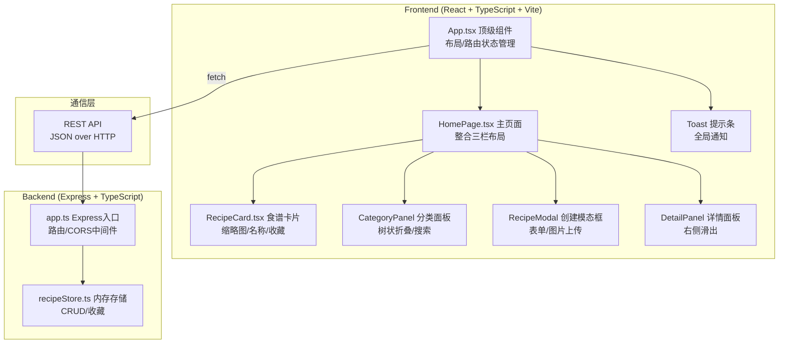
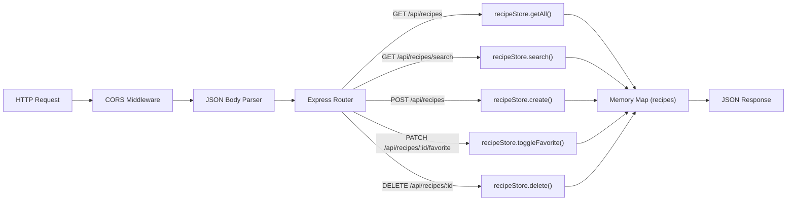
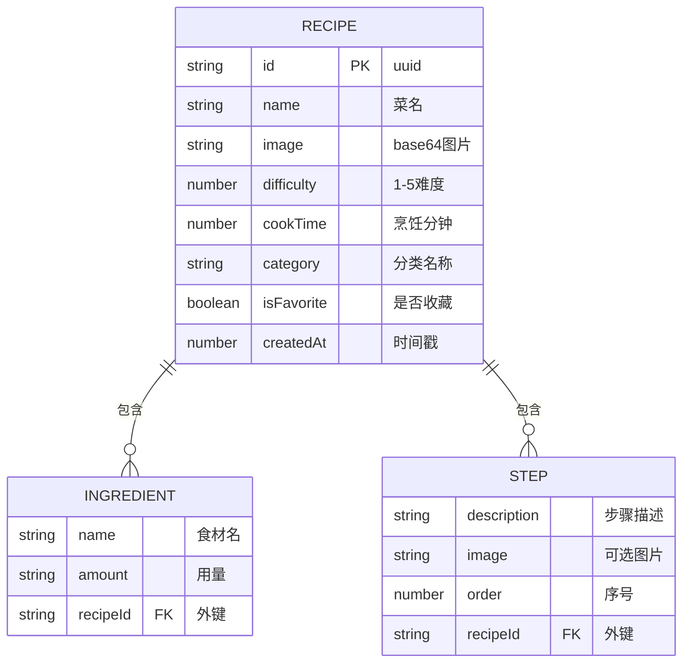

## 1. 架构设计



## 2. 技术描述

- **前端**：React 18 + TypeScript 5 + Vite 5 + @vitejs/plugin-react
- **后端**：Express 4 + TypeScript 5 + cors + uuid
- **状态管理**：React Hooks（useState/useEffect/useCallback），无需额外状态库
- **数据库**：内存存储（Map 数据结构，recipeStore.ts）
- **构建工具**：Vite（前端热更新）、ts-node-dev 或 tsc + node（后端）
- **样式方案**：内联 CSS（styled-jsx 风格）+ CSS 变量，无需 Tailwind（用户未要求）
- **图标库**：lucide-react

## 3. 路由定义

| 路由 | 用途 |
|-------|---------|
| / | 主页面（单页应用，无客户端路由切换） |

## 4. API 定义

### TypeScript 类型定义
```typescript
interface Ingredient {
  name: string;
  amount: string;
}

interface Step {
  description: string;
  image?: string; // base64 data URL
}

interface Recipe {
  id: string;           // uuid
  name: string;
  image: string;        // base64 data URL
  difficulty: number;   // 1-5
  cookTime: number;     // 分钟
  ingredients: Ingredient[];
  steps: Step[];
  category: string;
  isFavorite: boolean;
  createdAt: number;
}
```

### 接口列表

| 方法 | 路径 | 请求体 | 响应 | 说明 |
|------|------|--------|------|------|
| GET | /api/recipes | - | `Recipe[]` | 获取全部食谱 |
| GET | /api/recipes/search?q=xxx | - | `Recipe[]` | 搜索食谱 |
| POST | /api/recipes | `Omit<Recipe,'id','isFavorite','createdAt'>` | `Recipe` | 创建食谱 |
| PATCH | /api/recipes/:id/favorite | `{ isFavorite: boolean }` | `Recipe` | 切换收藏状态 |
| DELETE | /api/recipes/:id | - | `{ success: true }` | 删除食谱 |

## 5. 服务器架构图



## 6. 数据模型

### 6.1 数据模型定义（ER 图）


### 6.2 初始种子数据

应用启动时 recipeStore 初始化内置 3-5 条示例食谱数据（家常菜、川菜、甜品等分类），确保首次打开即有内容展示。
