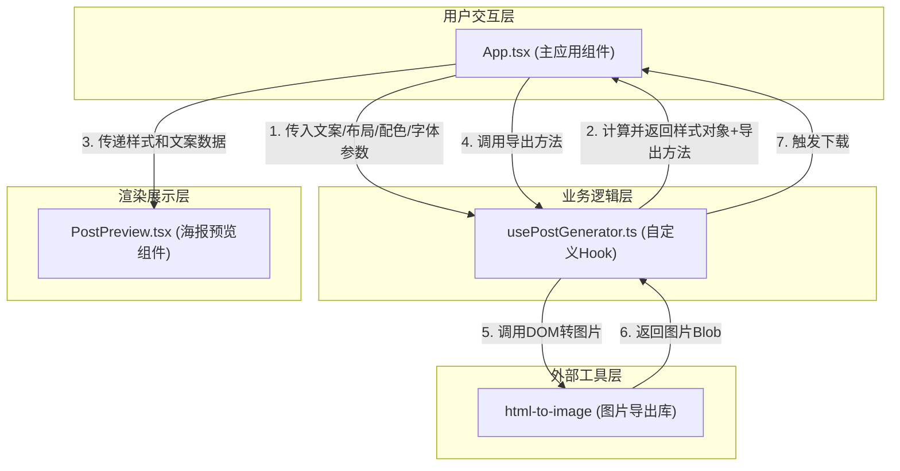

## 1. 架构设计

本项目为纯前端React单页应用，采用分层架构设计，职责清晰，数据单向流动。



## 2. 技术描述

- **前端框架**：React@18 + ReactDOM@18
- **开发语言**：TypeScript（严格模式，target ES2020）
- **构建工具**：Vite + @vitejs/plugin-react
- **图片导出**：html-to-image（纯浏览器端DOM转图片）
- **状态管理**：React useState + 自定义Hook，无需额外状态库
- **CSS方案**：内联样式 + CSS transition动画，零CSS框架依赖

## 3. 目录结构与文件职责

```
auto78/
├── index.html                    # Vite入口HTML，挂载根节点#root
├── package.json                  # 项目依赖与启动脚本
├── vite.config.js                # Vite构建配置（React+JSX+严格模式）
├── tsconfig.json                 # TypeScript配置（严格+ES2020）
└── src/
    ├── App.tsx                   # 主应用组件：全局状态管理、控制面板UI、协调子组件
    ├── hooks/
    │   └── usePostGenerator.ts   # 自定义Hook：海报样式计算、防抖逻辑、导出封装
    └── components/
        └── PostPreview.tsx       # 海报预览组件：接收props渲染600x800px海报
```

### 文件间调用关系

| 调用方 | 被调用方 | 调用方式 | 数据流向 |
|--------|----------|----------|----------|
| App.tsx | usePostGenerator.ts | Hook调用（参数：文案/布局/配色/字体） | App → Hook（输入参数）→ Hook → App（样式对象+导出函数） |
| App.tsx | PostPreview.tsx | JSX组件渲染（props：文案+样式） | App → PostPreview（样式+文案props） |
| usePostGenerator.ts | html-to-image | import调用toPng函数 | Hook调用库 → 返回图片Blob → Hook触发下载 |

## 4. 核心类型定义

```typescript
// 布局类型
type LayoutType = 'center' | 'left' | 'wrap';

// 配色方案类型
type ColorSchemeType = 'dark' | 'gradient' | 'morandi' | 'warm' | 'mint' | 'white';

// 字体类型
type FontType = 'serif' | 'sans-serif' | 'monospace';

// 配色方案样式结构
interface ColorScheme {
  background: string;           // 背景色/渐变CSS值
  textColor: string;            // 主文字颜色
  subtitleColor: string;        // 副标题颜色（通常与主文字同色或稍浅）
}

// 海报样式对象结构
interface PosterStyle {
  containerStyle: React.CSSProperties;   // 海报容器样式（背景、尺寸、阴影）
  titleStyle: React.CSSProperties;       // 标题样式（位置、字体、大小、颜色）
  subtitleStyle: React.CSSProperties;    // 副标题样式
  isTransitioning: boolean;              // 是否处于过渡状态（字体切换淡入淡出用）
}

// Hook返回值结构
interface UsePostGeneratorReturn {
  posterStyle: PosterStyle;              // 计算好的样式对象
  exportPoster: () => Promise<void>;     // 导出函数
  isExporting: boolean;                  // 是否正在导出（控制加载动画）
  previewRef: React.RefObject<HTMLDivElement>; // 海报DOM引用（供导出用）
}
```

## 5. 数据流详解

### 5.1 文案输入数据流

```
用户输入 → App.onChange → App.setState(title/subtitle)
    → usePostGenerator监听依赖变化 → 防抖300ms
    → 重新计算posterStyle → 返回给App
    → App传递给PostPreview组件重渲染
```

### 5.2 布局/配色/字体切换数据流

```
用户点击选项 → App.setState(layout/color/font)
    → usePostGenerator立即重新计算样式（无防抖）
    → 返回新posterStyle（含transition属性）
    → PostPreview通过CSS transition实现平滑动画
```

### 5.3 导出流程数据流

```
用户点击导出按钮 → App调用exportPoster()
    → Hook设置isExporting=true → App显示加载动画
    → Hook通过previewRef获取DOM → 调用html-to-image的toPng()
    → 生成Blob URL → 创建<a>标签触发下载（文件名: poster_时间戳.png）
    → Hook设置isExporting=false → 动画结束
```

## 6. 性能优化策略

| 优化点 | 实现方案 | 预期效果 |
|--------|----------|----------|
| 文案频繁输入 | useRef配合setTimeout实现300ms防抖 | 减少重渲染，预览延迟≤300ms |
| 样式计算 | useMemo缓存posterStyle，依赖项仅触发必要重算 | 避免无效计算 |
| DOM引用 | useRef缓存海报容器DOM引用 | 导出时无需重复查询DOM |
| 过渡动画 | 纯CSS transition实现，不触发JS帧动画 | 流畅60fps，GPU加速 |
| 字体加载 | 仅使用系统Web安全字体 | 首屏无外部资源，渲染≤1s |

## 7. 兼容性与约束

- **浏览器支持**：Chrome/Edge/Firefox最新两个版本（html-to-image依赖Canvas API）
- **无后端依赖**：纯浏览器端运行，图片导出不经过服务器
- **无外部图片**：海报完全由CSS和文字渲染，确保html-to-image转换质量
- **TypeScript严格**：strict: true，noImplicitAny: true，strictNullChecks: true
