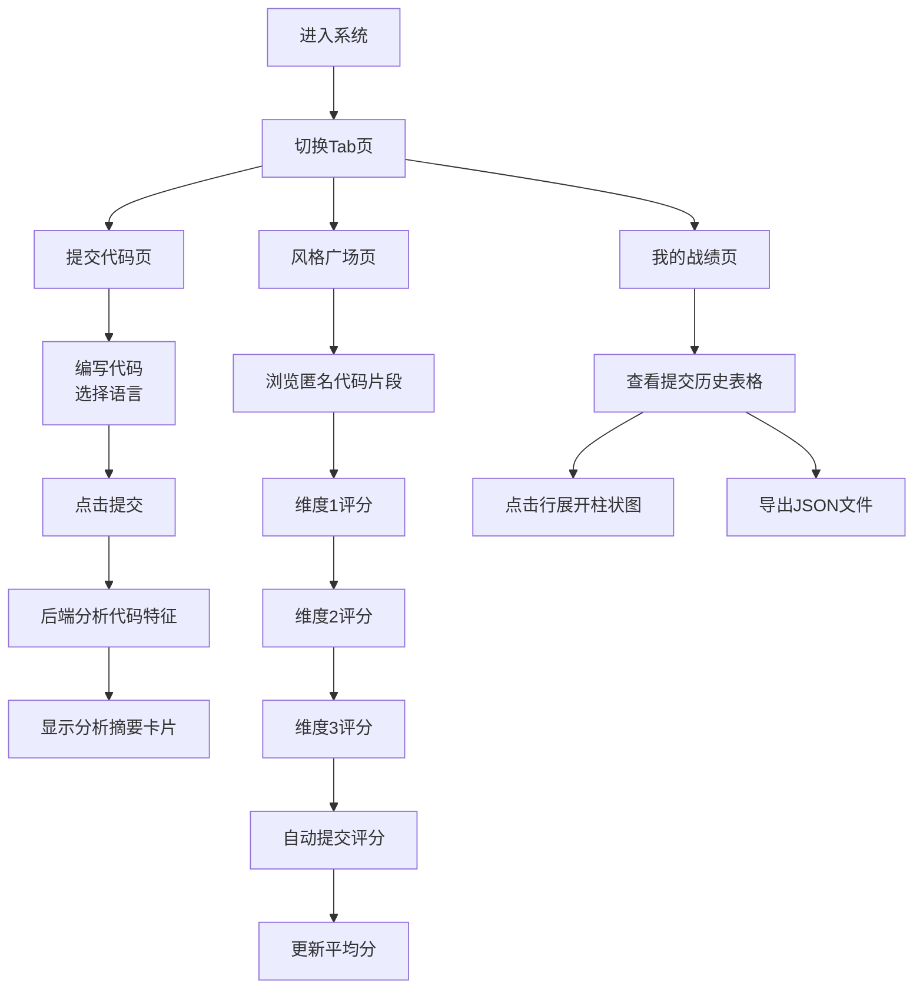

## 1. 产品概述

程序员代码风格互评系统是一个面向开发团队内部的代码质量提升平台，通过匿名互评机制让团队成员相互学习、共同进步。解决传统代码评审中新手参与感低、代码风格缺乏统一衡量标准的问题。

- 核心目标：提升团队整体代码质量，统一代码风格，促进知识共享
- 目标用户：开发团队成员（初级、中级、高级开发者）
- 核心价值：匿名互评降低心理负担，多维度评分提供客观反馈，代码分析卡片提供量化指标

## 2. 核心功能

### 2.1 用户角色
| 角色 | 注册方式 | 核心权限 |
|------|----------|----------|
| 普通用户 | 自动分配用户ID | 提交代码、匿名评分、查看个人战绩、导出数据 |

### 2.2 功能模块
1. **提交代码页**：代码编辑器、语言切换、代码分析摘要卡片
2. **风格广场页**：匿名代码片段展示、三星维度评分、平均分更新
3. **我的战绩页**：提交历史表格、评分分布柱状图、JSON数据导出

### 2.3 页面详情
| 页面名称 | 模块名称 | 功能描述 |
|-----------|-------------|---------------------|
| 提交代码页 | 代码编辑器 | Monaco Editor实现，支持JS/Python语法高亮，获取/设置代码内容 |
| 提交代码页 | 分析摘要卡片 | 展示代码行数、圈复杂度、注释率、命名风格，综合评分进度环动画 |
| 风格广场页 | 代码片段卡片 | 匿名展示其他用户代码，隐藏用户名只显示ID后缀 |
| 风格广场页 | 星级评分组件 | 可读性、优雅度、效率三个维度，1-5分星型评分按钮，顺序解锁 |
| 我的战绩页 | 战绩表格 | 展示提交历史、平均分、最高分、最低分，点击展开柱状图 |
| 我的战绩页 | 数据导出 | 导出JSON文件，包含提交时间和评分详情 |

## 3. 核心流程

用户进入系统后，可通过顶部导航切换三个功能页。提交代码后获得分析反馈，在风格广场为他人匿名评分，在我的战绩查看个人历史数据。

## 4. 用户界面设计

### 4.1 设计风格
- **主题色**：深色主题，主背景 `#1e1e2e`
- **强调色**：亮青色 `#64ffda`（选中状态），金色 `#ffd600`（星级评分），渐变色 `#64ffda` → `#00bcd4`（柱状图）
- **辅助色**：浅灰色 `#a0a0b0`（未选中状态），红到绿渐变色（评分卡片）
- **按钮风格**：圆角按钮，hover时有微缩放和阴影效果
- **字体**：代码使用等宽字体（JetBrains Mono / Fira Code），界面文字使用现代无衬线字体
- **布局风格**：卡片式布局，顶部导航栏固定，内容区域滚动
- **动画效果**：Tab切换底部滑条0.3s cubic-bezier，进度环1s ease-out，星级填充0.2s弹性缩放，柱状图高度0.5s ease

### 4.2 页面设计概述
| 页面名称 | 模块名称 | UI元素 |
|-----------|-------------|-------------|
| 全局 | 顶部导航栏 | 三个Tab按钮，底部滑动指示器，选中文字亮青色，未选中浅灰色 |
| 提交代码页 | 代码编辑区 | 左侧Monaco编辑器，右侧语言切换按钮和提交规则说明，底部提交按钮 |
| 提交代码页 | 分析卡片 | 渐变背景色（红→绿根据评分），进度环动画，四个指标展示 |
| 风格广场页 | 代码卡片列表 | 10个卡片，代码块展示，评分区域三个维度顺序解锁 |
| 我的战绩页 | 数据表格 | 斑马纹行，点击展开动画，柱状图渐变色柱体 |

### 4.3 响应性
- 桌面端优先设计（≥1280px）
- 平板端（≥768px）：布局保持，适当调整间距
- 移动端（<768px）：单列布局，导航Tab可横向滚动
- 触摸设备优化：增加按钮点击区域，减少精确点击需求

### 4.4 交互细节
- 代码编辑器支持语法高亮、行号显示、自动缩进
- 星级评分按钮hover时有预览效果，点击时有弹性缩放动画
- 表格行hover时有背景色变化，点击展开有平滑过渡
- 所有加载状态有骨架屏或loading指示器
- 评分提交成功有toast提示
